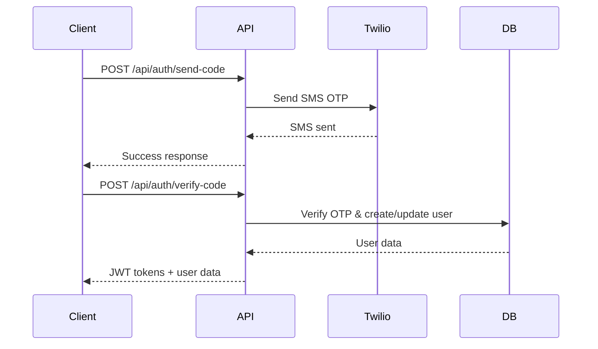
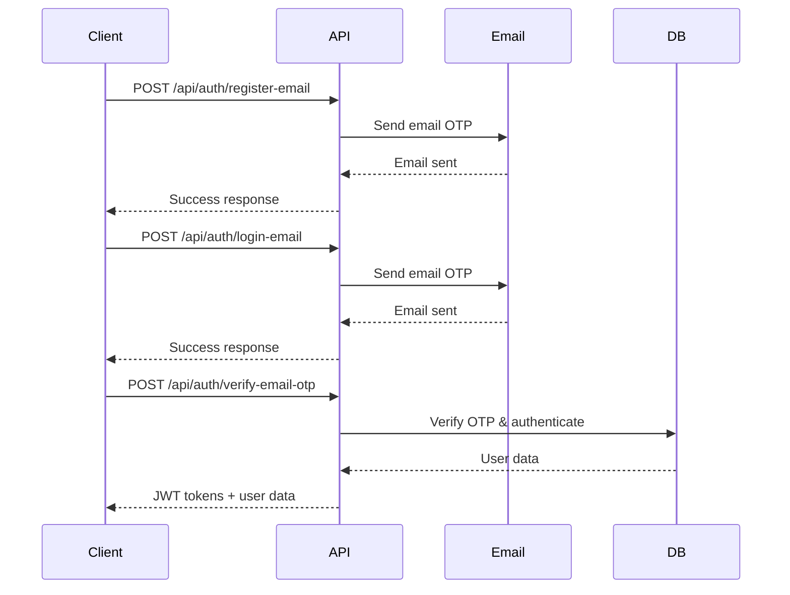

# LocalPro Super App API Authentication Documentation

## Overview

The LocalPro Super App implements a comprehensive authentication system that supports multiple authentication methods and provides secure access to the platform's features. The system uses JWT (JSON Web Tokens) for session management and supports role-based access control (RBAC).

## Authentication Methods

The platform supports two primary authentication methods:

### 1. Phone Number Authentication (SMS OTP)
- **Primary method** for mobile-first user experience
- Uses Twilio for SMS delivery
- Supports international phone numbers

### 2. Email Authentication (Email OTP)
- **Alternative method** for users preferring email
- Uses email service for OTP delivery
- Supports password-based authentication for returning users

## Authentication Flow

### Phone Number Authentication Flow



### Email Authentication Flow



## API Endpoints

### Public Endpoints (No Authentication Required)

#### Phone Number Authentication

**Send Verification Code**
```http
POST /api/auth/send-code
Content-Type: application/json

{
  "phoneNumber": "+1234567890"
}
```

**Response (Success)**
```json
{
  "success": true,
  "message": "Verification code sent successfully"
}
```

**Verify Code and Authenticate**
```http
POST /api/auth/verify-code
Content-Type: application/json

{
  "phoneNumber": "+1234567890",
  "code": "123456"
}
```

**Response (Success - New User)**
```json
{
  "success": true,
  "message": "User registered and logged in successfully",
  "token": "eyJhbGciOiJIUzI1NiIsInR5cCI6IkpXVCJ9...",
  "refreshToken": "abc123def456...",
  "user": {
    "id": "user_id",
    "phoneNumber": "+1234567890",
    "firstName": null,
    "lastName": null,
    "email": null,
    "roles": ["client"],
    "isVerified": true,
    "trustScore": 50
  },
  "isNewUser": true
}
```

**Response (Success - Existing User)**
```json
{
  "success": true,
  "message": "Login successful",
  "token": "eyJhbGciOiJIUzI1NiIsInR5cCI6IkpXVCJ9...",
  "refreshToken": "abc123def456...",
  "user": {
    "id": "user_id",
    "phoneNumber": "+1234567890",
    "firstName": "John",
    "lastName": "Doe",
    "email": "john@example.com",
    "roles": ["client", "provider"],
    "isVerified": true,
    "trustScore": 85
  },
  "isNewUser": false
}
```

#### Email Authentication

**Register with Email**
```http
POST /api/auth/register-email
Content-Type: application/json

{
  "email": "user@example.com",
  "password": "SecurePass123",
  "firstName": "John",
  "lastName": "Doe"
}
```

**Response (Success)**
```json
{
  "success": true,
  "message": "Verification code sent to your email",
  "email": "u***@example.com"
}
```

**Login with Email**
```http
POST /api/auth/login-email
Content-Type: application/json

{
  "email": "user@example.com",
  "password": "SecurePass123"
}
```

**Response (Success)**
```json
{
  "success": true,
  "message": "Verification code sent to your email",
  "email": "u***@example.com"
}
```

**Verify Email OTP**
```http
POST /api/auth/verify-email-otp
Content-Type: application/json

{
  "email": "user@example.com",
  "otpCode": "123456"
}
```

**Response (Success)**
```json
{
  "success": true,
  "message": "Login successful",
  "token": "eyJhbGciOiJIUzI1NiIsInR5cCI6IkpXVCJ9...",
  "refreshToken": "abc123def456...",
  "user": {
    "id": "user_id",
    "email": "user@example.com",
    "phoneNumber": "+email-abc123def",
    "firstName": "John",
    "lastName": "Doe",
    "roles": ["client"],
    "isVerified": true,
    "trustScore": 50
  }
}
```

### Protected Endpoints (Authentication Required)

#### Token Refresh
```http
POST /api/auth/refresh
Authorization: Bearer <refresh_token>
```

**Response (Success)**
```json
{
  "success": true,
  "message": "Token refreshed successfully",
  "token": "new_access_token...",
  "refreshToken": "new_refresh_token..."
}
```

#### Get Current User Profile
```http
GET /api/auth/me
Authorization: Bearer <access_token>
```

**Response (Success)**
```json
{
  "success": true,
  "user": {
    "id": "user_id",
    "phoneNumber": "+1234567890",
    "email": "user@example.com",
    "firstName": "John",
    "lastName": "Doe",
    "roles": ["client", "provider"],
    "isVerified": true,
    "trustScore": 85,
    "profile": {
      "avatar": {
        "url": "https://cloudinary.com/...",
        "publicId": "avatar_123"
      },
      "bio": "Professional service provider"
    }
  }
}
```

#### Update User Profile
```http
PUT /api/auth/profile
Authorization: Bearer <access_token>
Content-Type: application/json

{
  "firstName": "John",
  "lastName": "Doe",
  "email": "john.doe@example.com",
  "profile": {
    "bio": "Updated bio",
    "address": {
      "street": "123 Main St",
      "city": "Anytown",
      "state": "CA",
      "zipCode": "12345"
    }
  }
}
```

#### Logout
```http
POST /api/auth/logout
Authorization: Bearer <access_token>
```

**Response (Success)**
```json
{
  "success": true,
  "message": "Logged out successfully"
}
```

## JWT Token Structure

### Access Token Payload
```json
{
  "id": "user_id",
  "phoneNumber": "+1234567890",
  "roles": ["client", "provider"],
  "isVerified": true,
  "type": "access",
  "iat": 1640995200,
  "exp": 1640998800,
  "iss": "localpro-api",
  "aud": "localpro-mobile"
}
```

### Token Expiration
- **Access Token**: 15 minutes (configurable via `JWT_ACCESS_TOKEN_EXPIRES_IN`)
- **Refresh Token**: 7 days (configurable via `JWT_REFRESH_TOKEN_EXPIRES_IN_DAYS`)

### Token Security Features
- **Issuer**: `localpro-api`
- **Audience**: `localpro-mobile`
- **Type validation**: Ensures only access tokens are accepted for API access
- **Automatic refresh**: Client can refresh tokens before expiration

## Password Security

### Password Requirements
- Minimum 8 characters
- At least one uppercase letter (A-Z)
- At least one lowercase letter (a-z)
- At least one number (0-9)

### Password Hashing
- **Algorithm**: bcrypt
- **Salt Rounds**: 10
- **Storage**: Hashed passwords only (never plain text)

## Role-Based Access Control (RBAC)

### Available Roles
- `client` - Base consumer role (always present)
- `provider` - Service provider
- `supplier` - Product supplier
- `instructor` - Course instructor
- `agency_owner` - Agency owner
- `agency_admin` - Agency administrator
- `partner` - Corporate partner
- `staff` - Limited admin access
- `admin` - Full platform access

### Role Authorization
```javascript
const { auth, authorize } = require('../middleware/auth');

// Require authentication
router.get('/protected', auth, handler);

// Require specific role
router.get('/admin-only', auth, authorize('admin'), handler);

// Require any of multiple roles
router.get('/provider-area', auth, authorize(['provider', 'agency_admin']), handler);
```

## Rate Limiting

### Authentication Rate Limits
- **SMS OTP**: 1 request per minute per phone number
- **Email OTP**: 1 request per minute per email
- **General Auth**: Configurable limits per IP/client

### Rate Limit Headers
```http
X-RateLimit-Limit: 60
X-RateLimit-Remaining: 59
X-RateLimit-Reset: 1640995260
Retry-After: 60
```

## Error Handling

### Common Error Responses

**Invalid Credentials**
```json
{
  "success": false,
  "message": "Invalid email or password",
  "code": "INVALID_CREDENTIALS"
}
```

**Token Expired**
```json
{
  "success": false,
  "message": "Access token has expired",
  "code": "TOKEN_EXPIRED"
}
```

**Insufficient Permissions**
```json
{
  "success": false,
  "message": "User roles [client] are not authorized to access this route. Required: [admin]",
  "code": "INSUFFICIENT_PERMISSIONS"
}
```

**Rate Limit Exceeded**
```json
{
  "success": false,
  "message": "Please wait before requesting another verification code",
  "code": "RATE_LIMIT_EXCEEDED",
  "retryAfter": 60
}
```

## Client Implementation Guide

### Token Storage
```javascript
// Secure token storage (recommended)
localStorage.setItem('accessToken', token);
localStorage.setItem('refreshToken', refreshToken);

// Or sessionStorage for session-only persistence
sessionStorage.setItem('accessToken', token);
```

### API Client Setup
```javascript
// Axios interceptor for automatic token attachment
axios.interceptors.request.use((config) => {
  const token = localStorage.getItem('accessToken');
  if (token) {
    config.headers.Authorization = `Bearer ${token}`;
  }
  return config;
});

// Response interceptor for token refresh
axios.interceptors.response.use(
  (response) => response,
  async (error) => {
    if (error.response?.status === 401) {
      // Try to refresh token
      try {
        const refreshToken = localStorage.getItem('refreshToken');
        const response = await axios.post('/api/auth/refresh', {}, {
          headers: { Authorization: `Bearer ${refreshToken}` }
        });
        
        // Update stored tokens
        localStorage.setItem('accessToken', response.data.token);
        localStorage.setItem('refreshToken', response.data.refreshToken);
        
        // Retry original request
        error.config.headers.Authorization = `Bearer ${response.data.token}`;
        return axios(error.config);
      } catch (refreshError) {
        // Refresh failed, redirect to login
        localStorage.removeItem('accessToken');
        localStorage.removeItem('refreshToken');
        window.location.href = '/login';
      }
    }
    return Promise.reject(error);
  }
);
```

### OTP Verification Flow
```javascript
// Send OTP
const sendOTP = async (phoneNumber) => {
  const response = await fetch('/api/auth/send-code', {
    method: 'POST',
    headers: { 'Content-Type': 'application/json' },
    body: JSON.stringify({ phoneNumber })
  });
  return response.json();
};

// Verify OTP
const verifyOTP = async (phoneNumber, code) => {
  const response = await fetch('/api/auth/verify-code', {
    method: 'POST',
    headers: { 'Content-Type': 'application/json' },
    body: JSON.stringify({ phoneNumber, code })
  });
  
  const data = await response.json();
  
  if (data.success) {
    // Store tokens
    localStorage.setItem('accessToken', data.token);
    localStorage.setItem('refreshToken', data.refreshToken);
    
    // Redirect based on user type
    if (data.isNewUser) {
      window.location.href = '/onboarding';
    } else {
      window.location.href = '/dashboard';
    }
  }
  
  return data;
};
```

## Security Considerations

### Transport Security
- All authentication endpoints require HTTPS in production
- JWT tokens should only be transmitted over secure connections

### Token Security
- Store tokens securely (avoid plain text storage)
- Implement token rotation on refresh
- Clear tokens on logout
- Validate token expiration on client side

### Password Security
- Enforce strong password requirements
- Implement password change functionality
- Consider passwordless authentication for enhanced security

### Rate Limiting
- Implement client-side throttling
- Handle rate limit errors gracefully
- Show appropriate user feedback

## Environment Variables

```bash
# JWT Configuration
JWT_SECRET=your_super_secret_jwt_key
JWT_ACCESS_TOKEN_EXPIRES_IN=15m
JWT_REFRESH_TOKEN_EXPIRES_IN_DAYS=7

# Twilio Configuration (for SMS OTP)
TWILIO_ACCOUNT_SID=your_twilio_account_sid
TWILIO_AUTH_TOKEN=your_twilio_auth_token
TWILIO_PHONE_NUMBER=your_twilio_phone_number

# Email Configuration (for Email OTP)
EMAIL_SERVICE_API_KEY=your_email_service_key
EMAIL_FROM=noreply@localpro.com

# Rate Limiting
AUTH_RATE_LIMIT_WINDOW_MS=900000
AUTH_RATE_LIMIT_MAX_REQUESTS=10
SMS_RATE_LIMIT_WINDOW_MS=60000
SMS_RATE_LIMIT_MAX_REQUESTS=1
```

## Testing Authentication

### Postman Collection
Import the `LocalPro-Super-App-API.postman_collection.json` for comprehensive API testing.

### Test Scenarios
1. **New User Registration**: Phone number flow
2. **Existing User Login**: Phone number flow
3. **Email Registration**: Email/password flow
4. **Email Login**: Email/password flow
5. **Token Refresh**: Automatic token renewal
6. **Role-based Access**: Test different permission levels
7. **Rate Limiting**: Test rate limit enforcement

## Troubleshooting

### Common Issues

**"Invalid or expired verification code"**
- OTP codes expire after 10 minutes (email) or 5 minutes (SMS)
- Ensure code is entered correctly without spaces
- Check that the phone number/email matches exactly

**"Token has expired"**
- Implement automatic token refresh in client
- Check client system time is accurate
- Verify JWT configuration

**"User account is inactive"**
- Account may be suspended or pending verification
- Contact support for account status

**Rate limiting errors**
- Wait for the retry-after period
- Implement exponential backoff in client
- Check for abusive request patterns

---

*This documentation covers the complete authentication system for the LocalPro Super App API. For additional support or questions, refer to the API documentation or contact the development team.*