# 🎯 **LocalPro Super App - Flow Diagrams**

## **1. 🔐 Authentication & Onboarding Flow**

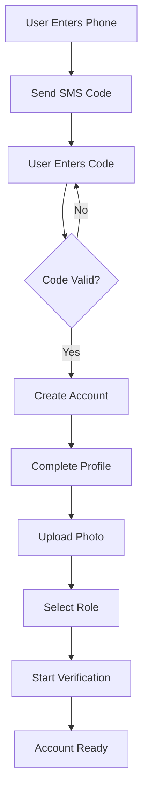

## **2. 🏪 Marketplace Service Booking Flow**

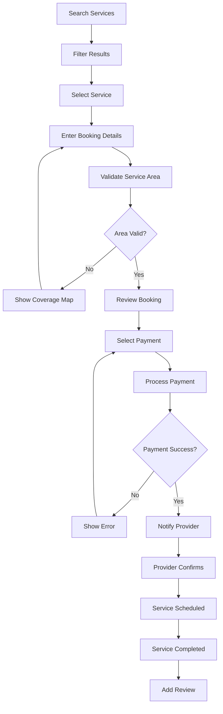

## **3. 💼 Job Application Flow**

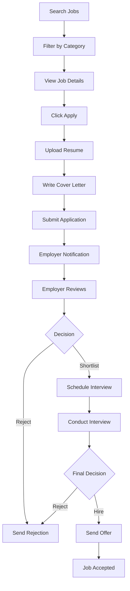

## **4. 🎓 Academy Learning Flow**

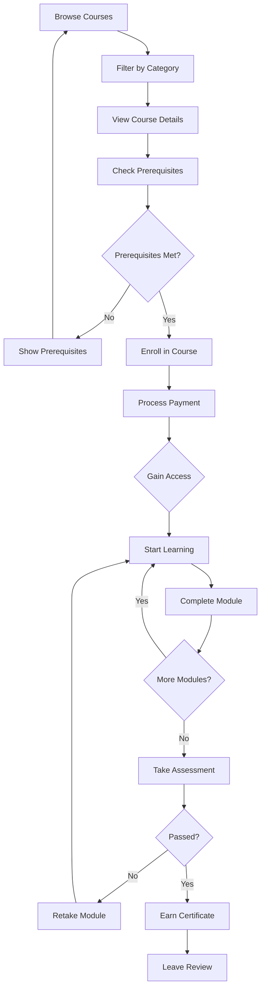

## **5. 📦 Supply Order Flow**

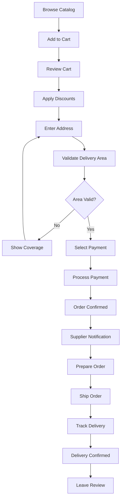

## **6. 🔧 Equipment Rental Flow**

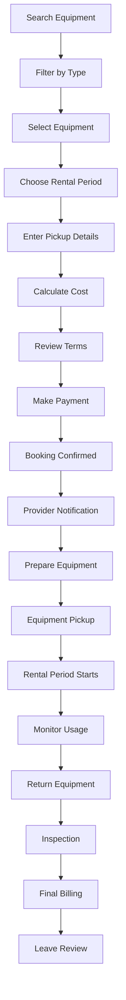

## **7. 💰 Financial Services Flow**

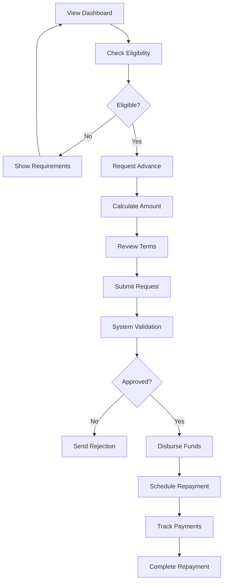

## **8. 🏢 Agency Management Flow**

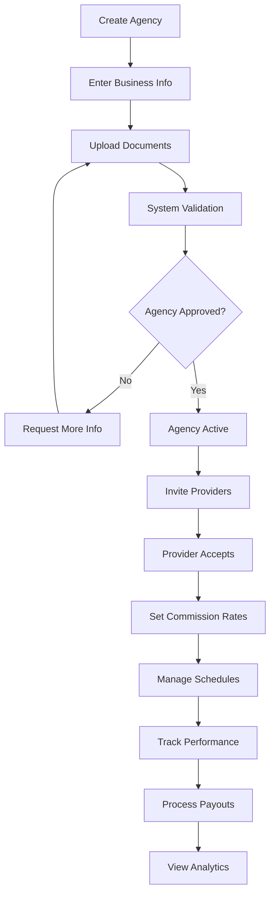

## **9. ⭐ LocalPro Plus Subscription Flow**

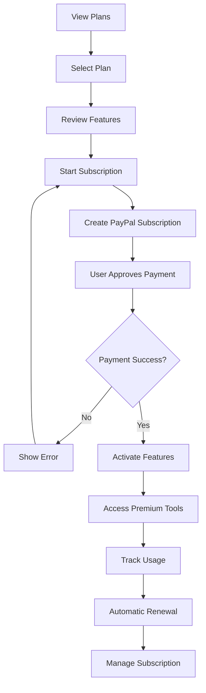

## **10. 🤝 Referral System Flow**

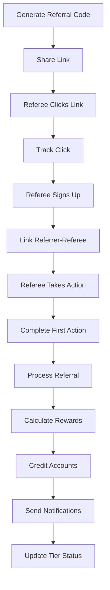

## **11. 🗺️ Location Services Flow**

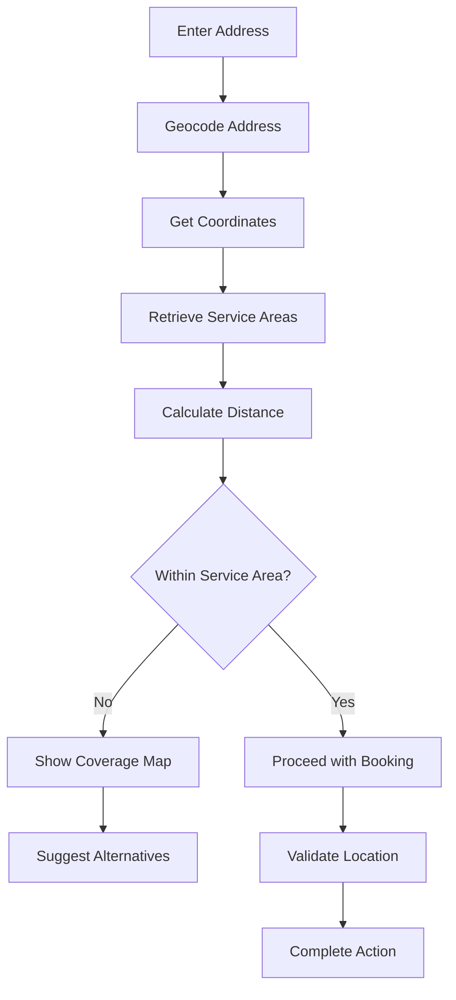

## **12. 📢 Advertising Campaign Flow**

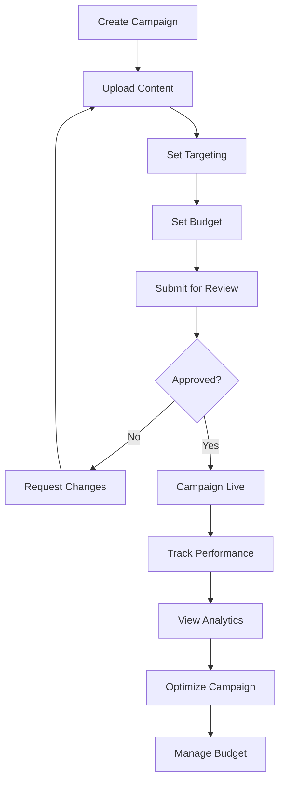

## **13. 🏢 Facility Care Flow**

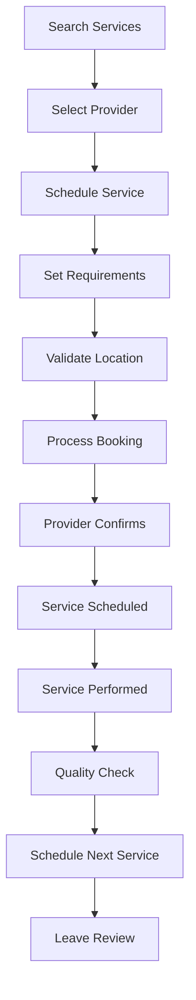

## **14. 🔒 Trust Verification Flow**

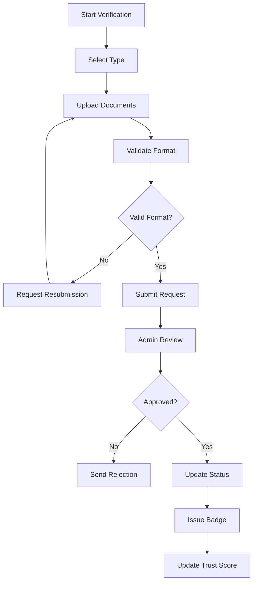

## **15. 📧 Communication Flow**

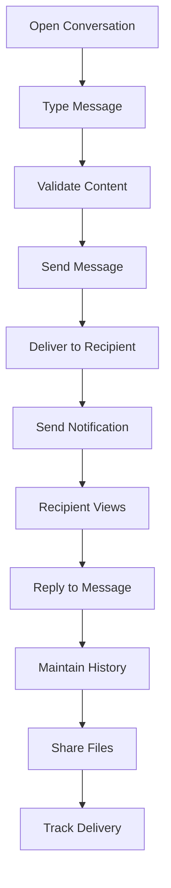

## **16. 📊 Analytics Flow**

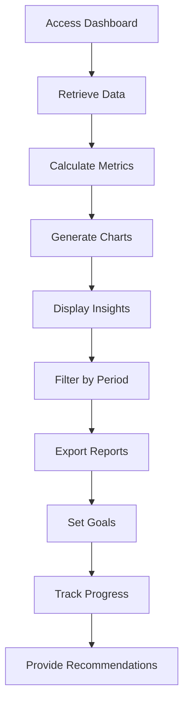

## **Cross-Module Integration Flows**

### **Payment Integration Flow**
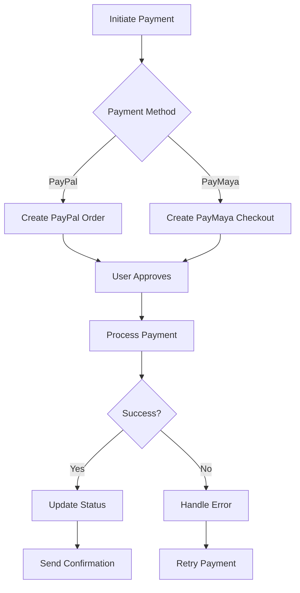

### **Location Validation Flow**
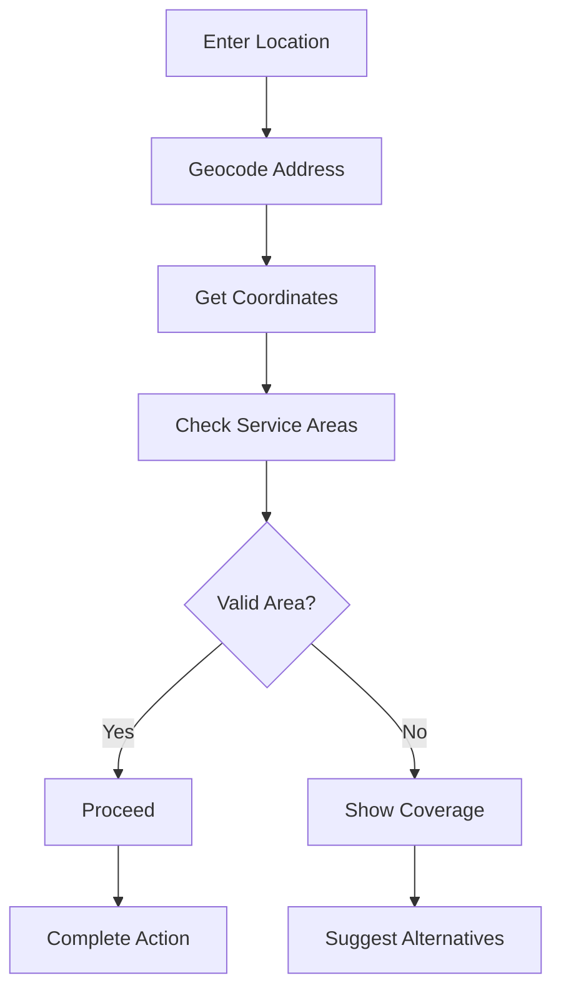

### **Notification Flow**
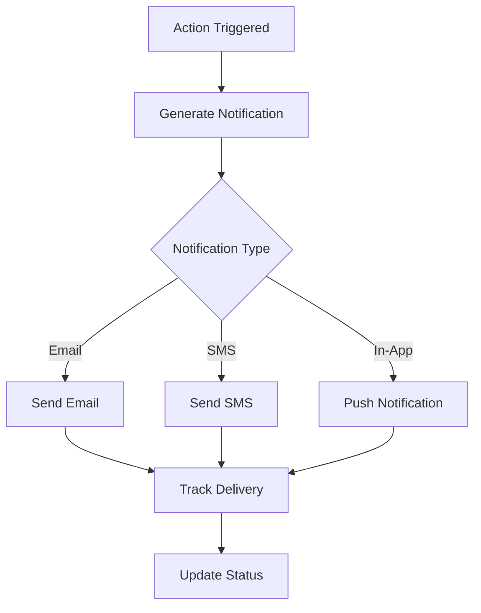

## **Error Handling Flows**

### **Payment Failure Flow**
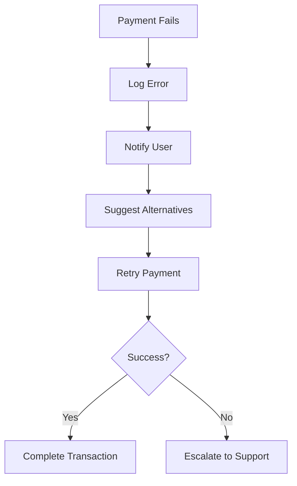

### **Service Area Validation Failure**
```mermaid
flowchart TD
    A[Location Invalid] --> B[Show Coverage Map]
    B --> C[Suggest Nearby Areas]
    C --> D[Offer Alternative Services]
    D --> E[User Selects Option]
    E --> F[Proceed with Selection]
```

---

*These flow diagrams provide visual representations of all major user journeys in the LocalPro Super App, showing the decision points, error handling, and integration points between different modules.*
