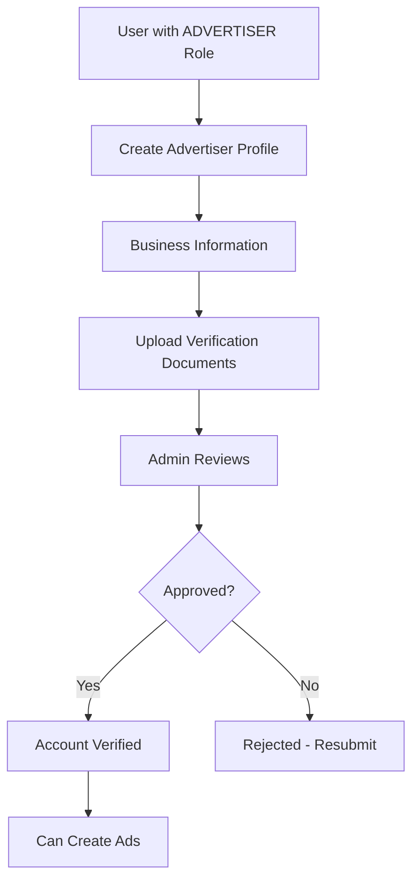
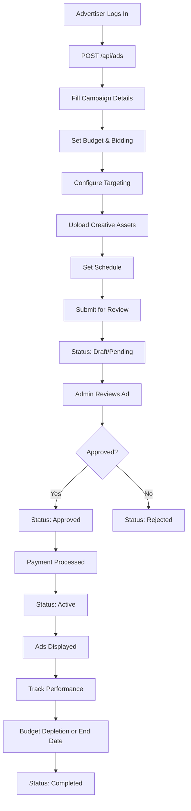
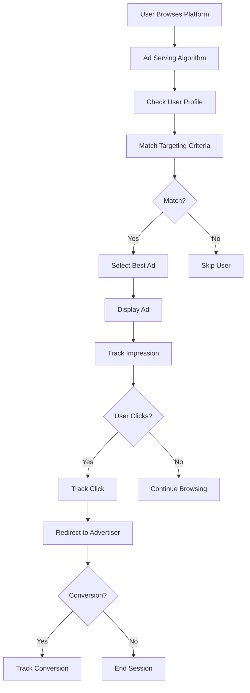
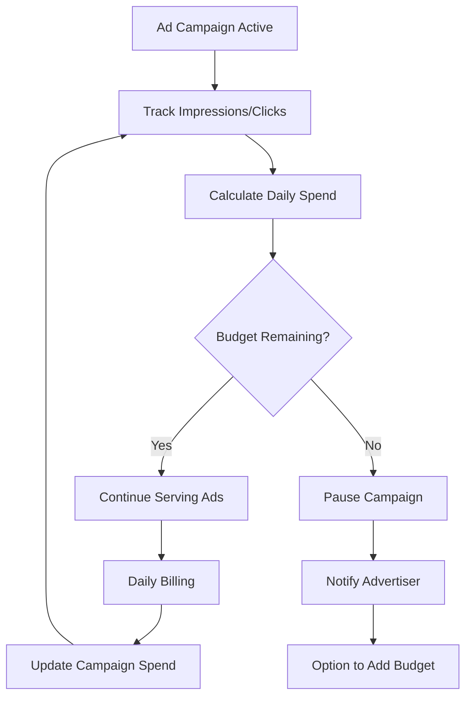

# 📢 Advertising System - Complete Documentation

## Overview

The LocalPro Advertising system is a comprehensive advertising platform that allows businesses to create, manage, and track advertising campaigns. It supports multiple ad types, bidding strategies, targeting options, and performance analytics.

---

## 👥 Who Can Create Ads

### **Advertisers (Who can create campaigns):**
- ✅ **ADVERTISER** - Primary role for creating and managing ad campaigns
- ✅ **ADMIN** - Can create ads for system management and testing

### **Access Control:**
```javascript
// From src/routes/ads.js
router.post('/', authorize('advertiser', 'admin'), createAd);
router.put('/:id', authorize('advertiser', 'admin'), updateAd);
router.delete('/:id', authorize('advertiser', 'admin'), deleteAd);
router.post('/:id/images', authorize('advertiser', 'admin'), uploadAdImages);
router.post('/:id/promote', authorize('advertiser', 'admin'), promoteAd);
```

**Requirements:**
- Must be authenticated
- Must have `advertiser` or `admin` role
- Advertiser field is automatically set to `req.user.id`
- Budget and payment must be configured

---

## 🔄 Complete Ad Campaign Flow

### **1. Advertiser Account Setup**



**Advertiser Profile Fields:**
- Business name, type, description
- Contact information (email, phone, website)
- Business address
- Verification documents (business license, tax certificate, insurance)
- Subscription plan (basic, premium, enterprise)

---

### **2. Ad Campaign Creation Flow**



**Step-by-Step:**

#### **Step 1: Create Campaign**
```javascript
POST /api/ads
Body: {
  title: "Hardware Store Grand Opening",
  description: "Visit our new location...",
  type: "banner",
  category: "hardware_stores",
  budget: {
    total: 1000,
    daily: 50,
    currency: "USD"
  },
  schedule: {
    startDate: "2023-07-15",
    endDate: "2023-07-31",
    timeSlots: []
  },
  targetAudience: {
    demographics: {
      ageRange: [25, 55],
      location: ["Manila", "Quezon City"]
    },
    behavior: {
      userTypes: ["providers", "clients"],
      activityLevel: "active"
    }
  },
  content: {
    headline: "Grand Opening Sale!",
    body: "20% off all tools...",
    callToAction: {
      text: "Shop Now",
      url: "https://..."
    }
  }
}
```

**Required Fields:**
- ✅ Title, description
- ✅ Type (banner, sponsored_listing, video, text, interactive)
- ✅ Category (hardware_stores, suppliers, training_schools, services, products)
- ✅ Budget total
- ✅ Schedule start and end dates

#### **Step 2: Upload Creative Assets**
```javascript
POST /api/ads/:id/images
// Upload images, videos, logos
```

#### **Step 3: Set Bidding Strategy**
**Bidding Strategies:**
- `cpc` - Cost Per Click (default)
- `cpm` - Cost Per Mille (per 1,000 impressions)
- `cpa` - Cost Per Acquisition/Action
- `fixed` - Fixed price placement

#### **Step 4: Submit for Review**
- Status changes: `draft` → `pending`
- Admin receives notification
- Ad content is reviewed for compliance

#### **Step 5: Admin Approval**
- Admin reviews ad content, targeting, budget
- Status: `approved` or `rejected`
- If rejected, advertiser receives notes

#### **Step 6: Payment & Activation**
- Payment processed (budget allocated)
- Status: `active`
- Ads start displaying based on targeting

#### **Step 7: Performance Tracking**
- Impressions tracked
- Clicks tracked
- Conversions tracked
- Analytics available via `GET /api/ads/:id/analytics`

#### **Step 8: Campaign Completion**
- Budget depleted OR
- End date reached
- Status: `completed` or `paused`

---

### **3. Ad Display & User Interaction Flow**



**Ad Serving Logic:**
1. User visits a page
2. System checks user profile against ad targeting
3. Matches ads based on:
   - Demographics (age, location, gender)
   - Behavior (user type, activity level)
   - Category interests
4. Selects highest bid/quality ad
5. Displays ad and tracks impression
6. User interaction tracked

---

## 💰 LocalPro Revenue Generation

### **Revenue Streams**

#### **1. Ad Budget Revenue** ⭐ Primary Revenue

**Revenue Model:**
LocalPro retains 100% of ad budgets paid by advertisers. Advertisers prepay their campaign budgets, and LocalPro charges based on actual performance (clicks, impressions, conversions).

**Pricing Models:**

##### **A. Cost Per Click (CPC) - Default**
```
Advertiser sets: $2.00 per click
Budget: $1,000
Expected Clicks: 500

Revenue: $1,000 (100% retention)
```

##### **B. Cost Per Mille (CPM) - Per 1,000 Impressions**
```
Advertiser sets: $5.00 per 1,000 impressions
Budget: $1,000
Expected Impressions: 200,000

Revenue: $1,000 (100% retention)
```

##### **C. Cost Per Acquisition (CPA)**
```
Advertiser sets: $50.00 per conversion
Budget: $1,000
Expected Conversions: 20

Revenue: $1,000 (100% retention)
```

##### **D. Fixed Price Placement**
```
Featured Banner Position: $500/month
Sponsored Listing: $300/month

Revenue: Fixed monthly/annual fees
```

---

#### **2. Platform Service Fees** 

**Suggested Implementation:**
- **Setup Fee**: $10-25 per campaign (one-time)
- **Management Fee**: 5-10% of budget (optional)
- **Payment Processing Fee**: 2.9% + $0.30 (if using payment gateway)

**Example:**
```
Campaign Budget: $1,000
Setup Fee: $15
Management Fee (5%): $50
Total Revenue: $1,065
```

---

#### **3. Featured/Premium Placement Fees**

**Promotion Types:**

##### **A. Featured Placement**
```javascript
POST /api/ads/:id/promote
Body: {
  promotionType: "featured",
  duration: 30,  // days
  budget: 500   // USD
}
```

**Revenue:** Direct payment for premium placement
- Featured banner: $500-1,500/month
- Top position: $300-800/month
- Sidebar placement: $100-300/month

##### **B. Sponsored Listings**
- Higher visibility in search results
- Priority in category pages
- **Revenue:** $200-500/month per listing

##### **C. Boosted Campaigns**
- Extra budget allocation
- Increased impression rate
- **Revenue:** 20-30% premium on base budget

---

#### **4. Advertiser Subscription Plans**

**Subscription Tiers:**

##### **Basic Plan:**
- Monthly fee: $29/month
- 5 active campaigns
- Basic analytics
- Email support

##### **Premium Plan:**
- Monthly fee: $99/month
- Unlimited campaigns
- Advanced analytics
- Priority support
- Discount on ad spending (5% off)

##### **Enterprise Plan:**
- Monthly fee: $299/month
- Unlimited campaigns
- Custom analytics
- Dedicated account manager
- Discount on ad spending (10% off)
- API access

**Revenue:**
```
Basic: 50 advertisers × $29 = $1,450/month
Premium: 20 advertisers × $99 = $1,980/month
Enterprise: 5 advertisers × $299 = $1,495/month
Total MRR: $4,925/month
```

---

#### **5. Verification & Compliance Fees**

**Advertiser Verification:**
- Initial verification: $50 (one-time)
- Annual renewal: $25
- Expedited review: $100 (24-hour turnaround)

**Ad Content Review:**
- Standard review: Free (included)
- Priority review: $25 per ad
- Custom review: $50 per complex ad

---

#### **6. Performance Bonus (Revenue Share)**

**Optional Revenue Model:**
LocalPro can offer performance-based pricing where advertiser success = platform success:

- If ad generates bookings/sales through LocalPro:
  - LocalPro takes commission on transactions
  - Example: Ad leads to service booking → LocalPro earns 2.9% booking fee

---

## 📊 Revenue Calculation Examples

### **Scenario 1: Small Business Banner Campaign**

**Campaign Details:**
- Type: Banner ad
- Bidding: CPC at $1.50/click
- Budget: $500
- Duration: 30 days

**Performance:**
- Impressions: 50,000
- Clicks: 333
- Conversions: 10

**Revenue Breakdown:**
```
Total Budget Paid: $500.00
Platform Revenue: $500.00 (100%)
```

**Additional Revenue:**
- If conversions led to 10 bookings at $100 each:
  - Booking commission (2.9%): $29.00
  - Total Revenue: $529.00

---

### **Scenario 2: Enterprise Sponsored Listing**

**Campaign Details:**
- Type: Sponsored listing
- Pricing: Fixed $800/month
- Duration: 12 months
- Subscription: Enterprise plan

**Revenue Breakdown:**
```
Monthly Ad Revenue: $800.00
Subscription Fee: $299.00
Total Monthly Revenue: $1,099.00
Annual Revenue: $13,188.00
```

---

### **Scenario 3: Multiple Campaign Portfolio**

**Advertiser Portfolio:**
- 3 Banner campaigns: $1,500/month total
- 1 Sponsored listing: $500/month
- Featured promotion: $300/month
- Premium subscription: $99/month

**Monthly Revenue from One Advertiser:**
```
Banner Budgets: $1,500.00
Sponsored Listing: $500.00
Featured Placement: $300.00
Subscription: $99.00
Total: $2,399.00/month
```

---

### **Scenario 4: Platform-Wide Revenue Projection**

**Assumptions:**
- 100 active advertisers
- Average budget per advertiser: $500/month
- 30% on subscriptions (average $50/month)
- 20% use featured placements (average $200/month)

**Monthly Revenue Calculation:**
```
Ad Budgets: 100 × $500 = $50,000
Subscriptions: 30 × $50 = $1,500
Featured Placements: 20 × $200 = $4,000
Setup Fees (new campaigns): ~$1,000
Verification Fees: ~$500

Total Monthly Revenue: ~$57,000
Annual Revenue: ~$684,000
```

---

## 🎯 Ad Types & Pricing

### **1. Banner Ads**
- **Placement:** Top of pages, sidebar, between content
- **Pricing:** CPC $0.50-$3.00 or CPM $2-$10
- **Best For:** Brand awareness, promotions

### **2. Sponsored Listings**
- **Placement:** Top of search results, category pages
- **Pricing:** $200-$800/month fixed or CPC $1-$5
- **Best For:** Direct leads, conversions

### **3. Video Ads**
- **Placement:** In-feed, pre-roll, banner
- **Pricing:** CPM $5-$20 or fixed $500-$2,000/month
- **Best For:** Engagement, storytelling

### **4. Text Ads**
- **Placement:** Search results, listings
- **Pricing:** CPC $0.30-$1.50
- **Best For:** Cost-effective, targeted traffic

### **5. Interactive Ads**
- **Placement:** Full-page, in-app
- **Pricing:** Fixed $1,000-$5,000/month
- **Best For:** High engagement, premium brands

---

## 📈 Performance Metrics & Billing

### **Tracked Metrics:**

#### **Impressions**
- Number of times ad is displayed
- Billing for CPM campaigns
- Revenue = (Impressions / 1,000) × CPM Rate

#### **Clicks**
- Number of times ad is clicked
- Billing for CPC campaigns
- Revenue = Clicks × CPC Rate

#### **Conversions**
- User actions (bookings, purchases, sign-ups)
- Billing for CPA campaigns
- Revenue = Conversions × CPA Rate

#### **Click-Through Rate (CTR)**
- CTR = (Clicks / Impressions) × 100
- Higher CTR = Better ad quality = Higher revenue potential

#### **Cost Per Acquisition (CPA)**
- CPA = Total Spend / Conversions
- Lower CPA = More efficient campaigns

---

### **Billing Flow:**



**Daily Billing Process:**
1. Track all impressions/clicks for the day
2. Calculate cost based on bidding strategy
3. Deduct from campaign budget
4. Update `performance.spend` field
5. If budget depleted, pause campaign
6. Notify advertiser

---

## 🔧 Implementation Recommendations

### **1. Payment Integration**

**Prepaid Model (Recommended):**
```javascript
// When ad is approved
const ad = await AdCampaign.findById(adId);
if (ad.status === 'approved') {
  // Process payment for budget
  await processPayment({
    userId: ad.advertiser,
    amount: ad.budget.total,
    description: `Ad campaign: ${ad.title}`,
    type: 'ad_budget'
  });
  
  // Activate campaign
  ad.status = 'active';
  await ad.save();
}
```

**Pay-as-You-Go Model (Alternative):**
- Weekly/monthly billing
- Invoice advertiser based on actual spend
- Require credit card on file

---

### **2. Budget Management**

**Daily Budget Allocation:**
```javascript
// Calculate daily budget
const days = (endDate - startDate) / (1000 * 60 * 60 * 24);
const dailyBudget = totalBudget / days;

// Track daily spend
ad.performance.spend += dailyCost;
ad.budget.daily = dailyBudget;

// Check if budget exceeded
if (ad.performance.spend >= ad.budget.total) {
  ad.status = 'paused';
  // Notify advertiser
}
```

---

### **3. Ad Serving Algorithm**

**Priority Ranking:**
```javascript
// Score ads based on:
1. Bid amount (higher = better)
2. Ad quality score (CTR, relevance)
3. Advertiser subscription tier
4. Budget remaining
5. Targeting match quality

// Select top-scoring ads for display
```

---

### **4. Revenue Tracking**

**Transaction Records:**
```javascript
// Record each ad purchase
await Transaction.create({
  user: advertiserId,
  type: 'ad_purchase',
  amount: adBudget,
  direction: 'outbound',
  description: `Ad campaign: ${adTitle}`,
  reference: `ad_${adId}`,
  status: 'completed',
  metadata: {
    source: 'advertising',
    campaignId: adId,
    budget: adBudget,
    duration: durationDays
  }
});
```

---

### **5. Analytics Dashboard**

**For Advertisers:**
- Campaign performance
- Spend tracking
- ROI calculations
- Audience insights

**For LocalPro Admin:**
- Total ad revenue
- Active campaigns
- Top advertisers
- Platform-wide metrics

---

## 🎯 Revenue Optimization Strategies

### **1. Dynamic Pricing**
- Increase CPC/CPM rates during high-demand periods
- Discount rates during low-demand periods
- Seasonal adjustments

### **2. Minimum Budget Requirements**
- Ensure minimum spend per campaign ($50-100)
- Increase average campaign value

### **3. Package Deals**
- Multi-campaign discounts
- Annual payment discounts (10-15% off)
- Bundle subscriptions with ad credits

### **4. Premium Features**
- Advanced targeting: +20% premium
- Video ads: Higher rates
- Real-time analytics: Subscription add-on

### **5. Referral Program**
- Existing advertisers refer new advertisers
- Both get ad credits
- Expand advertiser base

---

## 📝 Summary

### **Who Creates Ads:**
- ✅ ADVERTISER (primary)
- ✅ ADMIN

### **Revenue Sources:**
1. **Ad Budgets** (100% retention) - Primary
2. **Featured/Premium Placements** - High margin
3. **Subscription Plans** - Recurring revenue
4. **Setup & Verification Fees** - One-time
5. **Performance Fees** - Percentage of conversions
6. **Payment Processing Fees** - Transaction fees

### **Revenue Potential:**
- Small scale (50 advertisers): ~$25,000/month
- Medium scale (200 advertisers): ~$100,000/month
- Large scale (1,000 advertisers): ~$500,000/month

### **Key Metrics:**
- Average budget per advertiser
- Campaign completion rate
- Advertiser retention rate
- CTR and conversion rates
- Platform ad fill rate

### **Next Steps:**
1. Implement payment processing for ad budgets
2. Build ad serving algorithm
3. Create analytics dashboard
4. Set up automated billing
5. Implement advertiser onboarding flow

---

**Last Updated:** 2024
**Document Version:** 1.0

