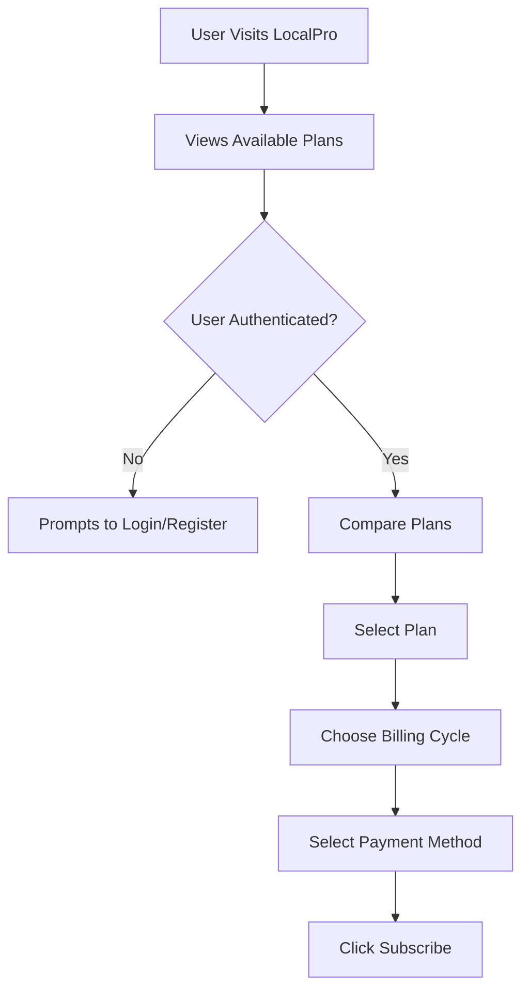
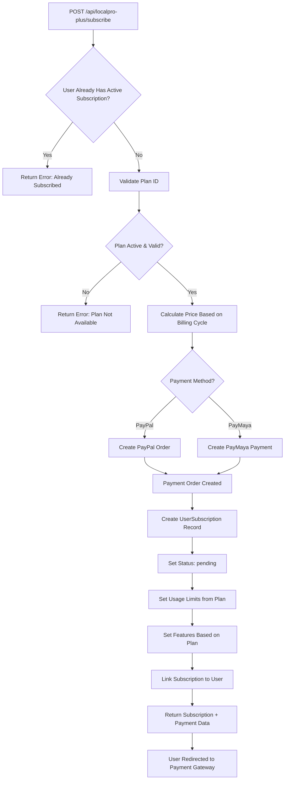
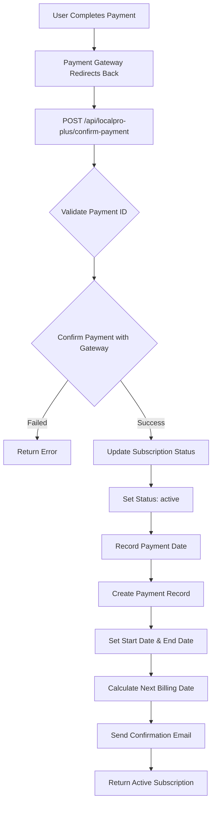
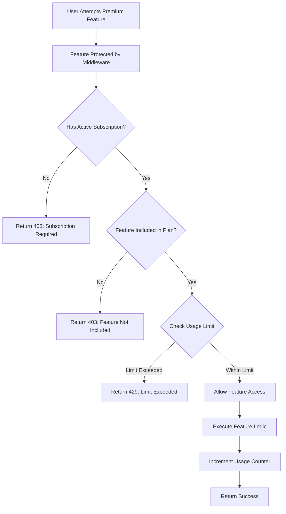
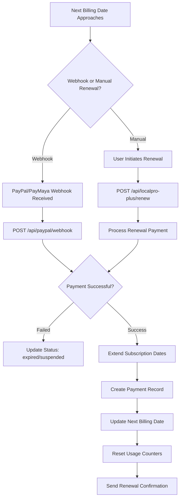
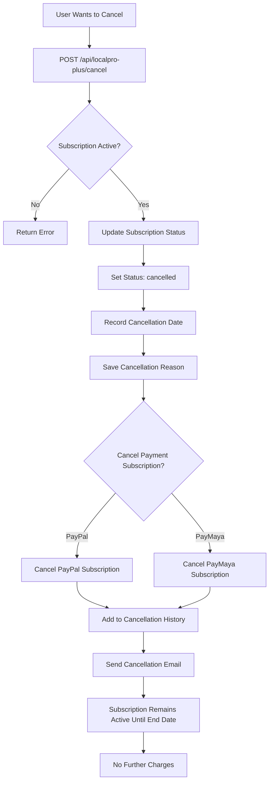
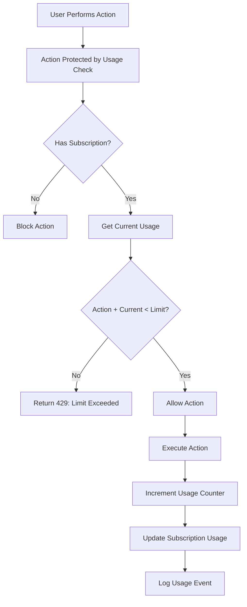
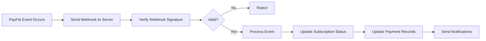
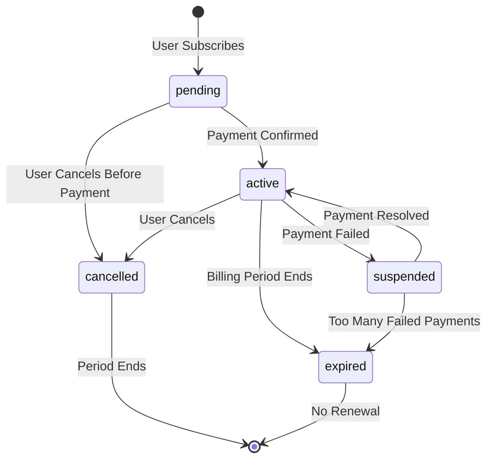

# LocalPro Plus - Complete Feature Overview & Process Flow

## 📋 What is LocalPro Plus?

**LocalPro Plus** is a premium subscription service that provides users with enhanced features, increased usage limits, and priority access across the LocalPro platform. It's designed for service providers, businesses, and power users who need more than the basic free tier.

### Purpose:
- **Monetization**: Generate recurring revenue through subscription plans
- **Feature Gating**: Restrict premium features to paying subscribers
- **Usage Management**: Control platform resource usage through tiered limits
- **Value Addition**: Provide enhanced tools and capabilities to subscribed users

---

## 🎯 Core Features

### 1. **Subscription Plans**
- **Basic Plan** ($9.99/month, $99.99/year)
- **Standard Plan** ($19.99/month, $199.99/year) ⭐ Popular
- **Premium Plan** ($39.99/month, $399.99/year)
- **Enterprise Plan** ($99.99/month, $999.99/year)

### 2. **Usage Limits Management**
- Maximum services per plan
- Maximum bookings per month
- Storage limits (MB/GB)
- API call limits
- Team/provider member limits

### 3. **Premium Features**
- Priority Support
- Advanced Analytics
- Custom Branding
- API Access
- White Label Options
- Team Management

### 4. **Payment Integration**
- PayPal subscription support
- PayMaya payment processing
- Automatic recurring billing
- Webhook handling for payment events

---

## 🔄 Complete Subscription Flow

### **1. Subscription Discovery & Selection Flow**



**API Endpoints:**
- `GET /api/localpro-plus/plans` - View all available plans
- `GET /api/localpro-plus/plans/:id` - View specific plan details

---

### **2. Subscription Creation Flow**



**API Endpoint:**
```http
POST /api/localpro-plus/subscribe
Content-Type: application/json

{
  "planId": "plan_id",
  "paymentMethod": "paypal|paymaya",
  "billingCycle": "monthly|yearly"
}
```

**What Happens:**
1. System checks if user already has active subscription
2. Validates plan exists and is active
3. Calculates price (monthly or yearly)
4. Creates payment order with PayPal or PayMaya
5. Creates `UserSubscription` record with:
   - Status: `pending`
   - Usage limits initialized
   - Features enabled based on plan
   - Payment details stored
6. Links subscription to user account
7. Returns payment data for frontend processing

---

### **3. Payment Confirmation Flow**



**API Endpoint:**
```http
POST /api/localpro-plus/confirm-payment
Content-Type: application/json

{
  "paymentId": "payment_id",
  "paymentMethod": "paypal|paymaya"
}
```

**What Happens:**
1. Payment gateway returns payment ID
2. System confirms payment with PayPal/PayMaya
3. Updates subscription status from `pending` → `active`
4. Creates `Payment` record with `completed` status
5. Sets subscription dates (start, end, next billing)
6. Sends confirmation email to user
7. User gains access to premium features

---

### **4. Active Subscription Usage Flow**



**Middleware Protection:**
```javascript
// Example: Protect a route with subscription
router.get('/premium-feature', 
  requireActiveSubscription,  // Check subscription exists
  requireFeatureAccess('advanced_analytics'),  // Check feature
  checkUsageLimit('api_calls'),  // Check usage
  premiumFeatureHandler,
  incrementUsage('api_calls')  // Track usage
);
```

---

### **5. Subscription Renewal Flow**



**Automatic Renewal (Webhook):**
- PayPal sends webhook events:
  - `BILLING.SUBSCRIPTION.PAYMENT.COMPLETED` → Renewal successful
  - `BILLING.SUBSCRIPTION.PAYMENT.FAILED` → Payment failed
  - `BILLING.SUBSCRIPTION.EXPIRED` → Subscription expired

**Manual Renewal:**
```http
POST /api/localpro-plus/renew
Content-Type: application/json

{
  "paymentMethod": "paypal|paymaya"
}
```

---

### **6. Subscription Cancellation Flow**



**API Endpoint:**
```http
POST /api/localpro-plus/cancel
Content-Type: application/json

{
  "reason": "Too expensive, Found alternative, etc."
}
```

**Important:** Cancelled subscriptions remain active until the end of the current billing period. No refunds are issued, but no further charges occur.

---

### **7. Usage Tracking Flow**



**Usage Check Endpoint:**
```http
GET /api/localpro-plus/usage
```

**Response:**
```json
{
  "success": true,
  "data": {
    "plan": {
      "name": "Standard",
      "features": [...]
    },
    "currentUsage": {
      "services": 8,
      "bookings": 45,
      "storage": 250,  // MB
      "apiCalls": 1200
    },
    "limits": {
      "maxServices": 15,
      "maxBookings": 100,
      "maxStorage": 500,  // MB
      "maxApiCalls": 5000
    },
    "status": "active",
    "nextBillingDate": "2024-12-15"
  }
}
```

---

## 📊 Data Models Overview

### **SubscriptionPlan**
```javascript
{
  name: "Standard",
  description: "Perfect for growing businesses",
  price: {
    monthly: 19.99,
    yearly: 199.99,
    currency: "USD"
  },
  features: [
    { name: "advanced_analytics", included: true, limit: null },
    { name: "priority_support", included: true, limit: null }
  ],
  limits: {
    maxServices: 15,
    maxBookings: 100,
    maxProviders: 3,
    maxStorage: 500,  // MB
    maxApiCalls: 5000
  },
  benefits: ["Advanced analytics", "Priority support"],
  isActive: true,
  isPopular: true
}
```

### **UserSubscription**
```javascript
{
  user: ObjectId,
  plan: ObjectId,
  status: "active" | "cancelled" | "expired" | "suspended" | "pending",
  billingCycle: "monthly" | "yearly",
  startDate: Date,
  endDate: Date,
  nextBillingDate: Date,
  paymentMethod: "paypal" | "paymaya",
  usage: {
    services: { current: 8, limit: 15 },
    bookings: { current: 45, limit: 100 },
    storage: { current: 250, limit: 500 },
    apiCalls: { current: 1200, limit: 5000 }
  },
  features: {
    prioritySupport: true,
    advancedAnalytics: true,
    customBranding: true,
    apiAccess: true,
    whiteLabel: false
  }
}
```

### **Payment**
```javascript
{
  user: ObjectId,
  subscription: ObjectId,
  amount: 19.99,
  currency: "USD",
  status: "completed" | "pending" | "failed",
  paymentMethod: "paypal",
  paymentDetails: {
    paypalOrderId: "ORDER_123",
    transactionId: "TXN_456"
  },
  billingPeriod: {
    startDate: Date,
    endDate: Date
  },
  processedAt: Date
}
```

---

## 🔐 Access Control Middleware

### **1. requireActiveSubscription**
Checks if user has an active subscription.

```javascript
router.get('/premium-dashboard', 
  requireActiveSubscription, 
  dashboardHandler
);
```

### **2. requireFeatureAccess(featureName)**
Checks if user's plan includes specific feature.

```javascript
router.get('/advanced-analytics', 
  requireFeatureAccess('advanced_analytics'),
  analyticsHandler
);
```

### **3. checkUsageLimit(featureName)**
Validates usage hasn't exceeded plan limits.

```javascript
router.post('/create-service',
  checkUsageLimit('services'),
  createServiceHandler,
  incrementUsage('services')
);
```

### **4. requirePlanLevel(level)**
Ensures user has minimum plan level (e.g., Premium or higher).

```javascript
router.get('/white-label',
  requirePlanLevel('premium'),
  whiteLabelHandler
);
```

---

## 🌐 API Endpoints Summary

### **Public Endpoints:**
- `GET /api/localpro-plus/plans` - View all plans
- `GET /api/localpro-plus/plans/:id` - View single plan

### **User Endpoints (Requires Auth):**
- `POST /api/localpro-plus/subscribe` - Subscribe to plan
- `POST /api/localpro-plus/confirm-payment` - Confirm payment
- `GET /api/localpro-plus/my-subscription` - Get my subscription
- `GET /api/localpro-plus/usage` - Get usage statistics
- `PUT /api/localpro-plus/settings` - Update settings
- `POST /api/localpro-plus/renew` - Renew subscription
- `POST /api/localpro-plus/cancel` - Cancel subscription

### **Admin Endpoints (Requires Admin Role):**
- `POST /api/localpro-plus/plans` - Create plan
- `PUT /api/localpro-plus/plans/:id` - Update plan
- `DELETE /api/localpro-plus/plans/:id` - Delete plan
- `GET /api/localpro-plus/analytics` - Get analytics

---

## 🔔 Webhook Integration

### **PayPal Webhooks**
Endpoint: `POST /api/paypal/webhook`

**Handled Events:**
- `PAYMENT.CAPTURE.COMPLETED` - Initial payment successful
- `BILLING.SUBSCRIPTION.ACTIVATED` - Subscription activated
- `BILLING.SUBSCRIPTION.PAYMENT.COMPLETED` - Renewal payment successful
- `BILLING.SUBSCRIPTION.PAYMENT.FAILED` - Payment failed
- `BILLING.SUBSCRIPTION.CANCELLED` - Subscription cancelled
- `BILLING.SUBSCRIPTION.EXPIRED` - Subscription expired
- `BILLING.SUBSCRIPTION.SUSPENDED` - Subscription suspended

**Webhook Flow:**


---

## 📈 Subscription Lifecycle States



**Status Transitions:**
1. **pending** → User initiated subscription, awaiting payment
2. **active** → Payment confirmed, full access granted
3. **cancelled** → User cancelled, remains active until period end
4. **expired** → Billing period ended, no renewal
5. **suspended** → Payment failed, access restricted

---

## 💡 Usage Examples

### **Protecting a Premium Route:**
```javascript
const express = require('express');
const { requireActiveSubscription } = require('../middleware/subscriptionAccess');

router.get('/premium-features', 
  requireActiveSubscription,
  (req, res) => {
    res.json({ 
      features: ['Advanced Analytics', 'Priority Support'] 
    });
  }
);
```

### **Checking Feature Access:**
```javascript
const { requireFeatureAccess } = require('../middleware/subscriptionAccess');

router.get('/custom-branding',
  requireFeatureAccess('custom_branding'),
  (req, res) => {
    // User has custom branding feature
    res.json({ branding: userCustomBranding });
  }
);
```

### **Tracking Service Creation:**
```javascript
const { checkUsageLimit, incrementUsage } = require('../middleware/subscriptionAccess');

router.post('/services',
  checkUsageLimit('services'),
  createService,
  incrementUsage('services'),
  (req, res) => {
    res.json({ service: req.service });
  }
);
```

---

## 🎯 Key Benefits for Users

1. **Increased Limits**: More services, bookings, storage
2. **Premium Features**: Advanced analytics, custom branding
3. **Priority Support**: Faster response times
4. **API Access**: Programmatic access to platform
5. **Team Management**: Multiple team members
6. **White Label**: Brand customization (higher tiers)

---

## 💰 Revenue Generation

- **Recurring Revenue**: Monthly/yearly subscriptions
- **Tiered Pricing**: Higher plans = more revenue
- **Upsell Opportunities**: Encourage upgrades
- **Retention**: Automatic renewals

---

**Last Updated:** 2024  
**System Version:** 1.0

