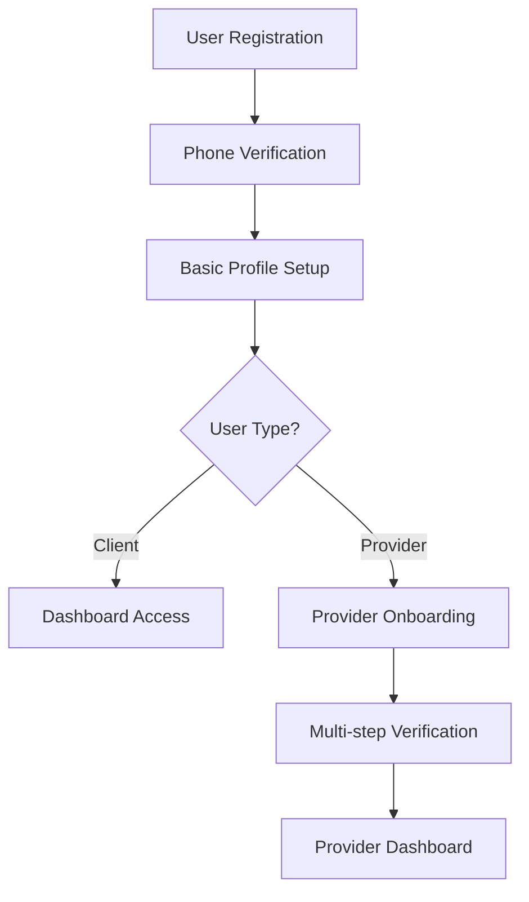

# 🎯 **LocalPro Super App - Onboarding API Documentation**

## **Overview**
The LocalPro Super App has a comprehensive onboarding system with two main flows:
1. **User Onboarding** - Basic profile completion after phone verification
2. **Provider Onboarding** - Multi-step provider verification process

---

## **1. 🔐 User Onboarding API**

### **Complete User Onboarding**
Complete the basic user profile setup after phone verification.

**Endpoint:** `POST /api/auth/complete-onboarding`  
**Access:** Private (requires authentication)  
**Content-Type:** `application/json`

#### **Request Body**
```json
{
  "firstName": "John",
  "lastName": "Doe", 
  "email": "john.doe@example.com"
}
```

#### **Request Parameters**
| Field | Type | Required | Validation | Description |
|-------|------|----------|------------|-------------|
| `firstName` | String | ✅ | 2-50 characters | User's first name |
| `lastName` | String | ✅ | 2-50 characters | User's last name |
| `email` | String | ✅ | Valid email format, unique | User's email address |

#### **Success Response (200)**
```json
{
  "success": true,
  "message": "Onboarding completed successfully",
  "token": "eyJhbGciOiJIUzI1NiIsInR5cCI6IkpXVCJ9...",
  "user": {
    "id": "64f8a1b2c3d4e5f6a7b8c9d0",
    "phoneNumber": "+1234567890",
    "firstName": "John",
    "lastName": "Doe",
    "email": "john.doe@example.com",
    "role": "client",
    "isVerified": true,
    "subscription": {
      "type": "free",
      "isActive": false
    },
    "trustScore": 0,
    "referral": {
      "referralCode": "JD123456"
    },
    "profile": {
      "avatar": null,
      "bio": null
    }
  },
  "redirect": {
    "destination": "dashboard",
    "reason": "User onboarding completed successfully"
  }
}
```

#### **Error Responses**

**400 - Missing Required Fields**
```json
{
  "success": false,
  "message": "First name, last name, and email are required",
  "code": "MISSING_REQUIRED_FIELDS"
}
```

**400 - Invalid Input Length**
```json
{
  "success": false,
  "message": "First name must be between 2 and 50 characters",
  "code": "INVALID_FIRST_NAME_LENGTH"
}
```

**400 - Invalid Email Format**
```json
{
  "success": false,
  "message": "Invalid email format",
  "code": "INVALID_EMAIL_FORMAT"
}
```

**400 - Email Already Exists**
```json
{
  "success": false,
  "message": "Email is already registered with another account",
  "code": "EMAIL_ALREADY_EXISTS"
}
```

**401 - Unauthorized**
```json
{
  "success": false,
  "message": "Access denied. No token provided.",
  "code": "UNAUTHORIZED"
}
```

**404 - User Not Found**
```json
{
  "success": false,
  "message": "User not found",
  "code": "USER_NOT_FOUND"
}
```

**500 - Server Error**
```json
{
  "success": false,
  "message": "Server error. Please try again.",
  "code": "INTERNAL_SERVER_ERROR"
}
```

#### **Features**
- ✅ **Input Validation**: Comprehensive validation for all fields
- ✅ **Email Uniqueness**: Prevents duplicate email addresses
- ✅ **Welcome Email**: Automatically sends welcome email to new users
- ✅ **Referral Code**: Generates unique referral code for user
- ✅ **Token Refresh**: Returns updated JWT token with new user info
- ✅ **Status Update**: Changes user status to 'active'
- ✅ **Audit Logging**: Comprehensive logging for security and debugging
- ✅ **Error Handling**: Detailed error messages with specific codes

---

## **2. 🏢 Provider Onboarding API**

### **Update Provider Onboarding Step**
Update a specific step in the provider onboarding process.

**Endpoint:** `PUT /api/providers/onboarding/step`  
**Access:** Private (requires authentication)  
**Content-Type:** `application/json`

#### **Request Body**
```json
{
  "step": "business_info",
  "data": {
    "businessName": "John's Plumbing Service",
    "businessType": "individual",
    "yearsInBusiness": 5,
    "serviceAreas": ["New York", "Brooklyn"],
    "specialties": ["plumbing", "emergency_repairs"]
  }
}
```

#### **Request Parameters**
| Field | Type | Required | Description |
|-------|------|----------|-------------|
| `step` | String | ✅ | Onboarding step identifier |
| `data` | Object | ✅ | Step-specific data |

#### **Available Onboarding Steps**
1. `personal_info` - Personal information
2. `business_info` - Business details
3. `services` - Service offerings
4. `location` - Service areas
5. `pricing` - Pricing structure
6. `documents` - Required documents
7. `verification` - Identity verification
8. `review` - Final review

#### **Success Response (200)**
```json
{
  "success": true,
  "message": "Onboarding step updated successfully",
  "data": {
    "step": "business_info",
    "progress": 25,
    "completed": false
  }
}
```

#### **Error Responses**

**400 - Invalid Step**
```json
{
  "success": false,
  "message": "Invalid onboarding step",
  "code": "INVALID_STEP"
}
```

**404 - Provider Not Found**
```json
{
  "success": false,
  "message": "Provider profile not found",
  "code": "PROVIDER_NOT_FOUND"
}
```

---

## **3. 🔄 Complete Onboarding Flow**

### **User Journey**


### **API Flow Sequence**
1. **Phone Registration**: `POST /api/auth/send-code`
2. **Phone Verification**: `POST /api/auth/verify-code`
3. **Profile Completion**: `POST /api/auth/complete-onboarding`
4. **Provider Setup** (if applicable): `PUT /api/providers/onboarding/step`

---

## **4. 🛡️ Security Features**

### **Authentication**
- All onboarding endpoints require valid JWT token
- Token includes `onboardingComplete` status
- Automatic token refresh after profile completion

### **Validation**
- Input sanitization and validation
- Email format validation
- Length constraints on all text fields
- Uniqueness checks for email addresses

### **Rate Limiting**
- SMS verification rate limiting (1 per minute)
- API endpoint rate limiting via middleware

### **Audit Logging**
- Comprehensive logging of all onboarding activities
- Client information tracking (IP, User-Agent)
- Performance monitoring with duration tracking

---

## **5. 📱 Frontend Integration**

### **Onboarding Status Check**
The JWT token includes an `onboardingComplete` field that can be used to determine the user's onboarding status:

```javascript
// Decode JWT token
const token = localStorage.getItem('token');
const decoded = jwt.decode(token);

if (!decoded.onboardingComplete) {
  // Redirect to onboarding flow
  router.push('/onboarding');
} else {
  // Redirect to dashboard
  router.push('/dashboard');
}
```

### **Redirect Logic**
The API provides redirect information in responses:

```javascript
// After successful onboarding
if (response.data.redirect.destination === 'dashboard') {
  router.push('/dashboard');
} else if (response.data.redirect.destination === 'onboarding') {
  router.push('/onboarding');
}
```

---

## **6. 🧪 Testing**

### **Test User Onboarding**
```bash
# Complete user onboarding
curl -X POST http://localhost:5000/api/auth/complete-onboarding \
  -H "Content-Type: application/json" \
  -H "Authorization: Bearer YOUR_JWT_TOKEN" \
  -d '{
    "firstName": "John",
    "lastName": "Doe",
    "email": "john.doe@example.com"
  }'
```

### **Test Provider Onboarding**
```bash
# Update provider onboarding step
curl -X PUT http://localhost:5000/api/providers/onboarding/step \
  -H "Content-Type: application/json" \
  -H "Authorization: Bearer YOUR_JWT_TOKEN" \
  -d '{
    "step": "business_info",
    "data": {
      "businessName": "Test Business",
      "businessType": "individual"
    }
  }'
```

---

## **7. 📊 Monitoring & Analytics**

### **Key Metrics to Track**
- Onboarding completion rate
- Time to complete onboarding
- Drop-off points in the flow
- Email delivery success rate
- Provider verification success rate

### **Logging Information**
All onboarding activities are logged with:
- User ID and phone number (masked)
- Client IP and User-Agent
- Request duration
- Success/failure status
- Error details (if applicable)

---

## **8. 🔧 Configuration**

### **Environment Variables**
```env
# Email service configuration
EMAIL_SERVICE_ENABLED=true
SMTP_HOST=smtp.gmail.com
SMTP_PORT=587
SMTP_USER=your-email@gmail.com
SMTP_PASS=your-app-password

# Frontend URL for redirects
FRONTEND_URL=http://localhost:3000

# JWT configuration
JWT_SECRET=your-jwt-secret
```

### **Rate Limiting Configuration**
```javascript
// SMS verification rate limiting
const smsRateLimit = rateLimit({
  windowMs: 60 * 1000, // 1 minute
  max: 1, // 1 request per window
  message: 'Please wait before requesting another verification code'
});
```

---

## **9. 🚀 Deployment Notes**

### **Prerequisites**
- MongoDB database connection
- Twilio SMS service configured
- Email service configured (optional)
- Cloudinary for file uploads (for provider onboarding)

### **Health Checks**
- Database connectivity
- Twilio service availability
- Email service availability
- File upload service availability

---

## **10. 📞 Support**

For technical support or questions about the onboarding API:
- Check the application logs for detailed error information
- Verify all required environment variables are set
- Ensure database connectivity is working
- Test with the provided curl examples

**API Version:** v1.0  
**Last Updated:** October 2024  
**Maintainer:** LocalPro Development Team
