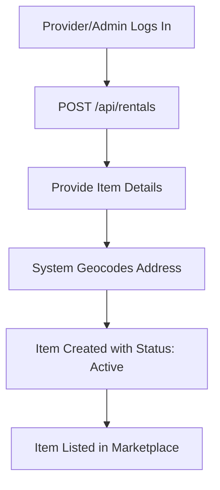
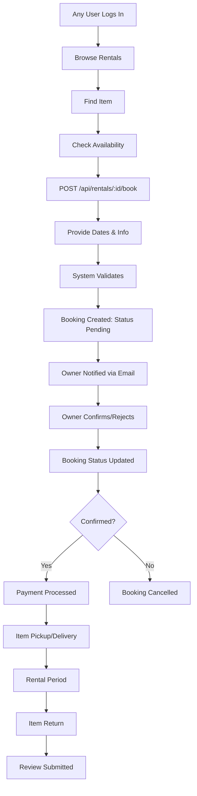

# 🛠️ Rentals System - Complete Documentation

## Overview

The LocalPro Rentals system is a peer-to-peer equipment rental marketplace that allows equipment owners to list their tools, vehicles, equipment, and machinery for rent, while renters can discover and book items they need.

---

## 👥 Who Can Create Rentals

### **Rental Owners (Who can list items):**
- ✅ **PROVIDER** - Primary role for listing rental items
- ✅ **ADMIN** - Can create rentals for system management

### **Access Control:**
```javascript
// From src/routes/rentals.js
router.post('/', authorize('provider', 'admin'), createRental);
router.post('/items', authorize('provider', 'admin'), createRental);
router.put('/:id', authorize('provider', 'admin'), updateRental);
router.delete('/:id', authorize('provider', 'admin'), deleteRental);
```

**Requirements:**
- Must be authenticated
- Must have `provider` or `admin` role
- Owner field is automatically set to `req.user.id`

---

## 🔐 Who Can Rent

### **Renters (Who can book items):**
- ✅ **Any Authenticated User** - CLIENT, PROVIDER, SUPPLIER, INSTRUCTOR, AGENCY_OWNER, AGENCY_ADMIN
- ❌ **Public/Unauthenticated Users** - Cannot book, only view

### **Booking Access:**
```javascript
// From src/routes/rentals.js
router.post('/:id/book', bookRental); // Requires auth middleware only
```

**Requirements:**
- Must be authenticated (any role)
- Must provide valid booking dates
- Item must be available for requested dates

---

## 🔄 Complete Rental Flow

### **1. Item Creation Flow (Owner Side)**



**Step-by-Step:**

1. **Owner Creates Listing**
   ```
   POST /api/rentals
   ```
   - Owner provides: name, title, description, category, pricing, location, specifications
   - System automatically:
     - Sets `owner` to current user ID
     - Geocodes address to get coordinates (for location search)
     - Sets `isActive: true`
     - Initializes views, ratings, bookings arrays

2. **Owner Uploads Images**
   ```
   POST /api/rentals/:id/images
   ```
   - Multiple images can be uploaded
   - Images stored in Cloudinary
   - Thumbnails generated automatically

3. **Item Goes Live**
   - Appears in public search results
   - Can be found via location-based search
   - Can be featured (admin control)

---

### **2. Booking Flow (Renter Side)**



**Detailed Steps:**

#### **Step 1: Discovery**
- Public endpoint: `GET /api/rentals`
- Search by category, location, price range
- Filter by availability
- Nearby search: `GET /api/rentals/nearby?lat=&lng=&radius=`

#### **Step 2: Booking Request**
```javascript
POST /api/rentals/:id/book
Body: {
  startDate: "2023-07-15T09:00:00.000Z",
  endDate: "2023-07-17T17:00:00.000Z",
  quantity: 1,
  specialRequests: "Please ensure fully charged",
  contactInfo: { phone: "...", email: "..." }
}
```

**Validation Checks:**
- ✅ Item exists and is active
- ✅ Start date is in the future
- ✅ End date is after start date
- ✅ Item is available for requested dates (no conflicts)
- ✅ Quantity available

#### **Step 3: Cost Calculation**
```javascript
// From rentalsController.js (line 502-503)
const days = Math.ceil((end - start) / (1000 * 60 * 60 * 24));
const totalCost = rental.pricing.daily * days * quantity;
```

**Cost Breakdown:**
- Base rental rate (daily/hourly/weekly/monthly)
- Delivery fee (if applicable)
- Insurance fee (if required)
- Deposit (held, not included in totalCost)
- **Platform Fee** (calculated but not explicitly in current code)

#### **Step 4: Booking Created**
- Booking added to item's `bookings` array
- Status: `pending`
- Owner receives email notification

#### **Step 5: Owner Response**
```javascript
PUT /api/rentals/:id/bookings/:bookingId/status
Body: { status: "confirmed" | "cancelled" }
```

**Status Flow:**
- `pending` → Owner reviews request
- `confirmed` → Booking approved, payment proceeds
- `cancelled` → Booking rejected or cancelled
- `completed` → Rental period finished

#### **Step 6: Payment Processing**
- Payment status tracked in booking
- Methods supported: PayPal, PayMaya, Bank Transfer, Cash
- Transaction ID stored
- Payment status: `pending` → `paid`

#### **Step 7: Rental Period**
- Pickup/Delivery scheduled
- Rental period active
- Communication between owner and renter
- Item condition documented

#### **Step 8: Return & Review**
- Item returned
- Condition checked
- Deposit released (if applicable)
- Renter can leave review (only after completed booking)

---

## 💰 LocalPro Revenue Generation

### **Revenue Streams**

#### **1. Transaction/Platform Fees** ⭐ Primary Revenue
Based on `AppSettings` payment configuration:

```javascript
// From src/models/AppSettings.js (lines 397-409)
transactionFees: {
  percentage: 2.9,  // Default 2.9%
  fixed: 0.30       // Default $0.30
}
```

**Fee Calculation Example:**
```
Booking Total: $100.00
Platform Fee: ($100 × 2.9%) + $0.30 = $2.90 + $0.30 = $3.20
Owner Receives: $100.00 - $3.20 = $96.80
```

**Implementation (Recommended):**
```javascript
// Should be added to booking calculation
const platformFee = {
  percentage: appSettings.payments.transactionFees.percentage,
  fixed: appSettings.payments.transactionFees.fixed
};

const platformCommission = (totalCost * platformFee.percentage / 100) + platformFee.fixed;
const ownerPayout = totalCost - platformCommission;
```

---

#### **2. Featured Listing Fees**
- Owners can pay to feature their items
- `isFeatured: true` - Premium placement in search results
- **Revenue Model:** One-time or recurring fee per listing

**Suggested Pricing:**
- Featured listing: $5-15 per week/month
- Top placement: Higher tier pricing

---

#### **3. Premium Membership for Owners**
- Enhanced listing features
- More images allowed
- Analytics dashboard
- Priority support
- **Revenue Model:** Monthly subscription fees

---

#### **4. Transaction Processing Fees**
- If LocalPro processes payments directly
- Small markup on payment processing
- Additional revenue beyond platform fee

---

#### **5. Insurance & Protection Services**
- Optional rental insurance
- Damage protection
- LocalPro acts as insurance provider/partner
- **Revenue Model:** Commission on insurance sales

---

#### **6. Verified Owner Badges**
- Verification program for professional equipment owners
- Badge display increases trust
- **Revenue Model:** Annual verification fee ($50-200/year)

---

#### **7. Advertisement Revenue**
- Banner ads on rental listing pages
- Sponsored listings in search results
- **Revenue Model:** CPM (Cost Per Thousand Impressions) or CPC

---

## 📊 Revenue Calculation Examples

### **Scenario 1: Single Rental Transaction**

**Booking Details:**
- Item: Professional Drill Set
- Daily Rate: $50
- Duration: 3 days
- Delivery Fee: $10
- Insurance: $5

**Calculation:**
```
Subtotal: $50 × 3 = $150
Delivery: $10
Insurance: $5
Total: $165

Platform Fee (2.9% + $0.30):
  Commission = ($165 × 2.9%) + $0.30
  Commission = $4.79 + $0.30 = $5.09

Owner Receives: $165 - $5.09 = $159.91
LocalPro Revenue: $5.09
```

---

### **Scenario 2: Weekly Rental**

**Booking Details:**
- Item: Excavator
- Weekly Rate: $1,500
- Duration: 2 weeks
- Deposit: $500 (returned, not revenue)

**Calculation:**
```
Subtotal: $1,500 × 2 = $3,000
Platform Fee: ($3,000 × 2.9%) + $0.30 = $87.30

Owner Receives: $2,912.70
LocalPro Revenue: $87.30
```

---

### **Scenario 3: Monthly Revenue Projection**

**Assumptions:**
- 500 bookings per month
- Average booking value: $200
- Average platform fee: $6.10 per transaction

**Monthly Revenue:**
```
Total Transactions: 500
Average Fee per Transaction: $6.10
Monthly Revenue: 500 × $6.10 = $3,050/month

Additional Revenue Streams:
- Featured Listings: 50 listings × $10 = $500
- Premium Memberships: 20 owners × $30 = $600
- Verification Fees: 10 owners × $100 = $1,000

Total Monthly Revenue: $3,050 + $2,100 = $5,150/month
Annual Revenue: $61,800/year
```

---

## 🔧 Implementation Recommendations

### **1. Add Commission Calculation to Booking Flow**

**File:** `src/controllers/rentalsController.js`

**Modify `bookRental` function:**
```javascript
// After calculating totalCost (line 503)
const AppSettings = require('../models/AppSettings');

// Get platform fee settings
const settings = await AppSettings.findOne();
const feeConfig = settings?.payments?.transactionFees || {
  percentage: 2.9,
  fixed: 0.30
};

// Calculate platform commission
const platformCommission = (totalCost * feeConfig.percentage / 100) + feeConfig.fixed;
const ownerPayout = totalCost - platformCommission;

// Add to booking object
const booking = {
  user: req.user.id,
  startDate: start,
  endDate: end,
  quantity,
  totalCost,
  platformFee: platformCommission,  // NEW
  ownerPayout: ownerPayout,            // NEW
  specialRequests,
  contactInfo,
  status: 'pending',
  createdAt: new Date()
};
```

---

### **2. Track Platform Revenue**

**Create Revenue Transaction Record:**
```javascript
const Transaction = require('../models/Finance').Transaction;

// After booking confirmation
await Transaction.create({
  user: booking.user,
  type: 'fee',
  amount: platformCommission,
  currency: 'USD',
  direction: 'inbound',
  description: `Platform fee for rental booking ${booking._id}`,
  reference: `rental_${booking._id}`,
  status: 'completed',
  paymentMethod: booking.payment.method,
  metadata: {
    source: 'rentals',
    bookingId: booking._id,
    rentalItemId: rental._id,
    ownerId: rental.owner._id
  }
});
```

---

### **3. Owner Payout System**

**Implement Payout Schedule:**
- Based on `AppSettings.payments.payoutSchedule`
- Weekly/Monthly payouts to owners
- Minimum payout threshold
- Track pending payouts

---

### **4. Featured Listing Management**

**Add Featured Listing Endpoint:**
```javascript
// src/routes/rentals.js
router.post('/:id/feature', authorize('provider', 'admin'), featureRental);

// Controller
const featureRental = async (req, res) => {
  const { duration } = req.body; // weeks
  const featuredFee = 10 * duration; // $10/week
  
  // Process payment
  // Update isFeatured: true
  // Schedule auto-removal after duration
};
```

---

## 📈 Revenue Optimization Strategies

### **1. Dynamic Pricing Recommendations**
- Suggest optimal rates based on market data
- Help owners maximize revenue
- LocalPro earns more on higher-value rentals

### **2. Volume Discounts**
- Lower platform fees for high-volume owners
- Encourage more listings
- More transactions = more revenue

### **3. Seasonal Promotions**
- Reduced platform fees during off-peak seasons
- Increase transaction volume
- Boost market activity

### **4. Referral Program Integration**
- Existing referral system: 8% commission on rental bookings
- Referrers get percentage of platform fee
- Expand user base and transactions

---

## 🎯 Key Metrics to Track

### **Revenue Metrics:**
1. **Gross Merchandise Value (GMV)** - Total booking value
2. **Platform Fee Revenue** - Actual commission earned
3. **Average Transaction Value (ATV)** - Average booking amount
4. **Take Rate** - Platform fee % of GMV
5. **Monthly Recurring Revenue (MRR)** - Subscription revenue

### **Operational Metrics:**
1. Number of active listings
2. Booking conversion rate
3. Average rental duration
4. Owner retention rate
5. Renter repeat booking rate

---

## 🔐 Security & Compliance

### **Payment Security:**
- All payments processed through secure gateways (PayPal, PayMaya)
- PCI compliance maintained
- Encrypted transaction data

### **Dispute Resolution:**
- Rental schema includes `disputed` status
- Communication log between parties
- Admin intervention capabilities

---

## 📝 Summary

### **Who Creates Rentals:**
- ✅ PROVIDER (primary)
- ✅ ADMIN

### **Who Can Rent:**
- ✅ Any authenticated user (all roles)

### **Revenue Sources:**
1. **Transaction Fees** (2.9% + $0.30) - Primary
2. Featured Listings
3. Premium Memberships
4. Verification Fees
5. Insurance Commissions
6. Advertisement Revenue

### **Revenue Potential:**
- Small scale (500 bookings/month): ~$5,000/month
- Medium scale (2,000 bookings/month): ~$20,000/month
- Large scale (10,000 bookings/month): ~$100,000/month

### **Next Steps:**
1. Implement commission calculation in booking flow
2. Add revenue tracking to transactions
3. Create payout system for owners
4. Implement featured listing feature
5. Set up analytics dashboard

---

**Last Updated:** 2024
**Document Version:** 1.0

