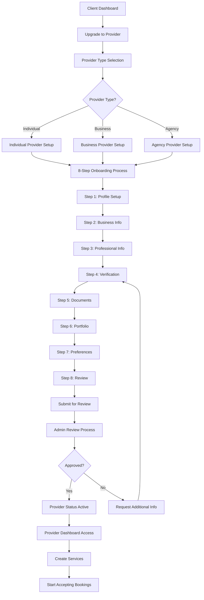
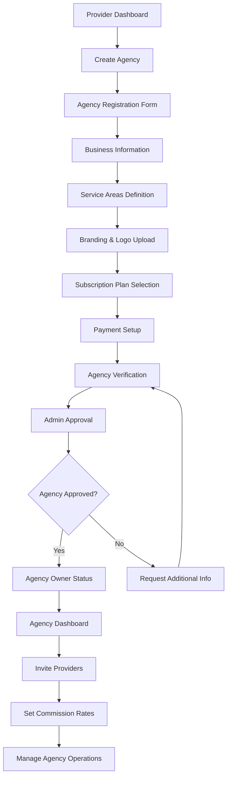
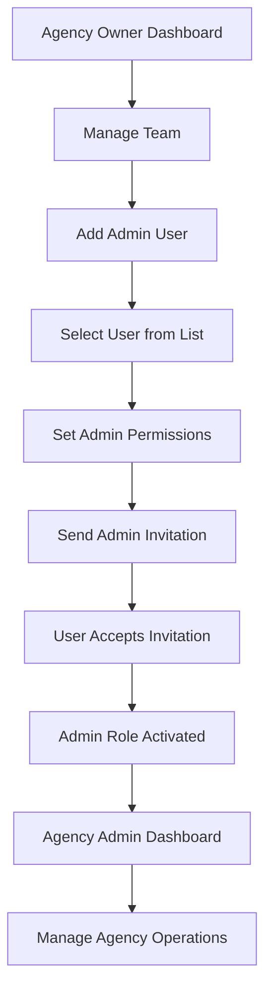
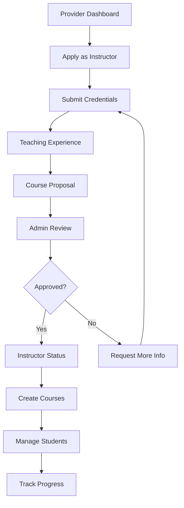
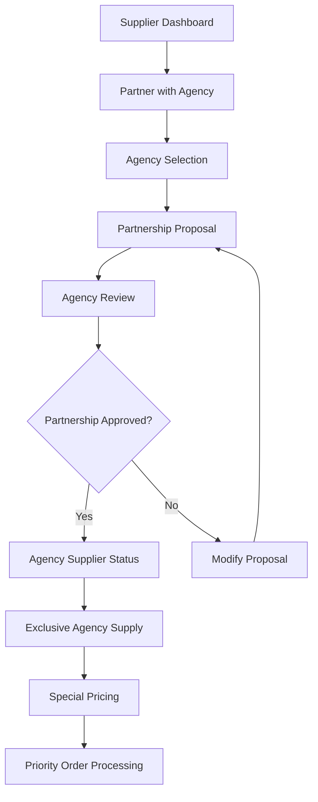
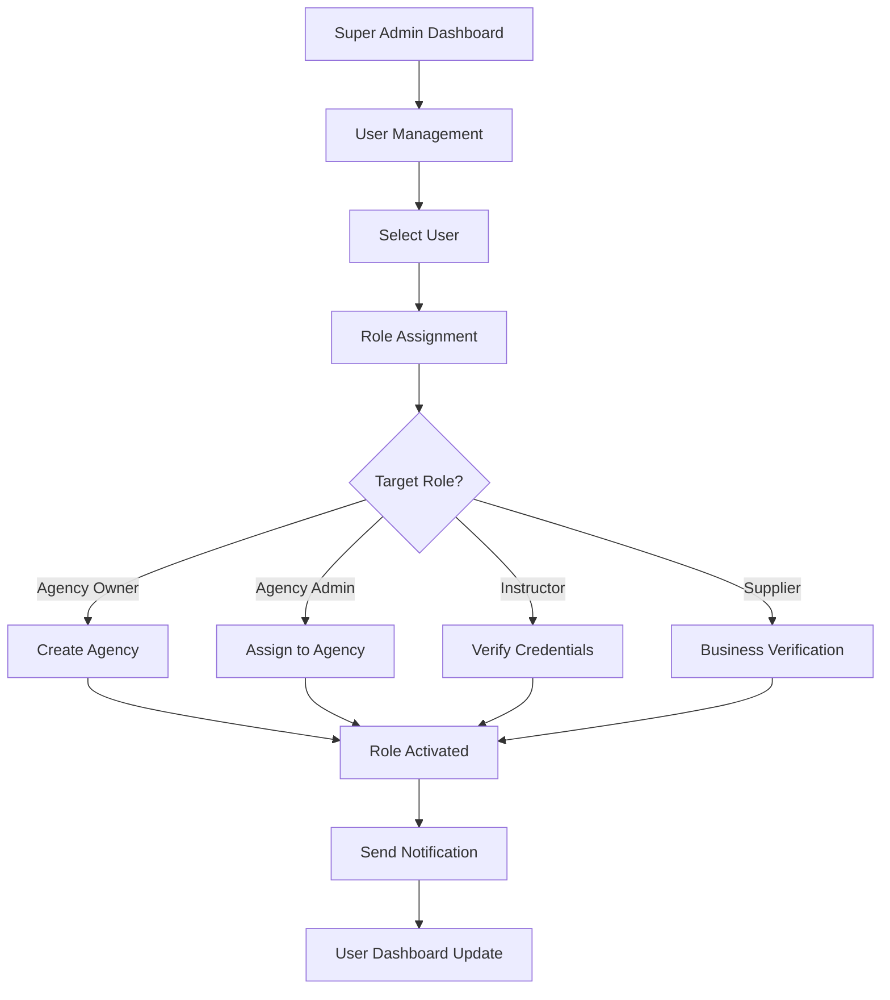
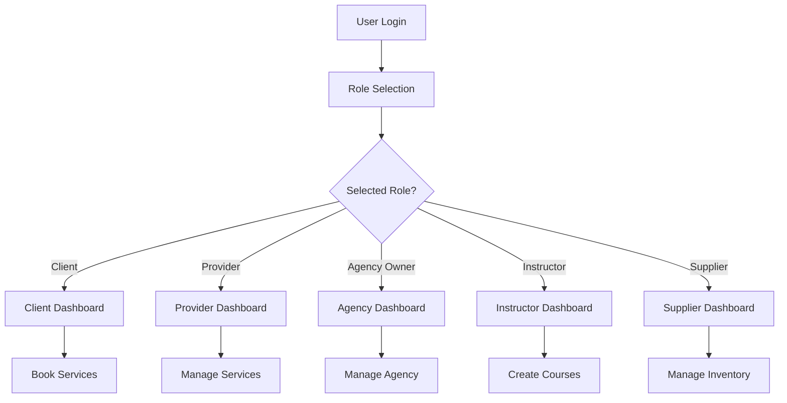

# 🔄 **LocalPro Super App - Role Transition Flows Documentation**

## **Overview**

The LocalPro Super App supports comprehensive role transitions allowing users to evolve their platform presence from basic clients to service providers, agency owners, instructors, and suppliers. This documentation covers all role transition processes, API endpoints, validation requirements, and implementation details.

---

## **📋 Table of Contents**

1. [Role Transition Overview](#role-transition-overview)
2. [Client to Provider Upgrade](#client-to-provider-upgrade)
3. [Provider to Agency Owner](#provider-to-agency-owner)
4. [Agency Owner to Agency Admin](#agency-owner-to-agency-admin)
5. [Provider to Instructor](#provider-to-instructor)
6. [Supplier Role Transitions](#supplier-role-transitions)
7. [Admin Role Management](#admin-role-management)
8. [Multi-Role User Flows](#multi-role-user-flows)
9. [API Reference](#api-reference)
10. [Validation Requirements](#validation-requirements)
11. [Notification Systems](#notification-systems)
12. [Success Metrics](#success-metrics)

---

## **Role Transition Overview**

### **Supported Role Transitions**

| **From Role** | **To Role** | **Complexity** | **Approval Required** | **Estimated Time** |
|---------------|-------------|----------------|----------------------|-------------------|
| Client | Provider | High | Yes | 3-7 days |
| Provider | Agency Owner | Medium | Yes | 1-3 days |
| Provider | Instructor | Medium | Yes | 2-5 days |
| Any | Agency Admin | Low | Yes | 1 day |
| Any | Supplier | Medium | Yes | 2-4 days |
| Any | Admin | High | Yes | 1-2 days |

### **Role Hierarchy**

```
Admin (System-wide access)
├── Agency Owner (Agency management)
│   ├── Agency Admin (Agency operations)
│   └── Provider (Service delivery)
├── Instructor (Course creation)
├── Supplier (Product management)
└── Client (Service consumption)
```

---

## **Client to Provider Upgrade**

### **Process Overview**

The client-to-provider upgrade is the most complex transition, involving an 8-step onboarding process with comprehensive verification requirements.

### **Flow Diagram**



### **8-Step Onboarding Process**

#### **Step 1: Profile Setup**
- Personal information completion
- Contact details verification
- Basic profile photo upload

#### **Step 2: Business Information**
- Business name and type
- Years in business
- Service areas definition
- Specialties selection

#### **Step 3: Professional Information**
- Work experience details
- Skills and certifications
- Professional references
- Portfolio samples

#### **Step 4: Verification**
- Identity verification
- Business registration (if applicable)
- Insurance documentation
- Background check initiation

#### **Step 5: Documents**
- Required document uploads
- Document verification
- Compliance checking
- Additional documentation requests

#### **Step 6: Portfolio**
- Work sample uploads
- Before/after photos
- Client testimonials
- Service demonstrations

#### **Step 7: Preferences**
- Service settings
- Availability configuration
- Pricing preferences
- Communication preferences

#### **Step 8: Review**
- Final information review
- Terms and conditions acceptance
- Submission for approval
- Confirmation of readiness

### **API Endpoints**

#### **1. Initiate Provider Upgrade**
```http
POST /api/providers/create-profile
Authorization: Bearer <token>
Content-Type: application/json

{
  "providerType": "individual|business|agency",
  "businessInfo": {
    "businessName": "John's Cleaning Service",
    "businessType": "individual",
    "yearsInBusiness": 2,
    "serviceAreas": ["Manila", "Quezon City"],
    "specialties": ["house_cleaning", "office_cleaning"]
  },
  "professionalInfo": {
    "experience": 5,
    "skills": ["cleaning", "organization"],
    "certifications": []
  }
}
```

**Response:**
```json
{
  "success": true,
  "message": "Provider profile created successfully",
  "data": {
    "providerId": "64f8a1b2c3d4e5f6a7b8c9d0",
    "status": "pending",
    "onboarding": {
      "currentStep": "profile_setup",
      "progress": 10,
      "completed": false
    }
  }
}
```

#### **2. Update Onboarding Step**
```http
PUT /api/providers/onboarding/step
Authorization: Bearer <token>
Content-Type: application/json

{
  "step": "business_info|professional_info|verification|documents|portfolio|preferences|review",
  "data": {
    // Step-specific data
  }
}
```

**Response:**
```json
{
  "success": true,
  "message": "Onboarding step updated successfully",
  "data": {
    "step": "business_info",
    "progress": 25,
    "completed": false,
    "nextStep": "professional_info"
  }
}
```

#### **3. Upload Verification Documents**
```http
POST /api/providers/documents
Authorization: Bearer <token>
Content-Type: multipart/form-data

{
  "documentType": "identity|business_registration|insurance|background_check",
  "file": <file>,
  "description": "Document description"
}
```

#### **4. Submit for Review**
```http
POST /api/providers/submit-review
Authorization: Bearer <token>
```

#### **5. Check Onboarding Progress**
```http
GET /api/providers/onboarding/progress
Authorization: Bearer <token>
```

**Response:**
```json
{
  "success": true,
  "data": {
    "currentStep": "documents",
    "progress": 75,
    "completedSteps": [
      "profile_setup",
      "business_info", 
      "professional_info",
      "verification"
    ],
    "remainingSteps": [
      "documents",
      "portfolio",
      "preferences",
      "review"
    ],
    "estimatedTimeRemaining": "2-3 days"
  }
}
```

---

## **Provider to Agency Owner**

### **Process Overview**

Providers can upgrade to agency owners to manage multiple service providers under a single business entity.

### **Flow Diagram**



### **API Endpoints**

#### **1. Create Agency**
```http
POST /api/agencies
Authorization: Bearer <token>
Content-Type: application/json

{
  "name": "Elite Cleaning Agency",
  "description": "Professional cleaning services",
  "contact": {
    "email": "contact@elitecleaning.com",
    "phone": "+639171234567",
    "address": {
      "street": "123 Business St",
      "city": "Manila",
      "state": "Metro Manila",
      "zipCode": "1000"
    }
  },
  "business": {
    "type": "cleaning_services",
    "licenseNumber": "BL-2024-001",
    "taxId": "123456789"
  }
}
```

#### **2. Add Providers to Agency**
```http
POST /api/agencies/:id/providers
Authorization: Bearer <token>
Content-Type: application/json

{
  "userId": "provider_user_id",
  "commissionRate": 15,
  "role": "provider"
}
```

---

## **Agency Owner to Agency Admin**

### **Process Overview**

Agency owners can assign admin roles to trusted team members for operational management.

### **Flow Diagram**



### **API Endpoints**

#### **1. Add Agency Admin**
```http
POST /api/agencies/:id/admins
Authorization: Bearer <token>
Content-Type: application/json

{
  "userId": "user_id_to_promote",
  "role": "admin|manager|supervisor",
  "permissions": ["manage_providers", "view_analytics", "manage_bookings"]
}
```

---

## **Provider to Instructor**

### **Process Overview**

Providers with expertise can become instructors to create educational content and courses.

### **Flow Diagram**



### **API Endpoints**

#### **1. Apply as Instructor**
```http
POST /api/instructors/apply
Authorization: Bearer <token>
Content-Type: application/json

{
  "credentials": {
    "education": "Bachelor's in Business",
    "certifications": ["Professional Cleaning Certificate"],
    "experience": "5 years in cleaning industry"
  },
  "teachingExperience": {
    "yearsTeaching": 2,
    "subjects": ["cleaning_techniques", "safety_protocols"]
  },
  "courseProposal": {
    "title": "Advanced Cleaning Techniques",
    "description": "Comprehensive cleaning course",
    "targetAudience": "new_cleaners"
  }
}
```

---

## **Supplier Role Transitions**

### **Process Overview**

Suppliers can partner with agencies for exclusive supply agreements and priority processing.

### **Flow Diagram**



---

## **Admin Role Management**

### **Process Overview**

Super admins can assign various roles to users based on their qualifications and business needs.

### **Flow Diagram**



---

## **Multi-Role User Flows**

### **Process Overview**

Users can have multiple roles simultaneously, with role switching capabilities.

### **Flow Diagram**



---

## **API Reference**

### **Base URL**
```
/api/role-transitions
```

### **Authentication**
All endpoints require Bearer token authentication:
```
Authorization: Bearer <your-jwt-token>
```

### **Common Response Format**
```json
{
  "success": boolean,
  "message": string,
  "data": object,
  "errors": array,
  "timestamp": string
}
```

---

## **Validation Requirements**

### **Role Transition Validation Matrix**

| **From Role** | **To Role** | **Required Validations** | **Optional Validations** |
|---------------|-------------|-------------------------|--------------------------|
| Client | Provider | Identity, Business info, Documents | Portfolio, References |
| Provider | Agency Owner | Business license, Agency registration | Insurance, Bonding |
| Provider | Instructor | Teaching credentials, Course proposal | Education, Certifications |
| Any | Agency Admin | Agency membership, Admin permissions | Management experience |
| Any | Supplier | Business registration, Product catalog | Insurance, Quality standards |

### **Document Requirements**

#### **Provider Documents**
- Government-issued ID
- Business registration (if applicable)
- Insurance certificate
- Background check report
- Professional references

#### **Agency Owner Documents**
- Business license
- Tax registration
- Insurance coverage
- Agency bonding
- Financial statements

#### **Instructor Documents**
- Educational credentials
- Professional certifications
- Teaching experience proof
- Course materials sample
- Student testimonials

---

## **Notification Systems**

### **Email Notifications**

#### **Role Transition Notifications**
```json
{
  "to": "user@example.com",
  "template": "role-transition-notification",
  "data": {
    "userName": "John Doe",
    "fromRole": "Client",
    "toRole": "Provider",
    "status": "pending|approved|rejected",
    "nextSteps": "Complete onboarding process"
  }
}
```

#### **Admin Review Notifications**
```json
{
  "to": "admin@localpro.com",
  "template": "role-review-required",
  "data": {
    "userName": "John Doe",
    "roleTransition": "Client to Provider",
    "submissionDate": "2024-01-15",
    "priority": "normal|high|urgent"
  }
}
```

### **SMS Notifications**

#### **Status Updates**
```json
{
  "to": "+639171234567",
  "message": "Your provider application has been approved. You can now start accepting bookings!"
}
```

---

## **Success Metrics**

### **Key Performance Indicators**

| **Metric** | **Description** | **Target** | **API Endpoint** |
|------------|-----------------|------------|------------------|
| Upgrade Completion Rate | % of users who complete role upgrades | >80% | `GET /api/analytics/role-transitions` |
| Time to Activation | Average time from request to approval | <5 days | `GET /api/analytics/activation-times` |
| Drop-off Points | Where users abandon upgrade process | <20% | `GET /api/analytics/upgrade-funnel` |
| Success by Role | Success rates for each role transition | >75% | `GET /api/analytics/role-success-rates` |

### **Analytics Endpoints**

#### **1. Role Transition Analytics**
```http
GET /api/analytics/role-transitions
Authorization: Bearer <admin-token>

Response:
{
  "success": true,
  "data": {
    "totalTransitions": 1250,
    "completionRate": 82.4,
    "averageTimeToApproval": "3.2 days",
    "successByRole": {
      "client_to_provider": 78.5,
      "provider_to_agency_owner": 85.2,
      "provider_to_instructor": 72.1
    }
  }
}
```

#### **2. Upgrade Funnel Analysis**
```http
GET /api/analytics/upgrade-funnel
Authorization: Bearer <admin-token>

Response:
{
  "success": true,
  "data": {
    "funnel": {
      "initiated": 1000,
      "profileSetup": 850,
      "businessInfo": 720,
      "verification": 650,
      "documents": 580,
      "submitted": 520,
      "approved": 420
    },
    "dropOffPoints": [
      {
        "step": "documents",
        "dropOffRate": 12.1,
        "commonReasons": ["Missing documents", "Document quality"]
      }
    ]
  }
}
```

---

## **Error Handling**

### **Common Error Responses**

#### **400 - Bad Request**
```json
{
  "success": false,
  "message": "Invalid role transition request",
  "errors": [
    {
      "field": "providerType",
      "message": "Provider type is required"
    }
  ]
}
```

#### **403 - Forbidden**
```json
{
  "success": false,
  "message": "Insufficient permissions for role transition",
  "code": "INSUFFICIENT_PERMISSIONS"
}
```

#### **409 - Conflict**
```json
{
  "success": false,
  "message": "User already has this role",
  "code": "ROLE_ALREADY_EXISTS"
}
```

#### **422 - Validation Error**
```json
{
  "success": false,
  "message": "Validation failed",
  "errors": [
    {
      "field": "businessInfo.businessName",
      "message": "Business name is required"
    }
  ]
}
```

---

## **Best Practices**

### **For Developers**

1. **Always validate role transitions** before processing
2. **Implement proper error handling** for all edge cases
3. **Use transaction-based operations** for data consistency
4. **Implement audit logging** for all role changes
5. **Provide clear user feedback** throughout the process

### **For Users**

1. **Complete all required information** before submission
2. **Upload high-quality documents** for faster approval
3. **Respond promptly** to additional information requests
4. **Maintain professional profiles** for better approval rates
5. **Follow platform guidelines** for content and behavior

---

## **Troubleshooting**

### **Common Issues**

#### **1. Role Transition Stuck in Pending**
- Check if all required documents are uploaded
- Verify business information completeness
- Contact support for manual review

#### **2. Document Upload Failures**
- Ensure file size is under 10MB
- Use supported formats (PDF, JPG, PNG)
- Check internet connection stability

#### **3. Approval Delays**
- Check admin notification settings
- Verify document quality and completeness
- Contact admin team for status updates

### **Support Contacts**

- **Technical Issues**: tech-support@localpro.com
- **Role Transitions**: role-support@localpro.com
- **Document Verification**: verification@localpro.com
- **General Support**: support@localpro.com

---

## **Changelog**

### **Version 1.0.0** (2024-01-15)
- Initial role transition system implementation
- Client to Provider upgrade flow
- Basic validation and approval processes

### **Version 1.1.0** (2024-02-01)
- Added Agency Owner and Agency Admin transitions
- Enhanced document verification system
- Improved notification workflows

### **Version 1.2.0** (2024-03-01)
- Added Instructor role transitions
- Multi-role user support
- Enhanced analytics and reporting

---

*This documentation is maintained by the LocalPro Super App development team. For updates and support, contact the development team at dev@localpro.com.*
