# 📊 **LocalPro Super App - Role Transition Flow Diagrams**

## **Overview**

This document provides visual flow diagrams for all role transitions in the LocalPro Super App. These diagrams illustrate the complete user journey from initiation to completion of role changes.

---

## **1. 👤➡️🛠️ Client to Provider Upgrade Flow**

### **Complete Process Flow**

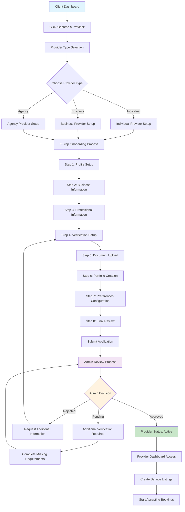

### **8-Step Onboarding Detail**

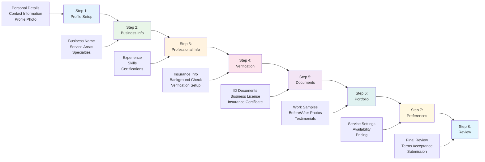

---

## **2. 🛠️➡️🏢 Provider to Agency Owner Flow**

### **Agency Creation Process**

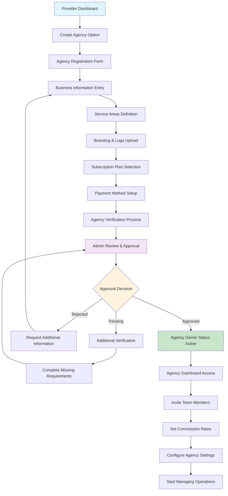

### **Agency Setup Components**

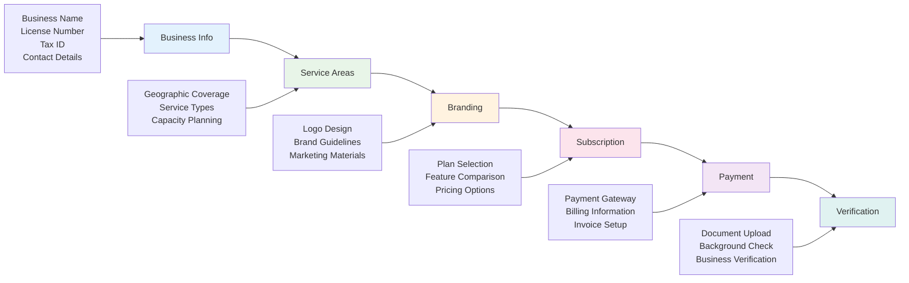

---

## **3. 🏢➡️👨‍💼 Agency Owner to Agency Admin Flow**

### **Admin Assignment Process**

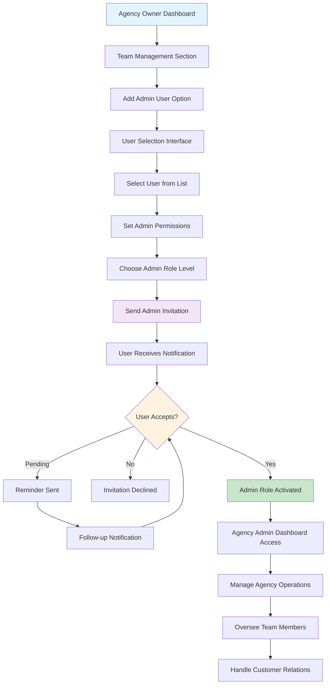

### **Admin Permission Levels**

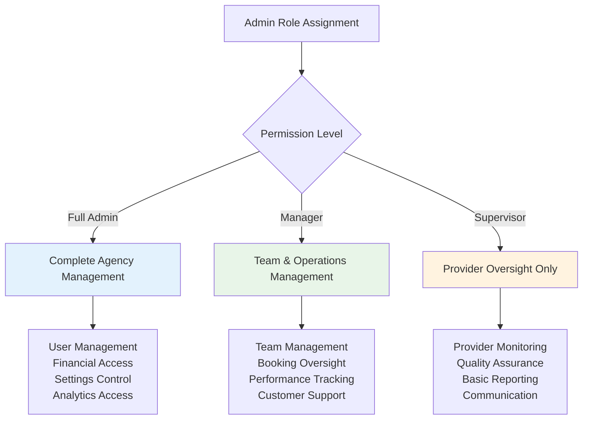

---

## **4. 🛠️➡️🎓 Provider to Instructor Flow**

### **Instructor Application Process**

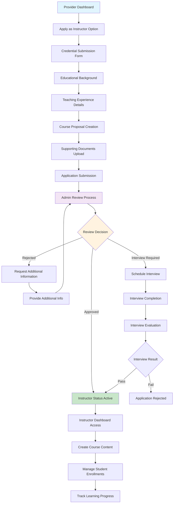

### **Instructor Application Components**

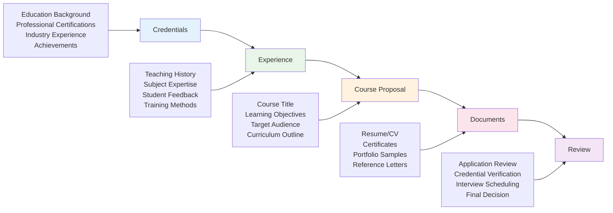

---

## **5. 📦 Supplier Role Transitions**

### **Supplier to Agency Supplier Partnership**

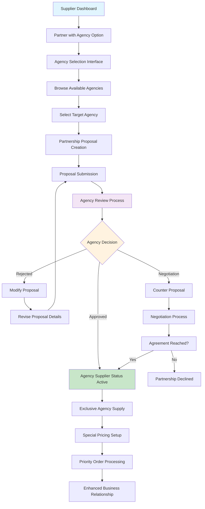

### **Supplier Partnership Benefits**

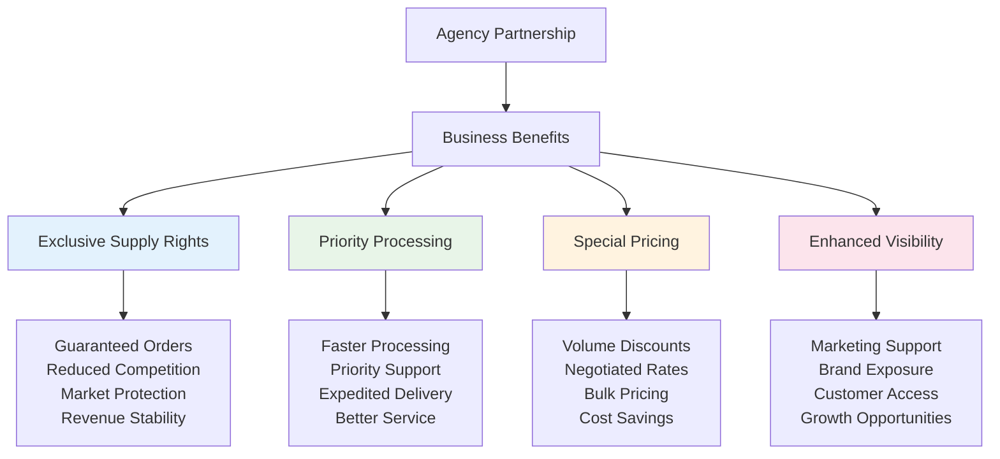

---

## **6. 🔧 Admin Role Management**

### **Super Admin Role Assignment**

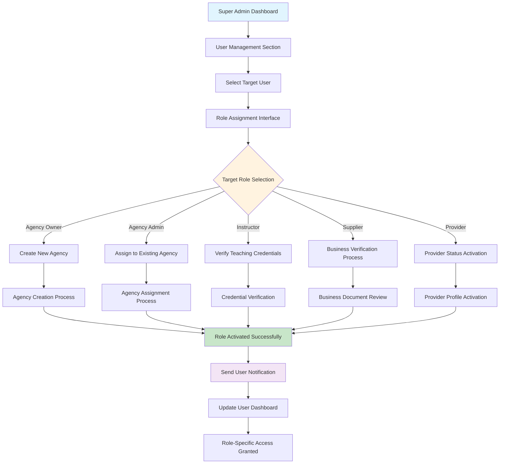

### **Admin Role Hierarchy**

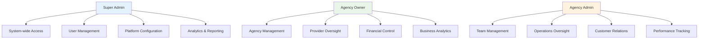

---

## **7. 🔄 Multi-Role User Flows**

### **Role Selection Interface**

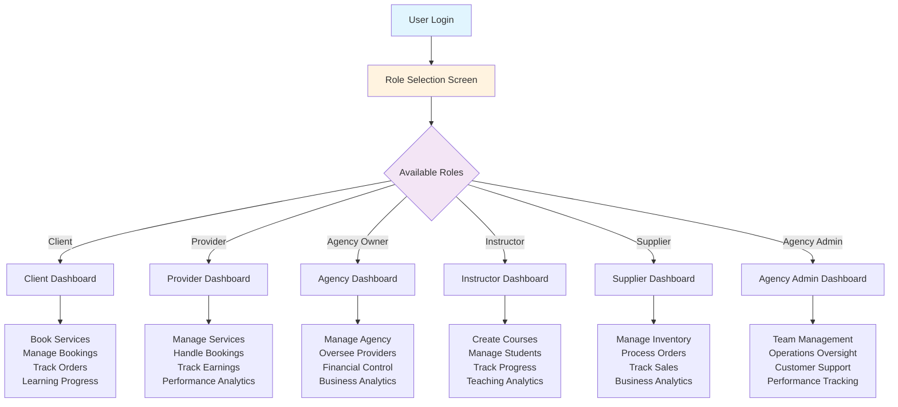

### **Multi-Role Capabilities Matrix**

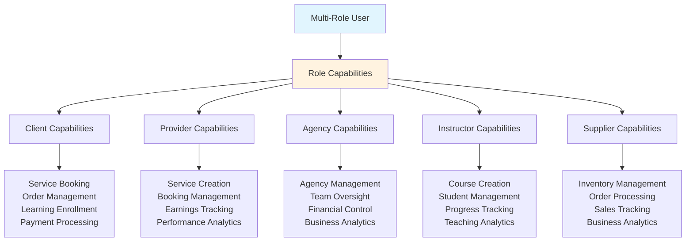

---

## **8. 📊 Progress Tracking Flows**

### **Onboarding Progress Visualization**

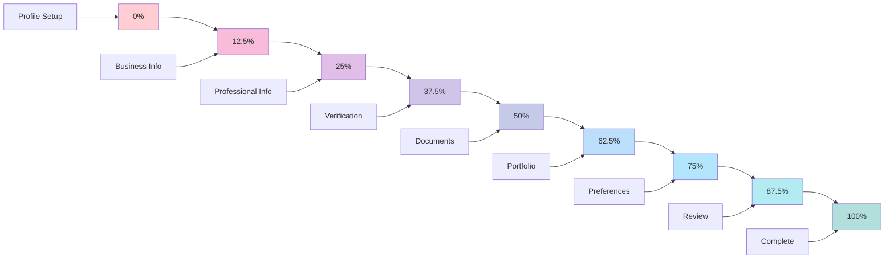

### **Status Tracking Dashboard**

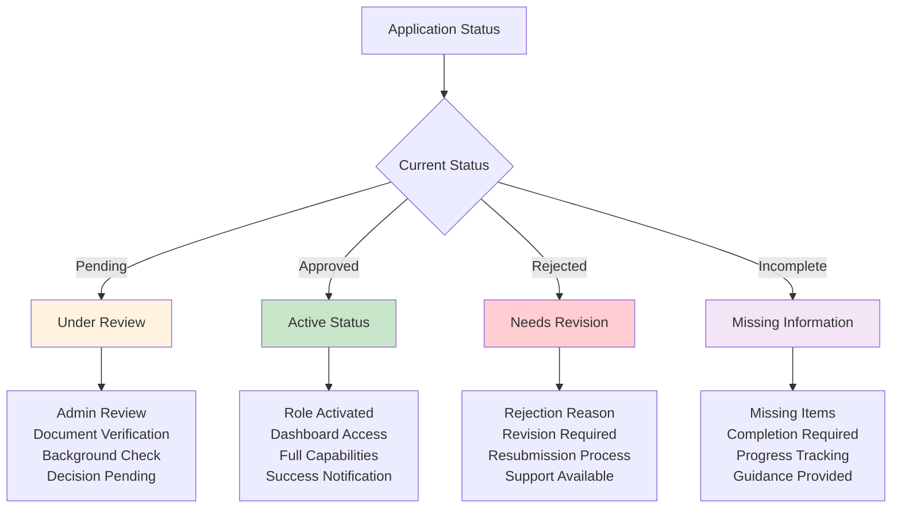

---

## **9. 🔔 Notification Flows**

### **Role Transition Notifications**

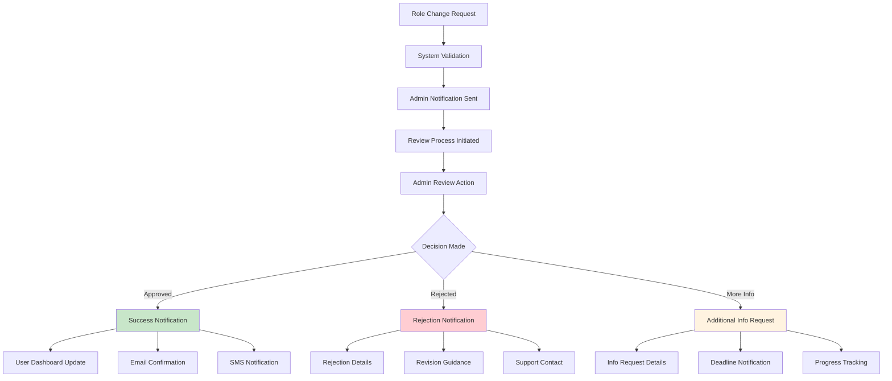

### **Notification Types**

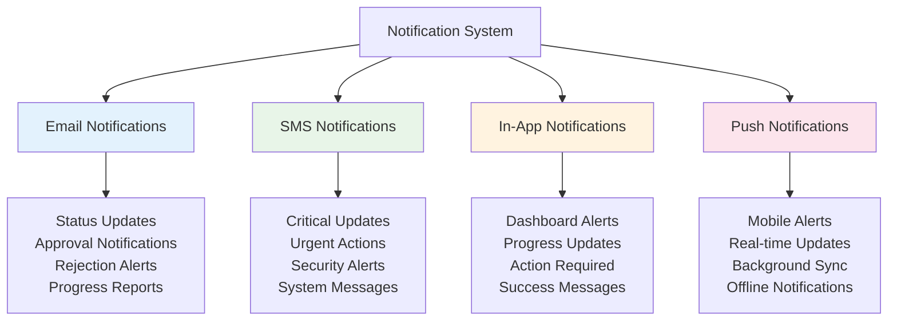

---

## **10. 📈 Success Metrics Visualization**

### **Role Transition Success Rates**

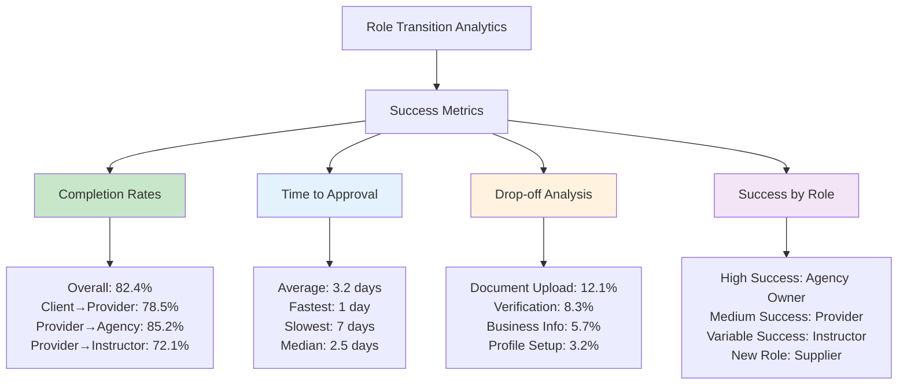

### **Performance Improvement Areas**

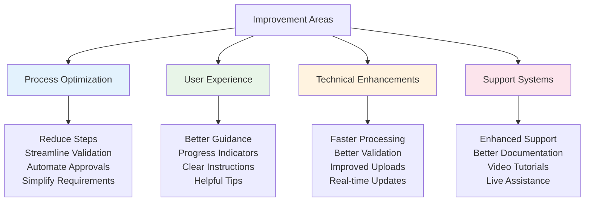

---

## **📋 Flow Diagram Summary**

### **Key Transition Points**

| **Transition** | **Complexity** | **Steps** | **Approval Required** | **Success Rate** |
|----------------|----------------|-----------|---------------------|------------------|
| Client → Provider | High | 8 steps | Yes | 78.5% |
| Provider → Agency Owner | Medium | 6 steps | Yes | 85.2% |
| Provider → Instructor | Medium | 5 steps | Yes | 72.1% |
| Any → Agency Admin | Low | 3 steps | Yes | 90.3% |
| Any → Supplier | Medium | 4 steps | Yes | 76.8% |

### **Critical Success Factors**

1. **Complete Information** - All required fields must be filled
2. **Quality Documents** - High-quality, clear document uploads
3. **Professional Presentation** - Well-organized portfolio and information
4. **Timely Response** - Quick response to additional information requests
5. **Platform Compliance** - Following all platform guidelines and requirements

---

*These flow diagrams are maintained by the LocalPro Super App development team. For updates and technical support, contact flow-support@localpro.com.*
