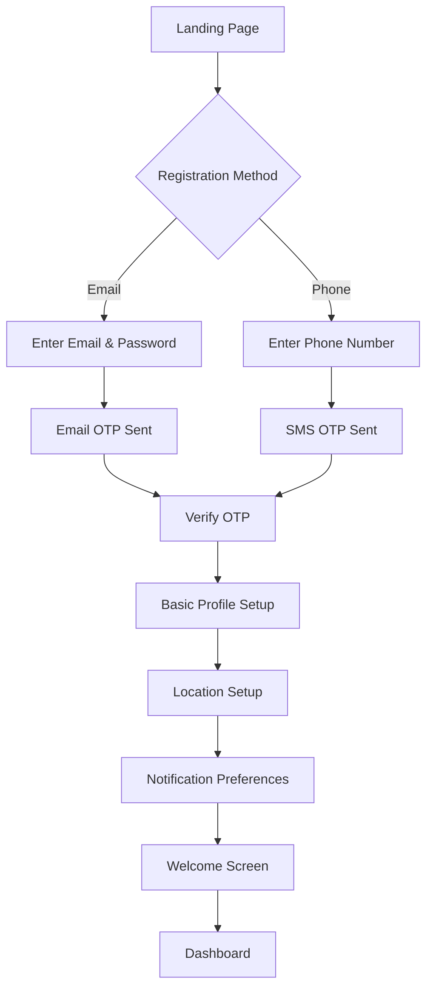
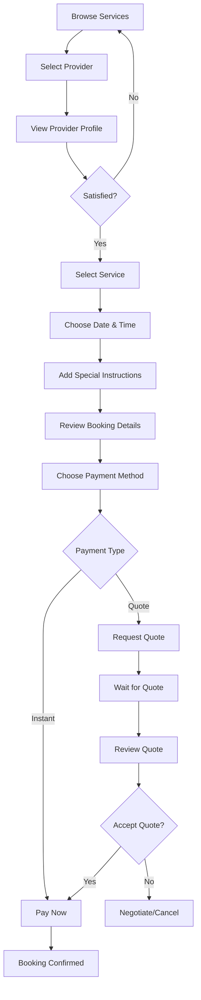
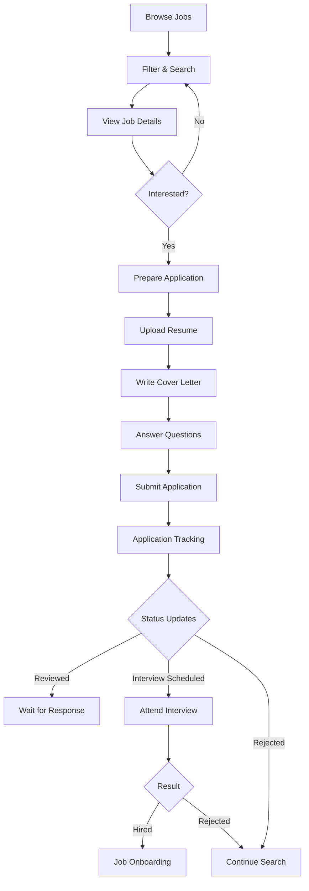
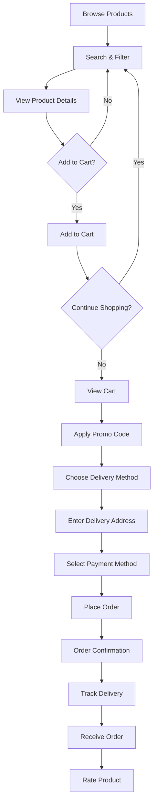
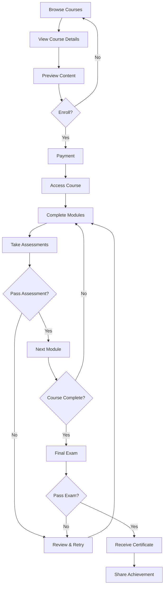

# Client User Journey - LocalPro Super App

> **Role:** Client (Default Base Role)  
> **Version:** 1.0.0  
> **Last Updated:** January 13, 2026

---

## 📋 Table of Contents

1. [Role Overview](#role-overview)
2. [Onboarding Journey](#onboarding-journey)
3. [Core Features & Workflows](#core-features--workflows)
4. [Service Booking Journey](#service-booking-journey)
5. [Job Search Journey](#job-search-journey)
6. [Shopping Journey](#shopping-journey)
7. [Learning Journey](#learning-journey)
8. [Communication & Support](#communication--support)
9. [Financial Management](#financial-management)
10. [Profile & Settings](#profile--settings)
11. [Feature Access Matrix](#feature-access-matrix)
12. [User Journey Map](#user-journey-map)

---

## 🎯 Role Overview

### Definition
**Client** is the default base role for all users in the LocalPro Super App. Clients are end-users who consume services, purchase products, and access platform features.

### Key Characteristics
- ✅ Default role assigned to all registered users
- ✅ Can book services from providers
- ✅ Can search and apply for jobs
- ✅ Can purchase supplies and products
- ✅ Can enroll in training courses
- ✅ Can rent equipment
- ✅ Can refer friends and earn rewards

### Target Audience
- Homeowners needing services (cleaning, repairs, etc.)
- Job seekers looking for employment
- DIY enthusiasts needing tools and supplies
- Professionals seeking skill development
- Anyone requiring local services

---

## 🚀 Onboarding Journey

### Registration Flow

### Step-by-Step Registration

#### 1. Choose Registration Method

**Option A: Email Registration**
- Endpoint: `POST /api/auth/register`
- Requirements:
  - Valid email address
  - Strong password (8+ chars, uppercase, lowercase, number)
  - First name and last name
- Success: OTP sent to email

**Option B: Phone Registration**
- Endpoint: `POST /api/auth/send-code`
- Requirements:
  - Valid phone number (+639XXXXXXXXX format)
- Success: OTP sent via SMS

#### 2. Verify Account
- Endpoint: `POST /api/auth/verify-email-otp` or `POST /api/auth/verify-code`
- Enter 6-digit OTP
- Auto-login on success
- Receive JWT token

#### 3. Complete Profile
- Endpoint: `PUT /api/auth/profile`
- Add profile photo (optional)
- Set address and location
- Configure notification preferences

#### 4. Explore Platform
- View welcome tutorial
- Browse service categories
- Discover featured providers
- Check job listings

---

## 🎨 Core Features & Workflows

### 1. Service Marketplace

**Browse Services**
- Endpoint: `GET /api/marketplace/services`
- Filter by:
  - Category (cleaning, plumbing, electrical, etc.)
  - Location (nearby services)
  - Price range
  - Ratings
  - Availability

**Search Providers**
- Endpoint: `GET /api/search/providers`
- Search criteria:
  - Service type
  - Provider name
  - Skills and specialties
  - Location radius

**View Provider Profile**
- Endpoint: `GET /api/providers/profile/:id`
- See:
  - Services offered
  - Hourly rates
  - Reviews and ratings
  - Portfolio/gallery
  - Availability calendar
  - Verification badges

### 2. Job Board

**Browse Jobs**
- Endpoint: `GET /api/jobs`
- Filter by:
  - Job category
  - Location
  - Salary range
  - Job type (full-time, part-time, contract)
  - Date posted

**Search Jobs**
- Endpoint: `GET /api/search/jobs`
- Advanced filters:
  - Keywords
  - Skills required
  - Experience level
  - Benefits offered

**Apply for Jobs**
- Endpoint: `POST /api/jobs/:id/apply`
- Upload resume
- Write cover letter
- Answer screening questions

### 3. Equipment Rentals

**Browse Equipment**
- Endpoint: `GET /api/rentals`
- Categories:
  - Power tools
  - Construction equipment
  - Party/event supplies
  - Outdoor gear

**Book Rental**
- Endpoint: `POST /api/rentals/:id/book`
- Select dates
- Choose pickup/delivery
- Add insurance (optional)

### 4. Supplies & Products

**Shop Supplies**
- Endpoint: `GET /api/supplies`
- Categories:
  - Cleaning supplies
  - Hardware materials
  - Professional tools
  - Safety equipment

**Place Order**
- Endpoint: `POST /api/supplies/:id/order`
- Add to cart
- Choose delivery method
- Apply promo codes

### 5. Training Academy

**Browse Courses**
- Endpoint: `GET /api/academy/courses`
- Filter by:
  - Category
  - Skill level
  - Duration
  - Price
  - Certification offered

**Enroll in Course**
- Endpoint: `POST /api/academy/courses/:id/enroll`
- Preview course content
- Check requirements
- Make payment
- Start learning

---

## 📅 Service Booking Journey

### Complete Booking Flow

### Detailed Booking Steps

#### Step 1: Service Selection
- Browse marketplace
- Filter services by need
- Compare providers
- Check reviews

#### Step 2: Provider Profile Review
- View services and rates
- Check availability
- Review portfolio
- Read customer reviews
- Verify certifications

#### Step 3: Booking Configuration
- Endpoint: `POST /api/marketplace/services/:id/book`
- Select service type
- Choose date and time
- Add service location
- Provide special instructions
- Estimate duration

#### Step 4: Quote or Instant Booking

**Instant Booking:**
- Fixed-price services
- Clear service parameters
- Immediate confirmation
- Pay upfront or on completion

**Quote Request:**
- Custom services
- Variable scope
- Provider reviews request
- Provides detailed quote
- Client accepts/negotiates

#### Step 5: Payment
- Endpoint: `POST /api/bookings/:id/payment`
- Payment methods:
  - Credit/Debit Card (PayMongo)
  - GCash/PayMaya
  - Wallet balance
  - Cash on completion

#### Step 6: Confirmation
- Receive booking confirmation
- Get provider contact
- Add to calendar
- Set reminders

#### Step 7: Service Day
- Track provider arrival (GPS)
- Chat with provider
- Service completion
- Rate and review

---

## 💼 Job Search Journey

### Job Application Flow

### Job Search Steps

#### 1. Discover Jobs
- Endpoint: `GET /api/jobs`
- Browse categories
- Set job alerts
- Save interesting jobs

#### 2. View Job Details
- Endpoint: `GET /api/jobs/:id`
- Job description
- Requirements
- Salary range
- Company info
- Benefits

#### 3. Prepare Application
- Build profile
- Update resume
- Highlight relevant skills
- Research company

#### 4. Submit Application
- Endpoint: `POST /api/jobs/:id/apply`
- Upload documents
- Fill application form
- Answer screening questions
- Submit

#### 5. Track Applications
- Endpoint: `GET /api/jobs/applications`
- View application status
- Receive updates
- Respond to messages

---

## 🛒 Shopping Journey

### Product Purchase Flow

### Shopping Steps

#### 1. Browse & Search
- Endpoint: `GET /api/supplies`
- Category navigation
- Search by keyword
- Filter by price, rating, supplier
- View featured products

#### 2. Product Details
- Endpoint: `GET /api/supplies/:id`
- Product description
- Specifications
- Images
- Pricing
- Stock availability
- Supplier info
- Customer reviews

#### 3. Cart Management
- Endpoint: `POST /api/supplies/cart/add`
- Add products
- Update quantities
- Remove items
- Save for later

#### 4. Checkout
- Endpoint: `POST /api/supplies/:id/order`
- Review cart
- Apply discounts
- Choose delivery:
  - Standard delivery
  - Express delivery
  - Pickup
- Enter address

#### 5. Payment & Order
- Select payment method
- Complete payment
- Receive confirmation
- Track order status

#### 6. Delivery & Review
- Track delivery
- Receive products
- Rate and review
- Contact support if issues

---

## 🎓 Learning Journey

### Course Enrollment Flow

### Learning Steps

#### 1. Discover Courses
- Endpoint: `GET /api/academy/courses`
- Browse categories
- Filter by level, duration, price
- View featured courses

#### 2. Course Preview
- Endpoint: `GET /api/academy/courses/:id`
- Course outline
- Learning objectives
- Instructor profile
- Student reviews
- Sample lessons

#### 3. Enrollment
- Endpoint: `POST /api/academy/courses/:id/enroll`
- Select course
- Make payment
- Get instant access

#### 4. Learning Progress
- Endpoint: `PUT /api/academy/courses/:id/progress`
- Watch video lessons
- Read materials
- Complete exercises
- Track progress

#### 5. Assessments
- Complete quizzes
- Take practice tests
- Final examination
- Earn passing grade

#### 6. Certification
- Receive digital certificate
- Download PDF
- Share on social media
- Add to profile

---

## 💬 Communication & Support

### Client Communication Channels

#### 1. Live Chat with Providers
- Endpoint: `POST /api/communication/chat/send`
- Real-time messaging
- Share images/documents
- Discuss booking details
- Negotiate terms

#### 2. In-App Notifications
- Endpoint: `GET /api/notifications`
- Booking updates
- Payment confirmations
- Job application status
- Course progress
- Promotional offers

#### 3. Push Notifications
- Endpoint: `POST /api/notifications/register-device`
- Instant alerts
- Provider messages
- Booking reminders
- Special offers

#### 4. Customer Support
- Endpoint: `POST /api/communication/support`
- Help center
- FAQs
- Submit ticket
- Live chat support
- Phone support

---

## 💰 Financial Management

### Wallet & Payments

#### 1. Wallet Management
- Endpoint: `GET /api/finance/wallet`
- View balance
- Transaction history
- Add funds
- Withdraw funds

#### 2. Payment Methods
- Endpoint: `GET /api/finance/payment-methods`
- Manage cards
- Link e-wallets (GCash, PayMaya)
- Set default method

#### 3. Transaction History
- Endpoint: `GET /api/finance/transactions`
- View all transactions
- Filter by type, date
- Download statements
- Track refunds

#### 4. Referral Earnings
- Endpoint: `GET /api/referrals/stats`
- Referral code
- Referral history
- Earnings from referrals
- Redeem rewards

---

## ⚙️ Profile & Settings

### Profile Management

#### 1. Personal Information
- Endpoint: `PUT /api/auth/profile`
- Update name, photo
- Change email/phone
- Update address
- Set preferences

#### 2. Account Settings
- Endpoint: `PUT /api/settings`
- Change password
- Two-factor authentication
- Privacy settings
- Delete account

#### 3. Notification Settings
- Endpoint: `PUT /api/settings/notifications`
- Email notifications
- Push notifications
- SMS alerts
- Marketing preferences

#### 4. Favorites & Saved Items
- Endpoint: `GET /api/favorites`
- Saved providers
- Favorite products
- Bookmarked courses
- Saved jobs

---

## 📊 Feature Access Matrix

| Feature | Endpoint | Access Level | Description |
|---------|----------|--------------|-------------|
| **Authentication** |
| Register | `POST /api/auth/register` | Public | Create account |
| Login | `POST /api/auth/login` | Public | User authentication |
| Verify OTP | `POST /api/auth/verify-email-otp` | Public | Email verification |
| **Service Marketplace** |
| Browse Services | `GET /api/marketplace/services` | Authenticated | View available services |
| Book Service | `POST /api/marketplace/services/:id/book` | Authenticated | Create booking |
| View Bookings | `GET /api/marketplace/bookings` | Authenticated | My bookings |
| **Job Board** |
| Browse Jobs | `GET /api/jobs` | Authenticated | View job listings |
| Apply for Job | `POST /api/jobs/:id/apply` | Authenticated | Submit application |
| My Applications | `GET /api/jobs/applications` | Authenticated | Track applications |
| **Shopping** |
| Browse Products | `GET /api/supplies` | Authenticated | View products |
| Place Order | `POST /api/supplies/:id/order` | Authenticated | Purchase products |
| My Orders | `GET /api/supplies/orders` | Authenticated | Order history |
| **Rentals** |
| Browse Equipment | `GET /api/rentals` | Authenticated | View rental items |
| Book Rental | `POST /api/rentals/:id/book` | Authenticated | Rent equipment |
| My Rentals | `GET /api/rentals/bookings` | Authenticated | Rental history |
| **Academy** |
| Browse Courses | `GET /api/academy/courses` | Authenticated | View courses |
| Enroll in Course | `POST /api/academy/courses/:id/enroll` | Authenticated | Join course |
| My Courses | `GET /api/academy/my-courses` | Authenticated | Enrolled courses |
| **Communication** |
| Send Message | `POST /api/communication/chat/send` | Authenticated | Chat with users |
| View Messages | `GET /api/communication/chat/:id` | Authenticated | Message history |
| **Financial** |
| View Wallet | `GET /api/finance/wallet` | Authenticated | Wallet balance |
| Add Funds | `POST /api/finance/wallet/add` | Authenticated | Top up wallet |
| Transactions | `GET /api/finance/transactions` | Authenticated | Transaction history |
| **Referrals** |
| Get Referral Code | `GET /api/referrals/code` | Authenticated | My referral code |
| Referral Stats | `GET /api/referrals/stats` | Authenticated | Referral performance |
| **Profile** |
| View Profile | `GET /api/auth/profile` | Authenticated | My profile |
| Update Profile | `PUT /api/auth/profile` | Authenticated | Edit profile |
| Change Password | `POST /api/auth/change-password` | Authenticated | Update password |

---

## 🗺️ User Journey Map

### Primary User Journeys

#### Journey 1: First Service Booking
**Goal:** Successfully book and complete first service

**Touchpoints:**
1. Registration → Profile Setup
2. Browse Services → Compare Providers
3. Select Provider → View Profile
4. Choose Service → Select Date/Time
5. Make Payment → Confirm Booking
6. Wait for Service Day → Track Provider
7. Service Completion → Payment
8. Rate & Review → Refer Friends

**Pain Points & Solutions:**
- 🔴 Too many options → ✅ Smart filtering and recommendations
- 🔴 Unclear pricing → ✅ Transparent pricing and quotes
- 🔴 Payment concerns → ✅ Secure payment, escrow system
- 🔴 Provider reliability → ✅ Verification badges, reviews

#### Journey 2: Job Application
**Goal:** Find and apply for relevant jobs

**Touchpoints:**
1. Browse Jobs → Set Filters
2. View Job Details → Save Interesting
3. Prepare Application → Update Profile
4. Submit Application → Track Status
5. Receive Interview → Attend
6. Get Hired → Celebrate

**Pain Points & Solutions:**
- 🔴 Too many irrelevant jobs → ✅ AI-powered job matching
- 🔴 Complex application → ✅ One-tap apply with saved profile
- 🔴 No status updates → ✅ Real-time application tracking

#### Journey 3: Shopping & Delivery
**Goal:** Purchase supplies with timely delivery

**Touchpoints:**
1. Search Products → Add to Cart
2. Review Cart → Apply Discounts
3. Checkout → Enter Address
4. Make Payment → Order Confirmation
5. Track Delivery → Receive Products
6. Review Product → Reorder

**Pain Points & Solutions:**
- 🔴 Limited product info → ✅ Detailed descriptions, images, reviews
- 🔴 Delivery delays → ✅ Real-time tracking, estimated delivery
- 🔴 Product quality concerns → ✅ Verified suppliers, return policy

---

## 🎯 Success Metrics

### Client Engagement
- Registration completion rate
- First booking within 7 days
- Repeat booking rate
- Average bookings per month
- Session duration

### Satisfaction
- Average rating given to providers
- Customer satisfaction score (CSAT)
- Net Promoter Score (NPS)
- Support ticket volume
- Complaint resolution time

### Financial
- Average transaction value
- Lifetime value (LTV)
- Referral conversion rate
- Wallet usage rate
- Repeat purchase rate

---

## 🚀 Best Practices for Clients

### Getting Started
1. Complete your profile fully
2. Add a profile photo
3. Verify your phone and email
4. Set your location for better matches
5. Enable push notifications

### Booking Services
1. Read provider reviews carefully
2. Check verification badges
3. Communicate clearly in chat
4. Be specific about requirements
5. Confirm date and time
6. Be available on service day

### Safety Tips
1. Use in-app chat for communication
2. Pay through the platform
3. Report suspicious behavior
4. Read terms and conditions
5. Keep records of transactions

### Maximizing Value
1. Use referral program
2. Look for promotions
3. Book during off-peak hours
4. Leave honest reviews
5. Join LocalPro Plus for perks

---

**Document Version:** 1.0.0  
**Last Updated:** January 13, 2026  
**Next Review:** April 13, 2026
