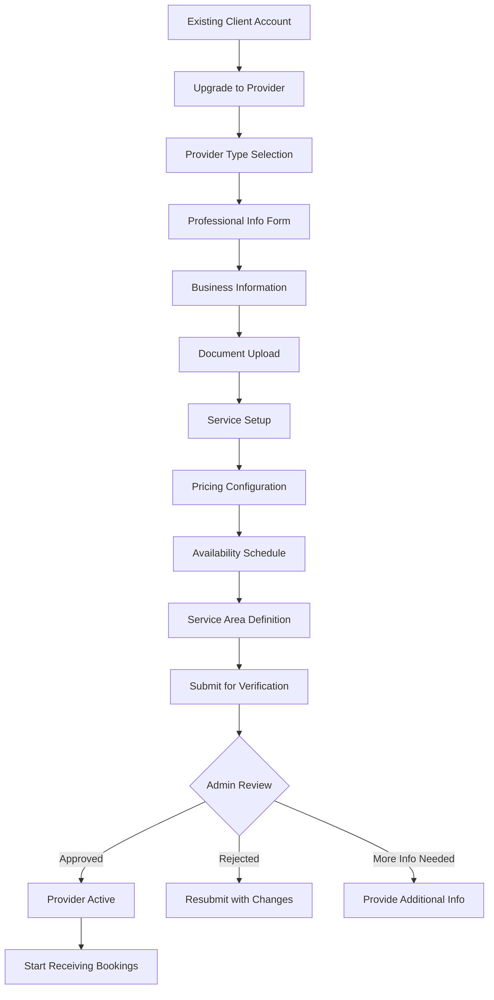
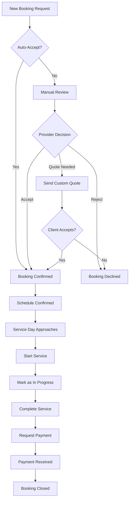

# Provider User Journey - LocalPro Super App

> **Role:** Provider (Service Provider)  
> **Version:** 1.0.0  
> **Last Updated:** January 13, 2026

---

## 📋 Table of Contents

1. [Role Overview](#role-overview)
2. [Provider Onboarding Journey](#provider-onboarding-journey)
3. [Profile Management](#profile-management)
4. [Service Management](#service-management)
5. [Booking Management](#booking-management)
6. [Financial Management](#financial-management)
7. [Reviews & Reputation](#reviews--reputation)
8. [Availability & Scheduling](#availability--scheduling)
9. [Communication](#communication)
10. [Analytics & Performance](#analytics--performance)
11. [Feature Access Matrix](#feature-access-matrix)
12. [User Journey Map](#user-journey-map)

---

## 🎯 Role Overview

### Definition
**Provider** is a user who offers professional services on the LocalPro platform. Providers can be individual professionals or businesses offering various services to clients.

### Key Characteristics
- ✅ Retains all client features
- ✅ Can offer multiple services
- ✅ Sets own rates and availability
- ✅ Receives and manages bookings
- ✅ Earns income from services
- ✅ Builds professional reputation
- ✅ Can join agencies

### Provider Types
- **Individual**: Solo service provider
- **Business**: Registered business entity
- **Agency Member**: Part of a service agency

### Target Services
- Cleaning services
- Plumbing & electrical
- Carpentry & construction
- Beauty & wellness
- Moving & logistics
- IT & tech support
- Home repairs
- And many more...

---

## 🚀 Provider Onboarding Journey

### Upgrade from Client to Provider



### Onboarding Steps

#### Step 1: Initiate Provider Upgrade
- Endpoint: `POST /api/providers/profile`
- Choose provider type:
  - Individual
  - Business
  - Agency

#### Step 2: Professional Information

**Required Information:**
- Specialties and categories
- Years of experience
- Hourly/fixed rates
- Certifications
- Languages spoken
- Portfolio/work samples

**Endpoint:** `POST /api/providers/profile`

**Request Body:**
```json
{
  "providerType": "individual",
  "professionalInfo": {
    "specialties": [
      {
        "category": "cleaning",
        "subcategories": ["house_cleaning", "office_cleaning"],
        "experience": 5,
        "hourlyRate": 250,
        "description": "Professional cleaning services",
        "certifications": [
          {
            "name": "Professional Cleaning Certificate",
            "issuedBy": "Cleaning Association",
            "issueDate": "2021-03-15"
          }
        ]
      }
    ],
    "languages": ["English", "Filipino"]
  }
}
```

#### Step 3: Business Information (if applicable)

**For Business Providers:**
- Business name
- Registration number
- Tax ID
- Years in business
- Business type

#### Step 4: Verification Documents

**Required Documents:**
- Valid government ID
- Business permit (for businesses)
- Professional certifications
- Insurance certificate (optional)
- Portfolio/references

**Upload Endpoint:** `POST /api/providers/:id/documents`

#### Step 5: Service Configuration

**Define Services:**
- Endpoint: `POST /api/providers/:id/services`
- Service categories
- Pricing structure
- Service duration
- Special requirements

#### Step 6: Availability Setup

**Configure Schedule:**
- Endpoint: `PUT /api/providers/availability`
- Weekly schedule
- Time slots
- Break times
- Holiday schedule

#### Step 7: Service Area

**Define Service Coverage:**
- Primary location
- Service radius (km)
- Additional service areas
- Travel fees

#### Step 8: Verification & Approval

**Admin Review Process:**
1. Document verification
2. Background check (if enabled)
3. Quality assessment
4. Profile approval

**Status Updates:**
- `pending_verification`: Under review
- `verified`: Approved and active
- `rejected`: Application denied
- `suspended`: Temporarily suspended

---

## 🎨 Profile Management

### Provider Profile Sections

#### 1. Basic Profile
- Endpoint: `GET /api/providers/profile/:id`
- Profile photo
- Business name
- Bio/description
- Contact information
- Service areas

#### 2. Portfolio & Gallery
- Endpoint: `POST /api/providers/:id/portfolio`
- Upload work photos
- Before/after images
- Video demonstrations
- Project descriptions

#### 3. Certifications & Badges
- Professional licenses
- Training certificates
- Platform badges:
  - Verified Provider
  - Top Rated
  - Quick Responder
  - Super Provider

#### 4. Reviews & Ratings
- Endpoint: `GET /api/providers/:id/reviews`
- Overall rating
- Customer reviews
- Response to reviews
- Rating breakdown

---

## 🛠️ Service Management

### Service Listing Management

#### 1. Create New Service
- Endpoint: `POST /api/providers/:id/services`

**Service Configuration:**
```json
{
  "name": "House Deep Cleaning",
  "category": "cleaning",
  "subcategory": "deep_cleaning",
  "description": "Comprehensive deep cleaning service",
  "pricingType": "hourly",
  "baseRate": 350,
  "minimumHours": 4,
  "includedItems": [
    "All cleaning supplies",
    "Equipment provided",
    "Sanitization"
  ],
  "addons": [
    {
      "name": "Window cleaning",
      "price": 200
    }
  ],
  "estimatedDuration": 4,
  "serviceArea": {
    "radius": 15,
    "travelFee": 100
  }
}
```

#### 2. Update Services
- Endpoint: `PUT /api/providers/services/:id`
- Modify pricing
- Update descriptions
- Add/remove add-ons
- Change availability

#### 3. Service Visibility
- Active/Inactive toggle
- Feature service
- Promotional pricing
- Special offers

---

## 📅 Booking Management

### Booking Lifecycle



### Booking Management Features

#### 1. View Booking Requests
- Endpoint: `GET /api/providers/bookings`
- Filter by status:
  - Pending
  - Confirmed
  - In Progress
  - Completed
  - Cancelled

#### 2. Accept/Reject Bookings
- Endpoint: `PATCH /api/providers/bookings/:id/status`
- Accept booking
- Decline with reason
- Suggest alternative time

#### 3. Quote Management
- Endpoint: `POST /api/providers/bookings/:id/quote`
- Create custom quote
- Itemized pricing
- Terms and conditions
- Quote expiration

#### 4. Booking Communication
- Endpoint: `POST /api/communication/chat/send`
- Chat with client
- Share location
- Send updates
- Confirm details

#### 5. Service Execution

**Start Service:**
- Endpoint: `PATCH /api/providers/bookings/:id/start`
- Check-in on site
- Update status
- Real-time tracking

**Complete Service:**
- Endpoint: `PATCH /api/providers/bookings/:id/complete`
- Mark as completed
- Upload completion photos
- Request payment
- Get signature (optional)

#### 6. Issue Management
- Report issues
- Request rescheduling
- Cancel booking
- Handle disputes

---

## 💰 Financial Management

### Earnings & Payouts

#### 1. Dashboard Overview
- Endpoint: `GET /api/providers/earnings`
- Total earnings
- Pending amount
- Available for withdrawal
- This month's earnings
- Growth trends

#### 2. Transaction History
- Endpoint: `GET /api/finance/transactions`
- Completed bookings
- Payment status
- Platform fees
- Net earnings

#### 3. Payout Management
- Endpoint: `POST /api/finance/payout`
- Request payout
- Payout methods:
  - Bank transfer
  - GCash
  - PayMaya
  - Check
- Payout schedule:
  - Weekly
  - Bi-weekly
  - Monthly

#### 4. Pricing Management
- Set service rates
- Seasonal pricing
- Promotional discounts
- Package deals

#### 5. Financial Reports
- Endpoint: `GET /api/providers/reports/financial`
- Income reports
- Tax documents
- Service breakdown
- Client statistics

---

## ⭐ Reviews & Reputation

### Building Professional Reputation

#### 1. Receiving Reviews
- Endpoint: `GET /api/providers/:id/reviews`
- Client ratings (1-5 stars)
- Written reviews
- Review categories:
  - Quality of work
  - Professionalism
  - Communication
  - Value for money
  - Punctuality

#### 2. Responding to Reviews
- Endpoint: `POST /api/providers/reviews/:id/response`
- Thank positive reviews
- Address concerns professionally
- Demonstrate customer service

#### 3. Trust Score
- Endpoint: `GET /api/providers/trust-score`
- Overall trust rating
- Verification status
- Completion rate
- Response time
- Cancellation rate

#### 4. Performance Badges
- **Top Rated**: 4.8+ rating, 50+ reviews
- **Quick Responder**: Responds within 1 hour
- **Super Provider**: Elite performance
- **Reliable**: 95%+ completion rate
- **Verified Pro**: Background checked

---

## 🗓️ Availability & Scheduling

### Schedule Management

#### 1. Set Availability
- Endpoint: `PUT /api/providers/availability`

**Weekly Schedule:**
```json
{
  "monday": {
    "available": true,
    "start": "08:00",
    "end": "18:00",
    "breaks": [
      { "start": "12:00", "end": "13:00" }
    ]
  },
  "tuesday": {
    "available": true,
    "start": "08:00",
    "end": "18:00"
  }
}
```

#### 2. Time Off & Holidays
- Endpoint: `POST /api/providers/availability/block`
- Block specific dates
- Set vacation periods
- Holiday schedule
- Emergency time off

#### 3. Booking Buffer
- Gap between bookings
- Travel time allowance
- Preparation time
- Cleanup buffer

#### 4. Auto-Accept Rules
- Instant booking for regular clients
- Auto-accept within availability
- Manual review for custom requests

---

## 💬 Communication

### Client Communication

#### 1. In-App Messaging
- Endpoint: `POST /api/communication/chat/send`
- Real-time chat
- Share images
- Send location
- Voice messages

#### 2. Notification Management
- Endpoint: `GET /api/notifications`
- New booking alerts
- Payment notifications
- Review notifications
- Platform updates

#### 3. Broadcast Messages
- Endpoint: `POST /api/communication/broadcast`
- Send updates to clients
- Promotional messages
- Schedule announcements

---

## 📊 Analytics & Performance

### Provider Dashboard

#### 1. Performance Metrics
- Endpoint: `GET /api/providers/analytics`

**Key Metrics:**
- Total bookings
- Completion rate
- Average rating
- Response time
- Earnings trend
- Popular services

#### 2. Booking Analytics
- Bookings over time
- Peak booking hours
- Popular service types
- Client demographics
- Cancellation reasons

#### 3. Financial Analytics
- Revenue trends
- Service profitability
- Average booking value
- Client lifetime value

#### 4. Competitive Insights
- Market positioning
- Pricing comparison
- Service demand trends

---

## 📊 Feature Access Matrix

| Feature | Endpoint | Access Level | Description |
|---------|----------|--------------|-------------|
| **Profile Management** |
| Create Provider Profile | `POST /api/providers/profile` | Client → Provider | Upgrade to provider |
| Update Profile | `PUT /api/providers/profile/:id` | Provider | Edit profile |
| Upload Documents | `POST /api/providers/:id/documents` | Provider | Verification docs |
| **Service Management** |
| Create Service | `POST /api/providers/:id/services` | Provider | Add new service |
| Update Service | `PUT /api/providers/services/:id` | Provider | Edit service |
| Delete Service | `DELETE /api/providers/services/:id` | Provider | Remove service |
| **Booking Management** |
| View Bookings | `GET /api/providers/bookings` | Provider | All bookings |
| Accept Booking | `PATCH /api/providers/bookings/:id/accept` | Provider | Confirm booking |
| Reject Booking | `PATCH /api/providers/bookings/:id/reject` | Provider | Decline booking |
| Start Service | `PATCH /api/providers/bookings/:id/start` | Provider | Begin service |
| Complete Service | `PATCH /api/providers/bookings/:id/complete` | Provider | Finish service |
| **Financial** |
| View Earnings | `GET /api/providers/earnings` | Provider | Income overview |
| Request Payout | `POST /api/finance/payout` | Provider | Withdraw funds |
| Transaction History | `GET /api/finance/transactions` | Provider | Payment history |
| **Availability** |
| Set Schedule | `PUT /api/providers/availability` | Provider | Configure schedule |
| Block Dates | `POST /api/providers/availability/block` | Provider | Time off |
| **Reviews** |
| View Reviews | `GET /api/providers/:id/reviews` | Provider | Customer feedback |
| Respond to Review | `POST /api/providers/reviews/:id/response` | Provider | Reply to review |
| **Analytics** |
| Performance Dashboard | `GET /api/providers/analytics` | Provider | Stats & metrics |
| Financial Reports | `GET /api/providers/reports/financial` | Provider | Income reports |

---

## 🗺️ User Journey Map

### Journey 1: First Service Booking

**Stages:**
1. **Discovery**: New booking notification
2. **Evaluation**: Review client request
3. **Decision**: Accept or send quote
4. **Preparation**: Confirm details, prepare
5. **Execution**: Provide service
6. **Completion**: Get paid, receive review
7. **Growth**: Build reputation

**Touchpoints:**
- Push notification → Booking details
- Chat with client → Confirm requirements
- Navigate to location → GPS tracking
- Complete service → Photo documentation
- Request payment → Receive funds
- Get review → Improve rating

### Journey 2: Building Reputation

**Milestones:**
- Complete first 10 bookings
- Achieve 4.5+ rating
- Earn first badge
- Get featured as top provider
- Join exclusive tier

---

## 🎯 Success Metrics

### Provider Performance
- Booking acceptance rate
- Service completion rate
- Average response time
- Customer satisfaction score
- Repeat client rate

### Financial Performance
- Monthly earnings
- Average booking value
- Earnings growth rate
- Payout frequency

### Reputation
- Overall rating
- Number of reviews
- Badge achievements
- Profile views
- Booking conversion rate

---

## 🚀 Best Practices for Providers

### Profile Optimization
1. Complete all profile sections
2. Upload high-quality portfolio photos
3. Write detailed service descriptions
4. Keep certifications updated
5. Maintain professional profile photo

### Booking Success
1. Respond quickly to requests
2. Communicate clearly
3. Confirm details before service
4. Arrive on time
5. Provide quality service
6. Document completion

### Client Relations
1. Be professional and courteous
2. Set clear expectations
3. Under-promise, over-deliver
4. Handle complaints gracefully
5. Request reviews politely

### Business Growth
1. Maintain high ratings
2. Offer competitive pricing
3. Expand service offerings
4. Build client loyalty
5. Leverage platform promotions

---

**Document Version:** 1.0.0  
**Last Updated:** January 13, 2026  
**Next Review:** April 13, 2026
