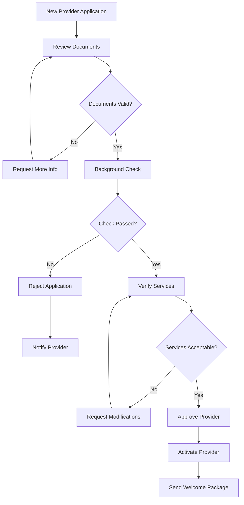
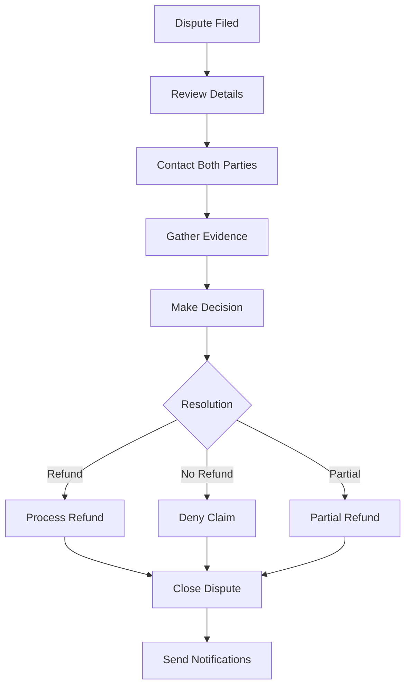

# Admin User Journey - LocalPro Super App

> **Role:** Admin (Platform Administrator)  
> **Version:** 1.0.0  
> **Last Updated:** January 13, 2026

---

## 📋 Table of Contents

1. [Role Overview](#role-overview)
2. [Admin Access & Permissions](#admin-access--permissions)
3. [User Management](#user-management)
4. [Provider Verification](#provider-verification)
5. [Content Moderation](#content-moderation)
6. [Financial Oversight](#financial-oversight)
7. [Platform Analytics](#platform-analytics)
8. [System Configuration](#system-configuration)
9. [Support & Dispute Resolution](#support--dispute-resolution)
10. [Feature Access Matrix](#feature-access-matrix)

---

## 🎯 Role Overview

### Definition
**Admin** is the highest-level role with full platform management capabilities. Admins oversee all operations, user activities, and system configurations.

### Key Responsibilities
- ✅ Manage all users and providers
- ✅ Verify and approve providers
- ✅ Moderate content and reviews
- ✅ Handle disputes and issues
- ✅ Monitor platform health
- ✅ Configure system settings
- ✅ Generate reports and analytics
- ✅ Manage staff permissions

### Admin Types
- **Super Admin**: Full system access
- **Admin**: Standard admin privileges
- **Moderator**: Content moderation
- **Support**: Customer support
- **Analyst**: Analytics and reporting

---

## 🔐 Admin Access & Permissions

### Login & Authentication
- Endpoint: `POST /api/auth/login`
- Admin credentials required
- Two-factor authentication (recommended)
- Secure session management

### Permission Levels
- **System Management**: Full control
- **User Management**: Create, edit, delete users
- **Content Moderation**: Approve, reject, remove content
- **Financial Access**: View transactions, process payouts
- **Analytics Access**: View all reports and metrics

---

## 👥 User Management

### 1. View All Users
- Endpoint: `GET /api/users`
- **Filters:**
  - Role (client, provider, supplier, etc.)
  - Status (active, suspended, banned)
  - Registration date
  - Verification status
  - Location

### 2. User Details & Management
- Endpoint: `GET /api/users/:id`
- View complete profile
- Edit user information
- Update roles
- View activity history
- Check financial records

### 3. User Status Management
- Endpoint: `PATCH /api/users/:id/status`
- **Actions:**
  - Suspend user
  - Ban user
  - Activate user
  - Delete account
  - Reset password

### 4. Role Management
- Endpoint: `POST /api/users/:id/roles`
- Add/remove roles
- Manage permissions
- Bulk role updates

### 5. User Statistics
- Endpoint: `GET /api/users/stats`
- Total users by role
- Active vs inactive
- New registrations
- User growth trends

---

## ✅ Provider Verification

### Verification Workflow

### 1. View Pending Verifications
- Endpoint: `GET /api/admin/providers/pending`
- List of pending applications
- Filter by submission date
- Priority queue

### 2. Review Provider Application
- Endpoint: `GET /api/admin/providers/:id/verification`
- **Review Items:**
  - Personal information
  - Professional qualifications
  - Business documents
  - Certifications
  - Portfolio/work samples

### 3. Verification Actions
- Endpoint: `PATCH /api/admin/providers/:id/verify`
- **Actions:**
  - Approve provider
  - Reject with reason
  - Request additional information
  - Schedule interview

### 4. Background Check
- Verify government ID
- Check criminal records (if applicable)
- Verify business registration
- Contact references

### 5. Post-Approval
- Send approval notification
- Activate provider account
- Provide onboarding materials
- Assign initial rating

---

## 🛡️ Content Moderation

### 1. Review System
- Endpoint: `GET /api/admin/reviews`
- **Moderate:**
  - Flagged reviews
  - Disputed ratings
  - Inappropriate content
  - Fake reviews

### 2. Service Listings
- Endpoint: `GET /api/admin/services`
- Review new services
- Approve service descriptions
- Flag inappropriate content
- Verify pricing

### 3. User-Generated Content
- **Moderate:**
  - Profile descriptions
  - Portfolio images
  - Chat messages (reported)
  - Job postings
  - Product listings

### 4. Reported Content
- Endpoint: `GET /api/admin/reports`
- View user reports
- Investigate issues
- Take action
- Communicate resolution

### 5. Moderation Actions
- Endpoint: `POST /api/admin/moderate/:type/:id`
- **Actions:**
  - Approve content
  - Remove content
  - Edit/modify
  - Warn user
  - Suspend account

---

## 💰 Financial Oversight

### 1. Transaction Monitoring
- Endpoint: `GET /api/admin/transactions`
- View all transactions
- Filter by:
  - Type (booking, purchase, payout)
  - Status (pending, completed, failed)
  - Amount range
  - Date range

### 2. Payout Management
- Endpoint: `GET /api/admin/payouts`
- **Manage:**
  - Pending payouts
  - Approve/reject payouts
  - Process bulk payouts
  - Handle payout issues

### 3. Financial Reports
- Endpoint: `GET /api/admin/reports/financial`
- **Reports:**
  - Revenue summary
  - Commission earnings
  - Payout status
  - Transaction volume
  - Growth metrics

### 4. Escrow Management
- Endpoint: `GET /api/admin/escrows`
- Monitor escrow transactions
- Release funds
- Handle disputes
- Process refunds

### 5. Pricing & Fees
- Endpoint: `PUT /api/admin/settings/pricing`
- Set platform fees
- Configure commission rates
- Manage promotional pricing
- Define refund policies

---

## 📊 Platform Analytics

### 1. Dashboard Overview
- Endpoint: `GET /api/admin/dashboard`
- **Metrics:**
  - Total users
  - Active bookings
  - Revenue today
  - Platform health
  - Key alerts

### 2. User Analytics
- Endpoint: `GET /api/analytics/users`
- User growth
- Retention rates
- Churn analysis
- Geographic distribution
- Role distribution

### 3. Booking Analytics
- Endpoint: `GET /api/analytics/bookings`
- Booking volume
- Popular services
- Completion rates
- Cancellation reasons
- Peak booking times

### 4. Financial Analytics
- Endpoint: `GET /api/analytics/financial`
- Revenue trends
- Commission breakdown
- Average transaction value
- Payment method usage

### 5. Performance Metrics
- Endpoint: `GET /api/analytics/performance`
- Response times
- System uptime
- Error rates
- User satisfaction scores

---

## ⚙️ System Configuration

### 1. Platform Settings
- Endpoint: `GET /api/admin/settings`
- **Configure:**
  - Platform name and branding
  - Contact information
  - Terms of service
  - Privacy policy
  - Feature toggles

### 2. Service Categories
- Endpoint: `GET /api/admin/job-categories`
- Manage categories
- Add/edit/delete
- Set icons and descriptions
- Define pricing guidelines

### 3. Notification Templates
- Endpoint: `GET /api/admin/notifications/templates`
- Email templates
- SMS templates
- Push notification templates
- Customize messaging

### 4. Payment Configuration
- Endpoint: `PUT /api/admin/settings/payment`
- Payment gateway settings
- Enable/disable methods
- Configure API keys
- Test payment flows

### 5. Integration Management
- Endpoint: `GET /api/admin/integrations`
- Third-party integrations
- API credentials
- Webhook configurations
- Service status

---

## 🤝 Support & Dispute Resolution

### 1. Support Tickets
- Endpoint: `GET /api/admin/support/tickets`
- View all tickets
- Assign to staff
- Respond to queries
- Track resolution time

### 2. Dispute Management
- Endpoint: `GET /api/admin/disputes`
- **Handle:**
  - Booking disputes
  - Payment issues
  - Service quality complaints
  - Refund requests

### 3. Dispute Resolution Process

### 4. User Communication
- Endpoint: `POST /api/admin/communication/send`
- Send announcements
- Platform updates
- Maintenance notices
- Promotional campaigns

---

## 📊 Feature Access Matrix

| Feature | Endpoint | Description |
|---------|----------|-------------|
| **User Management** |
| View All Users | `GET /api/users` | List all users |
| View User Details | `GET /api/users/:id` | User profile |
| Update User | `PUT /api/users/:id` | Edit user |
| Suspend/Ban User | `PATCH /api/users/:id/status` | Change status |
| Delete User | `DELETE /api/users/:id` | Remove user |
| **Provider Management** |
| Pending Verifications | `GET /api/admin/providers/pending` | Applications |
| Verify Provider | `PATCH /api/admin/providers/:id/verify` | Approve/reject |
| Provider Details | `GET /api/admin/providers/:id` | Full details |
| **Content Moderation** |
| Flagged Reviews | `GET /api/admin/reviews/flagged` | Reported reviews |
| Moderate Content | `POST /api/admin/moderate/:type/:id` | Take action |
| View Reports | `GET /api/admin/reports` | User reports |
| **Financial** |
| All Transactions | `GET /api/admin/transactions` | Transaction list |
| Manage Payouts | `GET /api/admin/payouts` | Payout queue |
| Financial Reports | `GET /api/admin/reports/financial` | Revenue reports |
| **Analytics** |
| Dashboard | `GET /api/admin/dashboard` | Overview metrics |
| User Analytics | `GET /api/analytics/users` | User insights |
| Booking Analytics | `GET /api/analytics/bookings` | Booking trends |
| **System** |
| Platform Settings | `GET /api/admin/settings` | Configuration |
| Manage Categories | `GET /api/admin/job-categories` | Service categories |
| Notification Templates | `GET /api/admin/notifications/templates` | Email/SMS templates |

---

## 🎯 Success Metrics

### Platform Health
- System uptime percentage
- Response time averages
- Error rate
- User satisfaction score

### User Growth
- New registrations per day
- User activation rate
- Monthly active users
- Retention rate

### Business Performance
- Gross merchandise value (GMV)
- Platform revenue
- Average transaction value
- Provider earnings

### Quality Metrics
- Provider approval rate
- Average service rating
- Dispute resolution time
- Customer support response time

---

## 🚀 Best Practices for Admins

### User Management
1. Review user reports promptly
2. Be fair and consistent in decisions
3. Document all actions
4. Communicate clearly with users
5. Protect user privacy

### Provider Verification
1. Thorough document review
2. Verify all credentials
3. Check references when possible
4. Clear communication of requirements
5. Fair and timely decisions

### Content Moderation
1. Follow community guidelines strictly
2. Be objective and unbiased
3. Give users chance to explain
4. Provide clear violation reasons
5. Educate users on policies

### Financial Management
1. Process payouts promptly
2. Monitor for fraud
3. Maintain accurate records
4. Transparent fee structure
5. Quick issue resolution

### System Management
1. Regular platform monitoring
2. Proactive issue resolution
3. Stay updated on regulations
4. Plan for scalability
5. Maintain security best practices

---

**Document Version:** 1.0.0  
**Last Updated:** January 13, 2026  
**Next Review:** April 13, 2026
