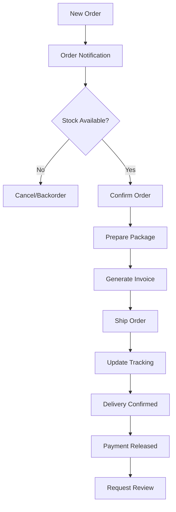

# Supplier User Journey - LocalPro Super App

> **Role:** Supplier (Product/Supply Seller)  
> **Version:** 1.0.0  
> **Last Updated:** January 13, 2026

---

## 📋 Table of Contents

1. [Role Overview](#role-overview)
2. [Supplier Onboarding](#supplier-onboarding)
3. [Product Management](#product-management)
4. [Order Management](#order-management)
5. [Inventory Management](#inventory-management)
6. [Financial Management](#financial-management)
7. [Analytics & Reports](#analytics--reports)
8. [Feature Access Matrix](#feature-access-matrix)

---

## 🎯 Role Overview

### Definition
**Supplier** is a user who sells supplies, products, and materials through the LocalPro marketplace. Suppliers can be individuals, businesses, or distributors.

### Key Characteristics
- ✅ Retains all client features
- ✅ Can list and sell products
- ✅ Manages inventory
- ✅ Fulfills orders
- ✅ Sets pricing and promotions
- ✅ Builds business reputation

### Target Products
- Cleaning supplies
- Hardware and tools
- Construction materials
- Professional equipment
- Safety gear
- Office supplies
- Specialty products

---

## 🚀 Supplier Onboarding

### Upgrade to Supplier Role

#### Step 1: Business Setup
- Endpoint: `POST /api/suppliers/register`

**Required Information:**
```json
{
  "businessInfo": {
    "businessName": "ABC Supplies",
    "businessType": "retailer",
    "registrationNumber": "DTI-123456",
    "taxId": "TAX-789456",
    "yearsInBusiness": 5
  },
  "contactInfo": {
    "email": "business@abcsupplies.com",
    "phone": "+639171234567",
    "address": {
      "street": "123 Supply Street",
      "city": "Manila",
      "state": "Metro Manila",
      "zipCode": "1000"
    }
  },
  "warehouseInfo": {
    "locations": [
      {
        "name": "Main Warehouse",
        "address": "456 Warehouse Ave",
        "capacity": 1000,
        "operatingHours": {
          "weekdays": "08:00-18:00",
          "weekends": "09:00-15:00"
        }
      }
    ]
  }
}
```

#### Step 2: Document Verification
- Business registration
- Tax documents
- Product certifications
- Warehouse permits

#### Step 3: Product Catalog Setup
- Define product categories
- Set pricing structure
- Configure shipping options
- Set inventory alerts

---

## 📦 Product Management

### 1. Add New Product
- Endpoint: `POST /api/supplies`

**Product Information:**
```json
{
  "name": "Professional Cleaning Kit",
  "description": "Complete cleaning solution for homes",
  "category": "cleaning_supplies",
  "subcategory": "cleaning_kits",
  "sku": "CLN-KIT-001",
  "pricing": {
    "basePrice": 1500,
    "salePrice": 1200,
    "currency": "PHP"
  },
  "inventory": {
    "quantity": 100,
    "lowStockThreshold": 20,
    "restockDate": "2026-02-01"
  },
  "specifications": {
    "brand": "CleanPro",
    "weight": "5kg",
    "dimensions": "30x20x15cm"
  },
  "images": [
    "https://cloudinary.com/product1.jpg",
    "https://cloudinary.com/product2.jpg"
  ],
  "shipping": {
    "weight": 5,
    "freeShippingThreshold": 2000,
    "estimatedDelivery": "3-5 days"
  }
}
```

### 2. Product Catalog Management
- Endpoint: `GET /api/supplies/my-products`
- View all products
- Filter by category, status
- Bulk edit
- Import/export catalog

### 3. Product Variants
- Add size, color, quantity options
- Set variant pricing
- Manage variant inventory

### 4. Product Promotions
- Endpoint: `POST /api/supplies/:id/promotion`
- Flash sales
- Bulk discounts
- Bundle deals
- Seasonal promotions

---

## 📋 Order Management

### Order Processing Flow



### 1. View Orders
- Endpoint: `GET /api/supplies/orders`
- **Filter by:**
  - Status (pending, processing, shipped, delivered)
  - Date range
  - Customer
  - Amount

### 2. Process Order
- Endpoint: `PATCH /api/supplies/orders/:id/process`
- Confirm order
- Check inventory
- Generate packing slip
- Update status

### 3. Shipping Management
- Endpoint: `POST /api/supplies/orders/:id/ship`
- Select courier
- Generate tracking number
- Print shipping label
- Update customer

### 4. Order Fulfillment
- Pack products securely
- Include invoice
- Quality check
- Ship on time

### 5. Handle Returns
- Endpoint: `POST /api/supplies/orders/:id/return`
- Process return requests
- Verify product condition
- Issue refund/replacement
- Update inventory

---

## 📊 Inventory Management

### 1. Stock Monitoring
- Endpoint: `GET /api/supplies/inventory`
- Current stock levels
- Low stock alerts
- Out of stock items
- Overstock items

### 2. Inventory Updates
- Endpoint: `PUT /api/supplies/:id/inventory`
- Add stock
- Reduce stock
- Adjust counts
- Set reorder points

### 3. Multi-Warehouse Management
- Track inventory by location
- Transfer stock between warehouses
- Optimize fulfillment

### 4. Inventory Reports
- Endpoint: `GET /api/supplies/reports/inventory`
- Stock valuation
- Turnover rate
- Dead stock analysis
- Reorder recommendations

---

## 💰 Financial Management

### 1. Sales Dashboard
- Endpoint: `GET /api/suppliers/dashboard`
- Total sales
- Pending orders
- Revenue trends
- Top products

### 2. Pricing Management
- Set competitive prices
- Dynamic pricing
- Bulk pricing tiers
- Cost-plus pricing

### 3. Earnings & Payouts
- Endpoint: `GET /api/suppliers/earnings`
- Total earnings
- Platform fees
- Net income
- Payout schedule

### 4. Financial Reports
- Endpoint: `GET /api/suppliers/reports/financial`
- Sales reports
- Profit margins
- Tax documents
- Product performance

---

## 📊 Analytics & Reports

### 1. Sales Analytics
- Endpoint: `GET /api/suppliers/analytics/sales`
- Sales trends
- Best-selling products
- Revenue by category
- Customer segments

### 2. Product Performance
- Views and clicks
- Conversion rate
- Cart abandonment
- Review ratings

### 3. Customer Insights
- Repeat customers
- Average order value
- Customer lifetime value
- Geographic distribution

### 4. Competitive Analysis
- Market positioning
- Price comparison
- Category trends
- Demand forecasting

---

## 📊 Feature Access Matrix

| Feature | Endpoint | Description |
|---------|----------|-------------|
| **Product Management** |
| Add Product | `POST /api/supplies` | Create new product |
| Edit Product | `PUT /api/supplies/:id` | Update product |
| Delete Product | `DELETE /api/supplies/:id` | Remove product |
| My Products | `GET /api/supplies/my-products` | Product catalog |
| **Order Management** |
| View Orders | `GET /api/supplies/orders` | All orders |
| Process Order | `PATCH /api/supplies/orders/:id/process` | Fulfill order |
| Ship Order | `POST /api/supplies/orders/:id/ship` | Mark as shipped |
| Handle Return | `POST /api/supplies/orders/:id/return` | Process return |
| **Inventory** |
| View Inventory | `GET /api/supplies/inventory` | Stock levels |
| Update Stock | `PUT /api/supplies/:id/inventory` | Adjust inventory |
| Inventory Report | `GET /api/supplies/reports/inventory` | Stock reports |
| **Financial** |
| Sales Dashboard | `GET /api/suppliers/dashboard` | Overview |
| Earnings | `GET /api/suppliers/earnings` | Income details |
| Request Payout | `POST /api/finance/payout` | Withdraw funds |

---

## 🎯 Success Metrics

### Sales Performance
- Total revenue
- Orders per day
- Average order value
- Conversion rate

### Product Performance
- Best sellers
- Stock turnover rate
- Product rating
- Return rate

### Customer Satisfaction
- Customer reviews
- Repeat purchase rate
- Customer complaints
- Response time

---

## 🚀 Best Practices for Suppliers

### Product Listings
1. High-quality product photos
2. Detailed descriptions
3. Accurate specifications
4. Competitive pricing
5. Clear shipping information

### Order Fulfillment
1. Process orders promptly
2. Pack securely
3. Ship on time
4. Update tracking information
5. Handle issues professionally

### Inventory Management
1. Maintain adequate stock
2. Set reorder alerts
3. Regular stock audits
4. Optimize storage
5. Forecast demand

### Customer Service
1. Respond quickly to inquiries
2. Handle returns fairly
3. Maintain quality standards
4. Seek customer feedback
5. Build loyal customer base

---

**Document Version:** 1.0.0  
**Last Updated:** January 13, 2026  
**Next Review:** April 13, 2026
