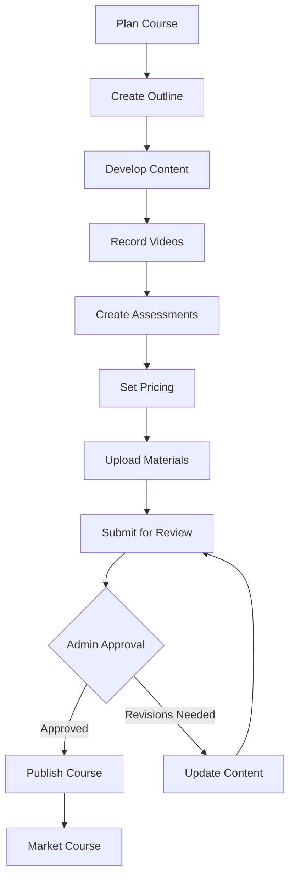

# Instructor User Journey - LocalPro Super App

> **Role:** Instructor (Course Creator/Trainer)  
> **Version:** 1.0.0  
> **Last Updated:** January 13, 2026

---

## 📋 Table of Contents

1. [Role Overview](#role-overview)
2. [Instructor Onboarding](#instructor-onboarding)
3. [Course Creation](#course-creation)
4. [Student Management](#student-management)
5. [Teaching & Delivery](#teaching--delivery)
6. [Financial Management](#financial-management)
7. [Analytics & Performance](#analytics--performance)
8. [Feature Access Matrix](#feature-access-matrix)

---

## 🎯 Role Overview

### Definition
**Instructor** is a user who creates and delivers training courses, workshops, and certifications on the LocalPro Academy platform.

### Key Characteristics
- ✅ Retains all client features
- ✅ Creates and publishes courses
- ✅ Manages student enrollment
- ✅ Delivers training content
- ✅ Issues certifications
- ✅ Earns from course sales

### Course Categories
- Technical skills (plumbing, electrical, etc.)
- Business skills
- Safety training
- Professional development
- Certification programs
- Soft skills

---

## 🚀 Instructor Onboarding

### Become an Instructor

#### Step 1: Application
- Endpoint: `POST /api/academy/instructor/apply`

**Required Information:**
```json
{
  "professionalInfo": {
    "expertise": ["plumbing", "electrical_work"],
    "yearsOfExperience": 10,
    "certifications": [
      {
        "name": "Master Plumber License",
        "issuedBy": "Philippine Contractors Board",
        "issueDate": "2015-06-01",
        "certificateUrl": "https://cloudinary.com/cert.pdf"
      }
    ],
    "education": [
      {
        "degree": "Bachelor of Science in Engineering",
        "institution": "University of Philippines",
        "graduationYear": 2010
      }
    ]
  },
  "teachingExperience": {
    "yearsTeaching": 5,
    "studentsTeaching": 200,
    "previousInstitutions": ["Technical Institute Manila"],
    "teachingStyle": "Hands-on practical training"
  },
  "motivation": "I want to share my 10+ years of experience..."
}
```

#### Step 2: Verification
- Review credentials
- Verify certifications
- Check teaching experience
- Admin approval

#### Step 3: Instructor Training
- Platform orientation
- Course creation guidelines
- Best practices
- Technical setup

---

## 📚 Course Creation

### Course Development Process



### 1. Create New Course
- Endpoint: `POST /api/academy/courses`

**Course Structure:**
```json
{
  "title": "Complete Plumbing Basics",
  "description": "Master essential plumbing skills",
  "category": "technical_skills",
  "subcategory": "plumbing",
  "level": "beginner",
  "language": "English",
  "duration": 20,
  "pricing": {
    "type": "paid",
    "amount": 2500,
    "currency": "PHP"
  },
  "whatYouLearn": [
    "Basic plumbing tools and usage",
    "Pipe fitting and installation",
    "Leak detection and repair"
  ],
  "requirements": [
    "No prior experience needed",
    "Basic hand tools helpful"
  ],
  "targetAudience": [
    "Aspiring plumbers",
    "DIY homeowners",
    "Career changers"
  ],
  "certification": {
    "provided": true,
    "certificateName": "Plumbing Basics Certificate",
    "validityPeriod": 24
  }
}
```

### 2. Course Content Structure
- Endpoint: `POST /api/academy/courses/:id/modules`

**Module Setup:**
- Create sections/modules
- Add lessons
- Upload videos
- Add reading materials
- Create quizzes
- Design assignments

### 3. Video Content
- Endpoint: `POST /api/academy/courses/:id/videos`
- Record high-quality videos
- Upload to platform
- Add captions/subtitles
- Set video order

### 4. Assessments
- Endpoint: `POST /api/academy/courses/:id/assessments`
- **Types:**
  - Multiple choice quizzes
  - Practical assignments
  - Project submissions
  - Final examination

### 5. Supplementary Materials
- PDF guides
- Checklists
- Templates
- Resource links
- Practice exercises

---

## 👨‍🎓 Student Management

### 1. Enrollment Management
- Endpoint: `GET /api/academy/instructor/enrollments`
- View enrolled students
- Track enrollment trends
- Manage waiting lists
- Set enrollment limits

### 2. Student Progress Tracking
- Endpoint: `GET /api/academy/courses/:id/students`
- Monitor completion rates
- Track lesson progress
- View assessment scores
- Identify struggling students

### 3. Student Communication
- Endpoint: `POST /api/academy/courses/:id/announcements`
- Send announcements
- Answer questions
- Provide feedback
- Share updates

### 4. Grading & Feedback
- Endpoint: `POST /api/academy/submissions/:id/grade`
- Review assignments
- Grade submissions
- Provide detailed feedback
- Issue certificates

---

## 📖 Teaching & Delivery

### Course Delivery Methods

#### 1. Self-Paced Courses
- Students learn at own speed
- Pre-recorded content
- Automated assessments
- Forum discussions

#### 2. Live Classes
- Endpoint: `POST /api/academy/courses/:id/live-session`
- Schedule live sessions
- Video conferencing
- Real-time Q&A
- Interactive demonstrations

#### 3. Hybrid Model
- Combine recorded and live content
- Flexible learning paths
- Scheduled check-ins
- Community interaction

### Content Updates
- Endpoint: `PUT /api/academy/courses/:id`
- Update course materials
- Add new lessons
- Revise content
- Respond to feedback

### Student Support
- Q&A forums
- Direct messaging
- Office hours
- Resource library

---

## 💰 Financial Management

### 1. Earnings Dashboard
- Endpoint: `GET /api/academy/instructor/earnings`
- **Metrics:**
  - Total earnings
  - This month's income
  - Student enrollments
  - Revenue per course

### 2. Pricing Strategy
- **Models:**
  - One-time payment
  - Subscription access
  - Bundle pricing
  - Early bird discounts

### 3. Revenue Share
- Platform commission: 20%
- Instructor earnings: 80%
- Bonus for high ratings
- Referral bonuses

### 4. Payout Management
- Endpoint: `POST /api/finance/payout`
- Monthly payouts
- Minimum threshold: ₱1,000
- Payment methods:
  - Bank transfer
  - GCash
  - PayMaya

### 5. Promotional Tools
- Coupon codes
- Discount campaigns
- Free preview lessons
- Referral program

---

## 📊 Analytics & Performance

### 1. Course Analytics
- Endpoint: `GET /api/academy/instructor/analytics`

**Metrics:**
- Total enrollments
- Active students
- Completion rate
- Average rating
- Revenue generated

### 2. Student Engagement
- Lesson completion rates
- Quiz performance
- Time spent learning
- Discussion participation
- Drop-off points

### 3. Course Performance
- Popular courses
- Course rating trends
- Student reviews
- Refund rates
- Certification completions

### 4. Competitive Insights
- Category trends
- Popular topics
- Pricing benchmarks
- Market demand

---

## 📊 Feature Access Matrix

| Feature | Endpoint | Description |
|---------|----------|-------------|
| **Course Management** |
| Create Course | `POST /api/academy/courses` | New course |
| Edit Course | `PUT /api/academy/courses/:id` | Update course |
| Delete Course | `DELETE /api/academy/courses/:id` | Remove course |
| My Courses | `GET /api/academy/my-created-courses` | Course list |
| Upload Video | `POST /api/academy/courses/:id/videos` | Add video |
| **Student Management** |
| View Enrollments | `GET /api/academy/instructor/enrollments` | Student list |
| Track Progress | `GET /api/academy/courses/:id/students` | Progress data |
| Grade Assignment | `POST /api/academy/submissions/:id/grade` | Provide grade |
| Issue Certificate | `POST /api/academy/certifications/issue` | Award cert |
| **Communication** |
| Send Announcement | `POST /api/academy/courses/:id/announcements` | Course update |
| Answer Question | `POST /api/academy/courses/:id/qa` | Q&A response |
| **Financial** |
| View Earnings | `GET /api/academy/instructor/earnings` | Income data |
| Request Payout | `POST /api/finance/payout` | Withdraw funds |
| **Analytics** |
| Course Analytics | `GET /api/academy/instructor/analytics` | Performance data |
| Student Analytics | `GET /api/academy/courses/:id/analytics` | Engagement metrics |

---

## 🎯 Success Metrics

### Course Performance
- Enrollment numbers
- Completion rate
- Student satisfaction
- Average rating
- Certificate issuance rate

### Financial Success
- Monthly revenue
- Revenue per student
- Refund rate
- Course profitability

### Student Outcomes
- Skill acquisition
- Certification rate
- Career advancement
- Student testimonials

---

## 🚀 Best Practices for Instructors

### Course Creation
1. Research market demand
2. Define clear learning objectives
3. Structure content logically
4. Use engaging teaching methods
5. Provide practical exercises

### Video Production
1. Good lighting and audio
2. Clear speaking voice
3. Engaging presentation
4. Screen sharing when needed
5. Professional appearance

### Student Engagement
1. Respond quickly to questions
2. Provide detailed feedback
3. Encourage discussions
4. Recognize achievements
5. Update content regularly

### Marketing
1. Write compelling descriptions
2. Use eye-catching thumbnails
3. Offer preview lessons
4. Collect testimonials
5. Promote on social media

### Quality Assurance
1. Test all course materials
2. Fix technical issues
3. Update outdated content
4. Improve based on feedback
5. Maintain high standards

---

**Document Version:** 1.0.0  
**Last Updated:** January 13, 2026  
**Next Review:** April 13, 2026
