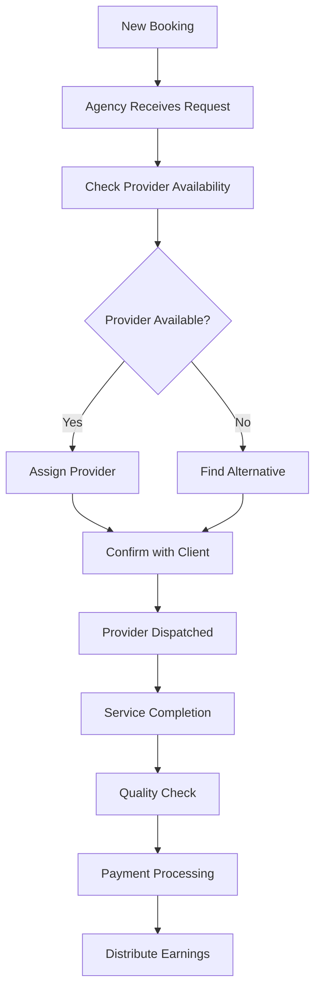
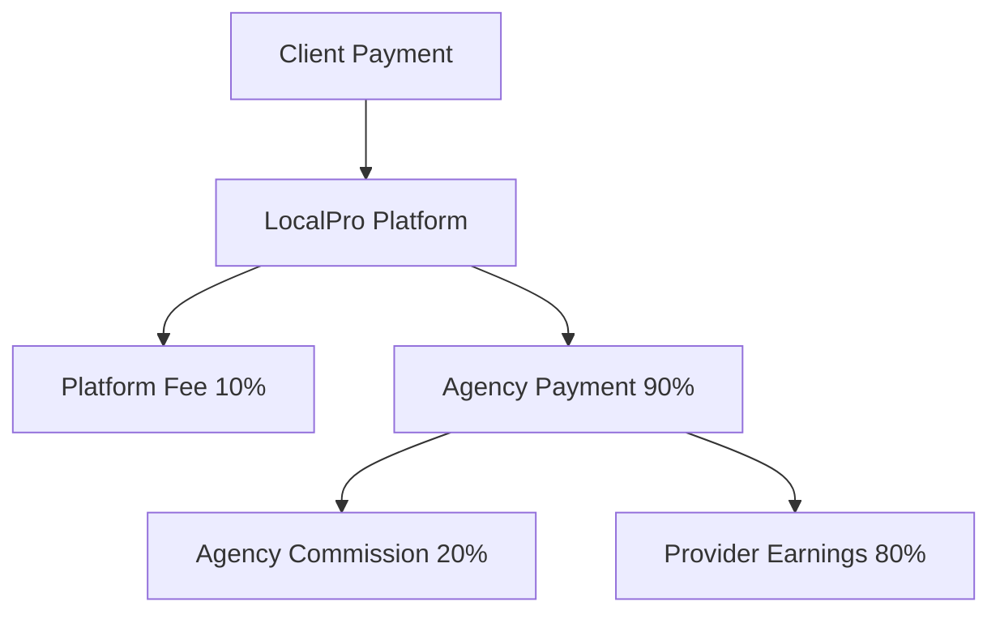

# Agency Owner User Journey - LocalPro Super App

> **Role:** Agency Owner (Service Agency Proprietor)  
> **Version:** 1.0.0  
> **Last Updated:** January 13, 2026

---

## 📋 Table of Contents

1. [Role Overview](#role-overview)
2. [Agency Creation & Setup](#agency-creation--setup)
3. [Provider Management](#provider-management)
4. [Service Operations](#service-operations)
5. [Booking & Dispatch](#booking--dispatch)
6. [Financial Management](#financial-management)
7. [Team Administration](#team-administration)
8. [Analytics & Growth](#analytics--growth)
9. [Feature Access Matrix](#feature-access-matrix)

---

## 🎯 Role Overview

### Definition
**Agency Owner** manages a service agency that employs or contracts multiple service providers. The agency owner oversees operations, manages providers, and grows the business.

### Key Characteristics
- ✅ Retains all client features
- ✅ Creates and owns service agency
- ✅ Recruits and manages providers
- ✅ Handles bulk bookings
- ✅ Manages agency finances
- ✅ Sets agency-wide policies
- ✅ Delegates to agency admins

### Agency Types
- **Cleaning Services**: House, office, commercial cleaning
- **Maintenance**: Building, facility, equipment maintenance
- **Construction**: Carpentry, masonry, electrical, plumbing
- **Logistics**: Moving, delivery, transportation
- **Healthcare**: Nursing, caregiving, therapy
- **Technology**: IT support, installations
- **Multi-Service**: Combined service offerings

---

## 🚀 Agency Creation & Setup

### Create New Agency

#### Step 1: Register Agency
- Endpoint: `POST /api/agencies`

**Agency Information:**
```json
{
  "name": "ProClean Services Agency",
  "type": "service_agency",
  "description": "Professional cleaning services with 50+ trained staff",
  "contactInfo": {
    "email": "contact@proclean.com",
    "phone": "+639171234567",
    "website": "https://proclean.com",
    "address": {
      "street": "123 Business Ave",
      "city": "Manila",
      "state": "Metro Manila",
      "zipCode": "1000"
    }
  },
  "businessInfo": {
    "industry": "cleaning",
    "businessType": "corporation",
    "registrationNumber": "SEC-2020-123456",
    "taxId": "TAX-789-456-123",
    "yearsInBusiness": 5,
    "numberOfEmployees": 50
  },
  "services": ["house_cleaning", "office_cleaning", "deep_cleaning"],
  "serviceArea": {
    "primaryCity": "Manila",
    "coverage": ["Makati", "Quezon City", "Pasig"],
    "maxRadius": 25
  },
  "operatingHours": {
    "weekdays": "07:00-20:00",
    "weekends": "08:00-18:00"
  }
}
```

#### Step 2: Document Submission
- Business registration
- Mayor's permit
- Tax documents
- Insurance certificates
- Safety certifications

#### Step 3: Verification Process
- Admin review
- Document verification
- Background check
- Business validation
- Approval

---

## 👥 Provider Management

### Recruitment & Onboarding

#### 1. Invite Providers
- Endpoint: `POST /api/agencies/:id/providers/invite`

**Invitation Methods:**
- Send email invitation
- Share referral link
- Import existing providers
- Bulk invite

#### 2. Provider Application
- Providers apply to join agency
- Submit credentials
- Background check
- Skills assessment
- Training requirements

#### 3. Accept/Reject Providers
- Endpoint: `POST /api/agencies/:id/providers/add`
- Review applications
- Verify qualifications
- Approve providers
- Assign services

### Provider Management

#### 1. View All Providers
- Endpoint: `GET /api/agencies/:id/providers`
- Active providers
- Provider performance
- Availability status
- Service specialties

#### 2. Provider Status
- Endpoint: `PATCH /api/agencies/:id/providers/:providerId/status`
- **Actions:**
  - Activate
  - Suspend
  - Remove from agency
  - Update roles

#### 3. Provider Performance
- Track bookings completed
- Monitor ratings
- Review customer feedback
- Identify top performers

#### 4. Training & Development
- Mandatory training programs
- Skill certifications
- Safety training
- Service quality standards

---

## 🛠️ Service Operations

### Agency Service Management

#### 1. Define Agency Services
- Endpoint: `POST /api/agencies/:id/services`
- Service catalog
- Standard pricing
- Service packages
- Quality standards

#### 2. Service Assignments
- Assign providers to services
- Set provider rates
- Define service areas
- Schedule availability

#### 3. Quality Control
- Service standards
- Quality inspections
- Customer satisfaction goals
- Continuous improvement

---

## 📅 Booking & Dispatch

### Booking Management System



#### 1. View Agency Bookings
- Endpoint: `GET /api/agencies/:id/bookings`
- All bookings
- Filter by status, date, provider
- Bulk operations

#### 2. Assign Bookings
- Endpoint: `POST /api/agencies/:id/bookings/:bookingId/assign`
- Auto-assignment rules
- Manual assignment
- Consider factors:
  - Provider skills
  - Location proximity
  - Availability
  - Current workload

#### 3. Dispatch Management
- Real-time tracking
- Route optimization
- Schedule adjustments
- Emergency reassignment

#### 4. Booking Oversight
- Monitor progress
- Handle issues
- Client communication
- Quality assurance

---

## 💰 Financial Management

### Agency Finances

#### 1. Revenue Dashboard
- Endpoint: `GET /api/agencies/:id/financial/dashboard`
- Total revenue
- Pending payments
- Provider earnings
- Agency commission

#### 2. Commission Structure
- Set agency commission (10-30%)
- Provider earnings (70-90%)
- Bonus structures
- Performance incentives

#### 3. Provider Payouts
- Endpoint: `GET /api/agencies/:id/financial/payouts`
- Calculate provider earnings
- Deduct agency commission
- Process payouts
- Generate pay slips

#### 4. Financial Reports
- Endpoint: `GET /api/agencies/:id/reports/financial`
- **Reports:**
  - Revenue by service
  - Provider earnings
  - Profit margins
  - Tax documents
  - Client billing

#### 5. Payment Distribution


---

## 👔 Team Administration

### Agency Administration

#### 1. Add Agency Admins
- Endpoint: `POST /api/agencies/:id/admins/add`
- Delegate administrative tasks
- Set permissions
- Monitor admin activities

#### 2. Roles & Permissions
- **Agency Owner**: Full control
- **Agency Admin**: Day-to-day operations
- **Supervisor**: Provider oversight
- **Coordinator**: Booking management

#### 3. Team Communication
- Endpoint: `POST /api/agencies/:id/announcements`
- Send updates
- Policy changes
- Training notifications
- Performance feedback

---

## 📊 Analytics & Growth

### Business Intelligence

#### 1. Agency Dashboard
- Endpoint: `GET /api/agencies/:id/analytics`
- **Metrics:**
  - Total bookings
  - Revenue trends
  - Provider performance
  - Customer satisfaction
  - Growth indicators

#### 2. Performance Reports
- Booking completion rate
- Average rating
- Customer retention
- Market share
- Competitive position

#### 3. Provider Analytics
- Top performers
- Utilization rates
- Training completion
- Customer ratings
- Earnings distribution

#### 4. Growth Opportunities
- Market expansion
- Service diversification
- Pricing optimization
- Marketing insights

---

## 📊 Feature Access Matrix

| Feature | Endpoint | Description |
|---------|----------|-------------|
| **Agency Management** |
| Create Agency | `POST /api/agencies` | Register agency |
| Update Agency | `PUT /api/agencies/:id` | Edit details |
| View Agency | `GET /api/agencies/:id` | Agency profile |
| **Provider Management** |
| Invite Provider | `POST /api/agencies/:id/providers/invite` | Send invitation |
| Add Provider | `POST /api/agencies/:id/providers/add` | Accept provider |
| Remove Provider | `DELETE /api/agencies/:id/providers/:providerId` | Remove member |
| View Providers | `GET /api/agencies/:id/providers` | Provider list |
| **Booking Management** |
| Agency Bookings | `GET /api/agencies/:id/bookings` | All bookings |
| Assign Booking | `POST /api/agencies/:id/bookings/:bookingId/assign` | Dispatch provider |
| Booking Analytics | `GET /api/agencies/:id/bookings/analytics` | Booking insights |
| **Financial** |
| Financial Dashboard | `GET /api/agencies/:id/financial/dashboard` | Revenue overview |
| Provider Payouts | `GET /api/agencies/:id/financial/payouts` | Earnings data |
| Financial Reports | `GET /api/agencies/:id/reports/financial` | Detailed reports |
| **Administration** |
| Add Admin | `POST /api/agencies/:id/admins/add` | Add administrator |
| Manage Permissions | `PUT /api/agencies/:id/admins/:adminId/permissions` | Set permissions |
| Send Announcement | `POST /api/agencies/:id/announcements` | Team updates |
| **Analytics** |
| Agency Analytics | `GET /api/agencies/:id/analytics` | Performance data |
| Provider Performance | `GET /api/agencies/:id/providers/analytics` | Provider metrics |

---

## 🎯 Success Metrics

### Operational Excellence
- Booking completion rate (target: 95%+)
- Average response time (target: <1 hour)
- Customer satisfaction (target: 4.5+ stars)
- Provider retention rate

### Financial Health
- Monthly revenue growth
- Profit margins
- Provider earnings satisfaction
- Cost per acquisition

### Growth Indicators
- Number of active providers
- Service area expansion
- Market share
- Brand recognition

---

## 🚀 Best Practices for Agency Owners

### Provider Management
1. Recruit quality providers
2. Provide comprehensive training
3. Fair compensation structure
4. Regular performance reviews
5. Recognition and rewards

### Operations
1. Efficient booking assignment
2. Real-time tracking
3. Quality control measures
4. Customer service excellence
5. Issue resolution protocols

### Financial Management
1. Transparent commission structure
2. Timely provider payments
3. Accurate financial records
4. Tax compliance
5. Investment in growth

### Team Building
1. Clear communication
2. Define roles and responsibilities
3. Empower team members
4. Foster collaboration
5. Professional development

### Business Growth
1. Market research
2. Service expansion
3. Strategic partnerships
4. Brand building
5. Customer loyalty programs

---

**Document Version:** 1.0.0  
**Last Updated:** January 13, 2026  
**Next Review:** April 13, 2026
