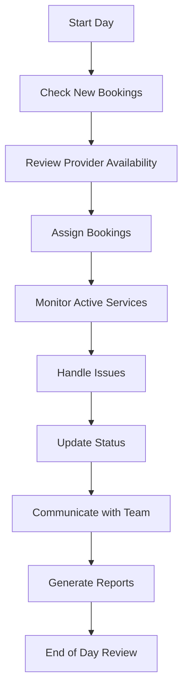

# Agency Admin User Journey - LocalPro Super App

> **Role:** Agency Admin (Agency Administrator)  
> **Version:** 1.0.0  
> **Last Updated:** January 13, 2026

---

## 📋 Table of Contents

1. [Role Overview](#role-overview)
2. [Getting Started](#getting-started)
3. [Daily Operations](#daily-operations)
4. [Provider Coordination](#provider-coordination)
5. [Booking Management](#booking-management)
6. [Communication](#communication)
7. [Reporting](#reporting)
8. [Feature Access Matrix](#feature-access-matrix)

---

## 🎯 Role Overview

### Definition
**Agency Admin** is appointed by the Agency Owner to handle day-to-day operations, coordinate providers, manage bookings, and support agency activities.

### Key Characteristics
- ✅ Retains all client features
- ✅ Manages daily agency operations
- ✅ Coordinates provider schedules
- ✅ Handles booking assignments
- ✅ Communicates with clients
- ✅ Reports to agency owner
- ❌ Cannot modify agency structure
- ❌ Limited financial access

### Responsibilities
- Provider coordination
- Booking dispatch
- Customer support
- Schedule management
- Issue resolution
- Performance monitoring
- Report generation

---

## 🚀 Getting Started

### Appointment as Agency Admin

#### 1. Owner Invitation
- Agency owner sends invitation
- Receive notification
- Accept role

#### 2. Access Granted
- Endpoint: `GET /api/agencies/:id/admin`
- Access agency dashboard
- View permissions
- Understand responsibilities

#### 3. Training & Orientation
- Agency policies
- Standard procedures
- System navigation
- Communication protocols
- Escalation procedures

---

## 📅 Daily Operations

### Daily Workflow



### Morning Routine

#### 1. Dashboard Check
- Endpoint: `GET /api/agencies/:id/admin/dashboard`
- **Review:**
  - New booking requests
  - Today's schedule
  - Provider availability
  - Pending issues
  - Important notifications

#### 2. Provider Check-in
- Confirm provider availability
- Review schedules
- Address concerns
- Assign day's bookings

#### 3. Client Communication
- Respond to inquiries
- Confirm appointments
- Send reminders
- Address concerns

---

## 👥 Provider Coordination

### Managing Agency Providers

#### 1. View Providers
- Endpoint: `GET /api/agencies/:id/providers`
- See all agency providers
- Check availability status
- View current assignments
- Monitor performance

#### 2. Availability Management
- Endpoint: `GET /api/agencies/:id/providers/availability`
- Track who's available
- Manage time-off requests
- Schedule breaks
- Handle emergencies

#### 3. Provider Communication
- Endpoint: `POST /api/communication/chat/send`
- Send assignments
- Share updates
- Provide instructions
- Collect feedback

#### 4. Performance Tracking
- Monitor completion rates
- Track customer ratings
- Identify training needs
- Recognize good performance

---

## 📋 Booking Management

### Booking Assignment Process

#### 1. View Booking Requests
- Endpoint: `GET /api/agencies/:id/bookings?status=pending`
- New requests
- Urgent bookings
- Rescheduling requests
- Cancellations

#### 2. Assign to Provider
- Endpoint: `POST /api/agencies/:id/bookings/:bookingId/assign`

**Assignment Considerations:**
- Provider specialization
- Location proximity
- Current workload
- Customer preferences
- Provider ratings

**Example:**
```json
{
  "bookingId": "booking123",
  "providerId": "provider456",
  "assignmentNotes": "Regular client, prefers Maria",
  "estimatedTravelTime": 20
}
```

#### 3. Monitor Active Bookings
- Endpoint: `GET /api/agencies/:id/bookings?status=active`
- Track progress
- GPS location monitoring
- Check-in/check-out times
- Issue alerts

#### 4. Handle Issues
- Provider delays
- Service complaints
- Emergency situations
- Rescheduling needs
- Client concerns

#### 5. Booking Completion
- Verify completion
- Collect feedback
- Process documentation
- Update records

---

## 💬 Communication

### Communication Channels

#### 1. Provider Communication
- Daily briefings
- Assignment notifications
- Real-time updates
- Performance feedback
- Schedule changes

#### 2. Client Communication
- Booking confirmations
- Provider assignments
- Status updates
- Issue resolution
- Follow-up messages

#### 3. Agency Owner Reporting
- Daily summaries
- Issue escalation
- Performance reports
- Recommendations
- Resource requests

#### 4. Team Coordination
- Endpoint: `POST /api/agencies/:id/announcements`
- Send team announcements
- Policy updates
- Schedule reminders
- Training notifications

---

## 📊 Reporting

### Reports and Analytics

#### 1. Daily Operations Report
- Endpoint: `GET /api/agencies/:id/reports/daily`
- **Contents:**
  - Bookings processed
  - Providers active
  - Issues resolved
  - Customer feedback
  - Revenue generated

#### 2. Provider Performance
- Endpoint: `GET /api/agencies/:id/providers/analytics`
- Completion rates
- Average ratings
- Response times
- Customer satisfaction

#### 3. Booking Analytics
- Endpoint: `GET /api/agencies/:id/bookings/analytics`
- Booking volume
- Peak times
- Service types
- Location distribution

#### 4. Issue Tracking
- Reported issues
- Resolution time
- Issue categories
- Prevention measures

---

## 📊 Feature Access Matrix

| Feature | Endpoint | Access Level | Description |
|---------|----------|--------------|-------------|
| **Dashboard** |
| Admin Dashboard | `GET /api/agencies/:id/admin/dashboard` | ✅ Full | Daily overview |
| **Provider Management** |
| View Providers | `GET /api/agencies/:id/providers` | ✅ Full | Provider list |
| Provider Availability | `GET /api/agencies/:id/providers/availability` | ✅ Full | Schedule view |
| Update Provider Status | `PATCH /api/agencies/:id/providers/:id/status` | ⚠️ Limited | Temporary changes only |
| **Booking Management** |
| View Bookings | `GET /api/agencies/:id/bookings` | ✅ Full | All bookings |
| Assign Booking | `POST /api/agencies/:id/bookings/:id/assign` | ✅ Full | Dispatch provider |
| Update Booking | `PATCH /api/agencies/:id/bookings/:id` | ✅ Full | Modify booking |
| Cancel Booking | `DELETE /api/agencies/:id/bookings/:id` | ⚠️ Limited | With approval |
| **Communication** |
| Send Message | `POST /api/communication/chat/send` | ✅ Full | Team/client chat |
| Send Announcement | `POST /api/agencies/:id/announcements` | ✅ Full | Team updates |
| **Reporting** |
| Daily Reports | `GET /api/agencies/:id/reports/daily` | ✅ Full | Operations report |
| Provider Analytics | `GET /api/agencies/:id/providers/analytics` | ✅ Full | Performance data |
| Booking Analytics | `GET /api/agencies/:id/bookings/analytics` | ✅ Full | Booking insights |
| **Financial** |
| View Revenue | `GET /api/agencies/:id/financial/summary` | ⚠️ Limited | Read-only |
| Provider Payouts | `GET /api/agencies/:id/financial/payouts` | ⚠️ Limited | View only |

**Legend:**
- ✅ Full Access
- ⚠️ Limited Access
- ❌ No Access

---

## 🎯 Success Metrics

### Operational Performance
- Booking assignment speed
- Provider utilization rate
- Customer satisfaction score
- Issue resolution time

### Team Performance
- Provider punctuality
- Service completion rate
- Quality ratings
- Team communication effectiveness

### Personal Performance
- Tasks completed daily
- Response time to issues
- Report accuracy
- Owner satisfaction

---

## 🚀 Best Practices for Agency Admins

### Booking Management
1. Assign bookings promptly
2. Match providers to suitable jobs
3. Confirm assignments
4. Monitor progress actively
5. Handle issues proactively

### Provider Management
1. Maintain open communication
2. Be fair and consistent
3. Recognize good work
4. Address issues quickly
5. Support provider needs

### Client Relations
1. Professional communication
2. Quick response times
3. Set realistic expectations
4. Follow up on concerns
5. Ensure satisfaction

### Organization
1. Keep detailed records
2. Use checklists
3. Plan ahead
4. Stay organized
5. Document everything

### Problem Solving
1. Stay calm under pressure
2. Gather all information
3. Find solutions quickly
4. Escalate when needed
5. Learn from issues

### Communication
1. Clear and concise messaging
2. Regular updates
3. Active listening
4. Professional tone
5. Timely responses

### Reporting
1. Accurate data collection
2. Timely report submission
3. Highlight important issues
4. Suggest improvements
5. Track trends

---

## 📝 Daily Checklist

### Morning
- [ ] Check new booking requests
- [ ] Review today's schedule
- [ ] Confirm provider availability
- [ ] Assign pending bookings
- [ ] Send daily briefing to team

### During Day
- [ ] Monitor active bookings
- [ ] Respond to messages
- [ ] Handle issues as they arise
- [ ] Update booking statuses
- [ ] Coordinate with providers

### Evening
- [ ] Review day's completions
- [ ] Collect feedback
- [ ] Prepare tomorrow's schedule
- [ ] Submit daily report
- [ ] Plan for next day

---

## 🚨 Escalation Procedures

### When to Escalate to Agency Owner

1. **Serious Client Complaints**
   - Major service failures
   - Safety concerns
   - Legal issues

2. **Provider Issues**
   - Misconduct
   - Repeated poor performance
   - Contract disputes

3. **Financial Matters**
   - Payment disputes
   - Large refund requests
   - Pricing issues

4. **Operational Challenges**
   - Resource shortages
   - System failures
   - Policy violations

---

**Document Version:** 1.0.0  
**Last Updated:** January 13, 2026  
**Next Review:** April 13, 2026
