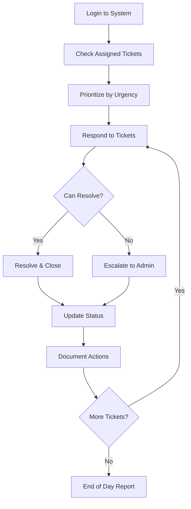

# Staff User Journey - LocalPro Super App

> **Role:** Staff (Platform Staff Member)  
> **Version:** 1.0.0  
> **Last Updated:** January 13, 2026

---

## 📋 Table of Contents

1. [Role Overview](#role-overview)
2. [Staff Types & Permissions](#staff-types--permissions)
3. [Getting Started](#getting-started)
4. [Daily Responsibilities](#daily-responsibilities)
5. [Task Management](#task-management)
6. [Support Operations](#support-operations)
7. [Reporting & Escalation](#reporting--escalation)
8. [Feature Access Matrix](#feature-access-matrix)

---

## 🎯 Role Overview

### Definition
**Staff** is a platform team member with specific permissions to perform assigned duties. Staff members support platform operations with limited but focused access based on their responsibilities.

### Key Characteristics
- ✅ Retains all client features
- ✅ Assigned specific permissions
- ✅ Supports platform operations
- ✅ Reports to admin/supervisor
- ⚠️ Limited access based on role
- ❌ Cannot access admin functions
- ❌ Cannot modify system settings

### Staff Purpose
- Customer support
- Content moderation
- Data entry
- Quality assurance
- Specialized tasks
- Operational support

---

## 👔 Staff Types & Permissions

### Permission-Based Roles

#### 1. Customer Support Staff
**Permissions:**
- `support.view`: View support tickets
- `support.respond`: Respond to tickets
- `users.view`: View user profiles
- `bookings.view`: View booking details
- `communication.send`: Send messages

**Responsibilities:**
- Handle customer inquiries
- Resolve basic issues
- Escalate complex problems
- Document interactions

---

#### 2. Content Moderator
**Permissions:**
- `content.view`: View reported content
- `content.moderate`: Approve/reject content
- `reviews.moderate`: Manage reviews
- `users.view`: View user profiles
- `reports.view`: Access violation reports

**Responsibilities:**
- Review flagged content
- Moderate user reviews
- Handle content reports
- Enforce community guidelines

---

#### 3. Data Entry Specialist
**Permissions:**
- `categories.manage`: Manage service categories
- `products.edit`: Edit product listings
- `content.create`: Create content
- `data.import`: Import data

**Responsibilities:**
- Update service categories
- Manage product catalogs
- Data entry tasks
- Content creation

---

#### 4. Quality Assurance
**Permissions:**
- `bookings.view`: View all bookings
- `providers.view`: View provider profiles
- `reviews.view`: Access reviews
- `quality.audit`: Conduct audits

**Responsibilities:**
- Quality checks
- Service audits
- Provider verification support
- Performance monitoring

---

#### 5. Operations Coordinator
**Permissions:**
- `bookings.view`: View bookings
- `providers.view`: View providers
- `communication.send`: Send notifications
- `reports.generate`: Create reports

**Responsibilities:**
- Booking coordination
- Provider communication
- Operational reporting
- Process optimization

---

## 🚀 Getting Started

### Staff Onboarding

#### Step 1: Account Creation
- Admin creates staff account
- Endpoint: `POST /api/staff`
- Assigns specific permissions
- Sets staff profile

#### Step 2: Receive Credentials
- Email notification with login
- Temporary password
- First login password change
- Security setup

#### Step 3: Training
- Role-specific training
- System navigation
- Policy guidelines
- Escalation procedures
- Tool familiarity

#### Step 4: Access Verification
- Endpoint: `GET /api/staff/me`
- View assigned permissions
- Understand boundaries
- Test access levels

---

## 📅 Daily Responsibilities

### Daily Workflow (Customer Support Example)



### Morning Routine

#### 1. System Login
- Secure authentication
- Review dashboard
- Check notifications

#### 2. Task Queue
- Endpoint: `GET /api/staff/tasks`
- View assigned tasks
- Check priorities
- Plan day's work

#### 3. Updates Review
- Platform changes
- Policy updates
- Team announcements
- Training materials

---

## ✅ Task Management

### Task Assignment & Completion

#### 1. View Assigned Tasks
- Endpoint: `GET /api/staff/tasks`
- **Task Types:**
  - Support tickets
  - Content reviews
  - Data updates
  - Quality checks
  - Special projects

#### 2. Task Details
- Endpoint: `GET /api/staff/tasks/:id`
- Task description
- Priority level
- Due date
- Required actions
- Success criteria

#### 3. Complete Task
- Endpoint: `PUT /api/staff/tasks/:id/complete`
- Perform required actions
- Document completion
- Add notes
- Mark as done

#### 4. Task Status Updates
```json
{
  "taskId": "task123",
  "status": "completed",
  "notes": "Ticket resolved, customer satisfied",
  "timeSpent": 15,
  "outcome": "success"
}
```

---

## 🤝 Support Operations

### Customer Support Workflow

#### 1. View Support Tickets
- Endpoint: `GET /api/staff/support/tickets`
- Assigned tickets
- Filter by:
  - Priority (urgent, high, normal, low)
  - Status (open, in progress, pending, closed)
  - Category
  - Date

#### 2. Ticket Details
- Endpoint: `GET /api/staff/support/tickets/:id`
- Customer information
- Issue description
- History
- Attached files
- Previous interactions

#### 3. Respond to Ticket
- Endpoint: `POST /api/staff/support/tickets/:id/respond`

**Response Template:**
```json
{
  "ticketId": "ticket123",
  "response": "Thank you for contacting us...",
  "action": "resolved",
  "resolution": "Provided account reset instructions",
  "followUp": false
}
```

#### 4. Escalation
- Endpoint: `POST /api/staff/support/tickets/:id/escalate`
- When to escalate:
  - Technical issues beyond scope
  - Policy violations
  - Refund requests over limit
  - Legal concerns
  - VIP customers

**Escalation Format:**
```json
{
  "ticketId": "ticket123",
  "escalateTo": "admin",
  "reason": "Requires financial approval",
  "urgency": "high",
  "summary": "Customer requests refund of ₱5,000",
  "recommendation": "Approve partial refund"
}
```

---

## 📊 Reporting & Escalation

### Performance Reporting

#### 1. Daily Report
- Endpoint: `POST /api/staff/reports/daily`
- **Contents:**
  - Tasks completed
  - Tickets resolved
  - Issues escalated
  - Time spent
  - Highlights/concerns

#### 2. Performance Metrics
- Endpoint: `GET /api/staff/performance`
- Response time
- Resolution rate
- Customer satisfaction
- Tasks completed
- Accuracy rate

---

## 🔐 Access Boundaries

### What Staff CAN Do
✅ View assigned content
✅ Perform assigned tasks
✅ Communicate with users (in scope)
✅ Update task status
✅ Generate permitted reports
✅ Escalate issues
✅ Access permitted data

### What Staff CANNOT Do
❌ Access admin functions
❌ Modify system settings
❌ Process payments (unless authorized)
❌ Delete users
❌ Change permissions
❌ Access financial data (unless authorized)
❌ Make policy decisions

---

## 📊 Feature Access Matrix

| Feature | Endpoint | Support | Moderator | Data Entry | QA | Operations |
|---------|----------|---------|-----------|------------|----|-----------| 
| **Tasks** |
| View Tasks | `GET /api/staff/tasks` | ✅ | ✅ | ✅ | ✅ | ✅ |
| Complete Task | `PUT /api/staff/tasks/:id/complete` | ✅ | ✅ | ✅ | ✅ | ✅ |
| **Support** |
| View Tickets | `GET /api/staff/support/tickets` | ✅ | ❌ | ❌ | ❌ | ⚠️ |
| Respond to Ticket | `POST /api/staff/support/tickets/:id/respond` | ✅ | ❌ | ❌ | ❌ | ⚠️ |
| Escalate Ticket | `POST /api/staff/support/tickets/:id/escalate` | ✅ | ✅ | ❌ | ✅ | ✅ |
| **Content** |
| View Content | `GET /api/staff/content` | ⚠️ | ✅ | ✅ | ✅ | ⚠️ |
| Moderate Content | `POST /api/staff/content/moderate` | ❌ | ✅ | ❌ | ⚠️ | ❌ |
| **Data** |
| Edit Categories | `PUT /api/staff/categories/:id` | ❌ | ❌ | ✅ | ❌ | ❌ |
| Import Data | `POST /api/staff/data/import` | ❌ | ❌ | ✅ | ❌ | ❌ |
| **Reporting** |
| Daily Report | `POST /api/staff/reports/daily` | ✅ | ✅ | ✅ | ✅ | ✅ |
| View Performance | `GET /api/staff/performance` | ✅ | ✅ | ✅ | ✅ | ✅ |

**Legend:**
- ✅ Full Access
- ⚠️ Limited Access
- ❌ No Access

---

## 🎯 Success Metrics

### Individual Performance
- Task completion rate
- Average response time
- Quality score
- Customer satisfaction
- Escalation rate
- Accuracy percentage

### Team Contribution
- Tickets resolved
- Content moderated
- Data processed
- Quality checks completed
- Special projects

---

## 🚀 Best Practices for Staff

### Task Management
1. Prioritize by urgency
2. Complete tasks thoroughly
3. Document all actions
4. Meet deadlines
5. Ask when unsure

### Communication
1. Professional tone
2. Clear and concise
3. Timely responses
4. Active listening
5. Proper escalation

### Quality
1. Attention to detail
2. Follow guidelines
3. Double-check work
4. Seek feedback
5. Continuous improvement

### Collaboration
1. Team communication
2. Share knowledge
3. Support colleagues
4. Participate in meetings
5. Provide constructive feedback

### Professional Development
1. Learn platform features
2. Stay updated on policies
3. Improve skills
4. Seek mentorship
5. Career growth mindset

---

## 📝 Common Scenarios

### Scenario 1: Customer Support
**Issue:** Customer can't reset password
**Action:**
1. Verify identity
2. Guide through reset process
3. If technical issue, escalate
4. Document resolution
5. Follow up if needed

### Scenario 2: Content Moderation
**Issue:** Inappropriate review reported
**Action:**
1. Review reported content
2. Check against guidelines
3. Remove if violates policy
4. Notify user
5. Document decision

### Scenario 3: Data Entry
**Issue:** Update service categories
**Action:**
1. Receive task assignment
2. Review data to update
3. Make changes carefully
4. Verify accuracy
5. Mark task complete

---

## 🚨 Escalation Guidelines

### When to Escalate

**Immediate Escalation:**
- Safety concerns
- Legal issues
- System security breaches
- Major platform errors
- VIP customer issues

**Standard Escalation:**
- Beyond permission scope
- Policy interpretation needed
- Large refund requests
- Complex technical issues
- Repeated user violations

**Escalation Process:**
1. Gather all information
2. Document issue clearly
3. Suggest resolution (if applicable)
4. Use escalation endpoint
5. Follow up as needed

---

**Document Version:** 1.0.0  
**Last Updated:** January 13, 2026  
**Next Review:** April 13, 2026
